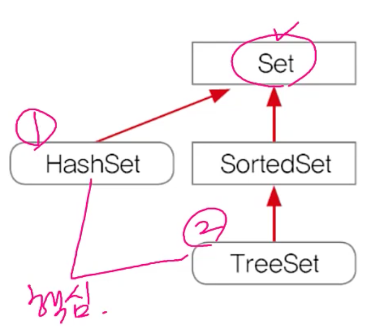
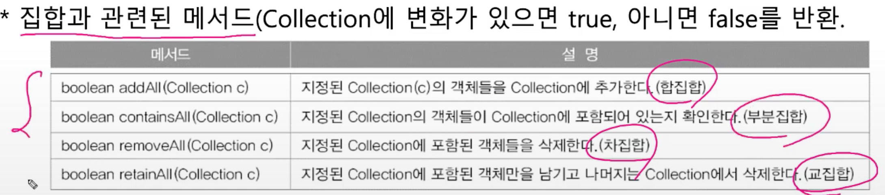
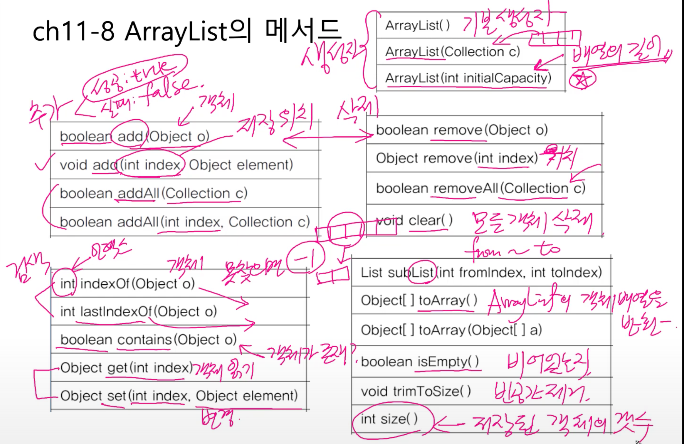
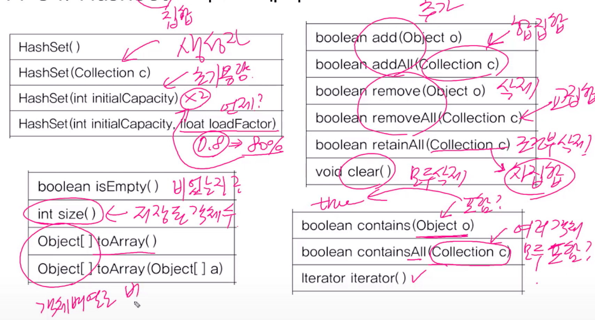

# Collections framework

- 컬렉션(다수의 객체)을 다루기 위한 표준화된 프로그래밍 방식
- 컬렉션을 쉽고 편리하게 다룰 수 있는 다양한 클래스를 제공
- 컬렉션 프레임웍의 핵심 인터페이스
  - List
  - Set
  - Map
  - 


1. Collection 인터페이스의 메서드

   - List, Set이 공통으로 Collection 인터페이스의 메서드를 사용
   - 

2. List 인터페이스

   - 
   - 

3. Set 인터페이스

   - 

   - Set인터페이스의 메서드는 Collection 인터페이스와 동일하다.
   - 


4. Map 인터페이스

   - 

   - 


-----------------------------------------------------------


1. ArrayList

   - 기존의 Vector를 개선한 것으로 구현원리와 기능적으로 동일

   - ArrayList는 동기화처리가 되어 있지 않다.

   - 데이터의 저장 공간으로 **배열을 사용**한다(배열기반)

   - 

   - ```
     
     ```

   - `subList()`는 일부분을 잘르는 메서드. 읽기전용

     - ```java
       List<T> sub = list1.subList(1,4); // sub는 읽기만 가능(1번,2번,3번 인덱스)
       ArrayList list2 = new ArrayList(list1.subList(1,4)); // sub와 같은 내용이지만 ArrayList생성.
       ```

   - ```java
     //Collection은 인터페이스, Collections는 유틸클래스
     Collections.sort(list1); //list1,2를 정렬한다. 기본이 오름차순. 012345
     Collections.sort(list2);
     
     ```

   - ```java
     ArrayList list1 = new ArrayList(10);
     list1.add(1);// Integer 1
     list1.add(2);
     list1.add(3);
     list1.add(4);
     list1.add(5);
     list1.add(6);
     
     System.out.println(list1); //[1, 2, 3, 4, 5, 6]
     
     list1.add("1");//String 1 add.
     System.out.println(list1); //  [1, 2, 3, 4, 5, 6, 1]
     
     //indexOf()는 지정된 객체의 위치를 알려준다.
     System.out.println(list1.indexOf("1")); // 6
     System.out.println(list1.indexOf(1)); // 0
     
     list1.remove(1); // 인덱스 1 삭제.
     System.out.println(list1);  //[1, 3, 4, 5, 6, 1] 인덱스 1이였던 2 삭제.
     
     list1.remove(new Integer(1)); // Integer 객체의 값이 1인 것을 삭제.
     System.out.println(list1); //  [3, 4, 5, 6, 1] 
     
     list1.remove(new String("1")); // String 객체의 값이 1인 것을 삭제.
     System.out.println(list1);  // [3, 4, 5, 6]
     ```

   - 

   - 


2. LinkedList

   - 장단점

     - 장점

       - 배열은 구조가 간단하고 데이터를 읽는 데 걸리는 시간이 짧다
       - 순차적인 데이터 추가(끝에 추가)와 삭제(끝부터 삭제)는 빠르다.

     - 단점

       - 크기를 변경할 수 없다. 크기를 변경하려면 새로운 배열을 생성 후 데이터 복사.
       - 크기 변경을 피하기 위해 충분히 큰 배열을 생성하면, 메모리가 낭비
       - 비순차적인 데이터의 추가, 삭제에 시간이 많이 걸린다.
         - 순차적인 아닌 중간 데이터를 삭제, 추가한다면 뒤에 많은 데이터를 옮겨야하기에.
       - 불연속적이므로 데이터 접근성이 나쁨

       ​	 

   - 배열의 단점을 보완

     - 배열과 달리 불연속적으로 존재하는 데이터를 연결(link). 주소가 연속적
     - 데이터의 삭제 : 단 한 번의 참조변경만으로 가능
     - 데이터의 추가 : 한 번의 Node객체생성과 두 번의 참조변경만으로 가능

   - 링크드 리스트는 불연속적이므로 데이터의 접근성이 나쁨

     - 이러한 접근성이 나쁜 것을 보완한 것 : doubly linked list(이중 연결리스트)
     - 링크드 리스트는 내 앞 노드만 아는 반면 이중연결리스트는 앞뒤로 안다.

     

   - ArrayList vs LinkedList 성능비교
     - 
     - 

   

3. Stack & Queue


4. Arrays

   - 배열을 다루기 편리한 메서드(static) 제공

   - `toString()` - 배열의 출력

     - ```java
       // 배열을 넣어주면 문자열을 반환.
       static String toString(boolean[] a);
       static String toString(byte[] a);
       static String toString(char[] a);
       static String toString(short[] a);
       static String toString(int[] a);
       static String toString(long[] a);
       static String toString(float[] a);
       static String toString(double[] a);
       static String toString(Object[] a);
       ```

   - `copyOf()`, `copyOfRange()` - 배열의 복사

     - ```java
       int[] arr = {0, 1, 2, 3, 4};
       int[] arr2 = Arrays.copyOf(arr, arr.length); // [0, 1, 2, 3, 4]
       int[] arr3 = Arrays.copyOf(arr, 3); //[0, 1, 2, 3, 4]
       int[] arr4 = Arrays.copyOf(arr, 7); //[0, 1, 2, 3, 4, 0, 0]
       int[] arr5 = Arrays.copyOfRange(arr, 2, 4); // [2, 3]
       int[] arr6 = Arrays.copyOfRange(arr, 0, 7); //[0, 1, 2, 3, 4, 0, 0]
       
       
       System.out.println(Arrays.toString(arr)); //[0, 1, 2, 3, 4]
       ```

   - `fill()`, `setAll()` - 배열 채우기

     - ```java
       int[] arr7 = new int[10];
       
       Arrays.fill(arr7, 9); // [9, 9, 9, 9, 9, 9, 9, 9, 9, 9]
       
       Arrays.setAll(arr7, (i) -> (int) ((Math.random()*10) +1)); //1<=x<11 [10, 1, 3, 3, 8, 2, 9, 9, 2, 6]
       ```

   - `sort()`, `binarySearch()` - 배열의 정렬과 검색

     - ```java
       int[] arr9 = {10, 1, 3, 3, 8, 2, 9, 9, 4, 6};
       int idx = Arrays.binarySearch(arr9, 2); //idx = -3 잘못된 결과 정렬이 안되어있어서.
       
       Arrays.sort(arr9); // [1, 2, 3, 3, 4, 6, 8, 9, 9, 10]
       
       int idx1 = Arrays.binarySearch(arr9, 2); // idx1 = 1, 1번 인덱스에 2가 있다.
       
       ```

   - `deepToString()` - 다차원 배열의 출력

     - ```java
       int[][] arr2D = {{11,12}, {21,22}};
       
       System.out.println(Arrays.deepToString(arr2D)); [[11, 12], [21, 22]]
       ```

   - `deepEquals()` - 다차원 배열의 비교

     - ```java
       String[][] str2D = new String[][]{{"aaa", "bbb"}, {"AAA", "BBB"}};
       String[][] str2D2 = new String[][]{{"aaa", "bbb"}, {"AAA", "BBB"}};
       
       System.out.println(Arrays.equals(str2D, str2D2)); //false 잘못된 결과.
       System.out.println(Arrays.deepEquals(str2D, str2D2)); // true. 올바른 결과
       
       ```

   - `asList(Object... a)` - 배열을 List로 변환. 

     - `Object... a`는 가변 매개변수로 갯수가 정해져있지 않다.

     - 또한 배열을 넣으면 List로 변환.

     - 반환된 List는 **읽기 전용**이다.

     - ```java
       List<Integer> list = Arrays.asList(new Integer[]{1,2,3,4,5});
       List<Integer> list1 = Arrays.asList(1,2,3,4,5);
       
       list.add(1);// error. UnsupportedOperationException 예외 발생. 읽기전용이므로.
       
       //읽기전용이 아닌 쓰기도 하고싶다면 새로 생성.
       List<Integer> list2 = new ArrayList<>(Arrays.asList(new Integer[]{1, 2, 3, 4, 5}));
       List<Integer> list3 = new ArrayList<>(Arrays.asList(1,2,3,4,5));
       
       list2.add(1);
       list3.add(2);
       ```

   - `stream()`, `spliterator()`, `parallelXXX()` - 람다와 스트림과 관련


5. Comparator와 Comparable 

   - 객체 정렬에 필요한 메서드(정렬기준 제공)를 정의한 인터페이스

     - Comparable - 기본 정렬기준을 구현하는데 사용.

     - Comparator - 기본 정렬기준 외에 다른 기준으로 정렬하고자할 때 사용

     - ```java
       public interface Comparator {
         int compare(Object o1, Object o2); //o1, o2 두 객체를 비교
         																	
         boolean equals(Obejct obj); //equals를 오버라이딩하라는 뜻
       }
       
       public interface Comparable {
         int compareTo(Object o); // 주어진 객체(o)를 자신과 비교
       }
       ```

     - `compare()`와 `compareTo()`는 두 객체의 비교결과를 반환하도록 작성. 반환 값이 양수(왼쪽이큼), 0(같다), 음수(오른쪽큼)

     - 

     - `Arrays`에 구현된 스택틱(클래스) 메소드로 `sort()`가 있다.

       - ```java
         //정렬에는 1.대상 2.정렬기준이 필요
         static void sort(Object[] a); //객체 배엘에 저장된 객체가 구현한 Comparable에 의한 정렬.
         static void sort(Object[] a, Comparator c); // 지정한 Comparator에 의한 정렬
         ```

   - ```java
     String[] strArr = {"cat", "Dog", "lion", "tiger"};
     
     Arrays.sort(strArr); // Sort(Object[] o)는 객체 배열에 저장된 객체(String)의 Comparable 구현에 의해서 정렬됨
     //즉. class String에 기본정렬기준 comparaTo()를 가지고 있음(사전순).
     System.out.println("strArr=" + Arrays.toString(strArr)); //[Dog, cat, lion, tiger]
     
     Arrays.sort(strArr, String.CASE_INSENSITIVE_ORDER);// 대소문자 구분안함. 두번째 인자(Comparator)가 지정한 정렬
     System.out.println("strArr = " + Arrays.toString(strArr));// [cat, Dog, lion, tiger]
     
     Arrays.sort(strArr, Comparator.reverseOrder()); // 역순으로
     System.out.println("strArr = " + Arrays.toString(strArr)); // [tiger, lion, cat, Dog]
     
     Arrays.sort(strArr, new Descending()); // 역순으로. 내가 직접 구현.
     System.out.println("strArr = " + Arrays.toString(strArr)); // [tiger, lion, cat, Dog]
     
     
     
     
     //직접 구현.
     public class Descending implements Comparator {
     
       public int compare(Object o1, Object o2) {
         if (o1 instanceof Comparable && o2 instanceof Comparable) {
           Comparable c1 = (Comparable)o1;
           Comparable c2 = (Comparable)o2;
           return c1.compareTo(c2) * -1; //역순의 정렬을 원하므로 파라미터 o1이 String이라면 String 기본정렬기준 반대이므로
                                         //양수 -> 음수. 음수 -> 양수
         }
         return -1;
       }
     }
     ```

     - `String.CASE_INSENSITIVE_ORDER`은 String에서 직접 만들어 놓은 Comparator.

       - ```java
         public static final Comparator<String> CASE_INSENSITIVE_ORDER
           = new CaseInsensitiveComparator();
         ```

   - Integer와 Comparable

     - ```java
       //implements Comparable<Integer>에서 Comparable을 구현했다는 것은 말 그대로
       //기본(default) 정렬 기준을 제공한다는 것. 즉, default이므로 정렬기준이 없을 때 사용.
       public final class Integer extends Number implements Comparable<Integer>{
         
         public int compareTo(Integer anotherInteger) {
               return compare(this.value, anotherInteger.value);
           }
         
         public static int compare(int x, int y) {
               return (x < y) ? -1 : ((x == y) ? 0 : 1);
           }
         
       }
       ```


6. HashSet

   - 순서X, 중복X

   - Set인터페이스를 구현한 대표적인 컬렉션 클래스

   - 가장 일반적인 Set

   - 순서를 유지하고 싶으면, LinkedHashSet 클래스를 사용하면 된다.

   - 

     - `Hashset(int initialCapcity, float loadFactor)`는 언제 사이즈를 두배 늘릴 것인지. loadFactor가 0.8이면 80%차면 2배로 늘린다.
     - `retainAll(Collection c)`은 c를 빼고 삭제. 차집합.

   - ```java
     Object[] objArr = {"1", 1, "2", "2", "3", "3", "4", "4", "4"}; //Object로 박싱되어서 1은 Integer 1 나머지는 String
     Set set = new HashSet();
     
     for (int i = 0; i < objArr.length; i++) {
       System.out.println(objArr[i]+ "=" + set.add(objArr[i]));
     }
     
     System.out.println(set);
     
     Iterator it = set.iterator();
     
     while (it.hasNext()) {
       System.out.println(it.next());
     }
     ```

     - 
     - Set은 중복X이다. String 1과 Integer 1은 다르므로 true로 잘 add되었고 나머지는 String으로 중복되므로 false되어서 add 실패

   - ```java
     Set set1 = new HashSet();//비어있는 HashSet.
     
     for (int i = 0; i < 6; i++) {
       int num = (int)(Math.random()*45) + 1;
       set1.add(num);
     }
     
     System.out.println(set1); //[32, 19, 5, 29, 14]
     List<Integer>list = new LinkedList(set1); //1. Set의 모든 요소를 List에 저장
     Collections.sort(list); // 2. List를 저장.
     System.out.println(list); //[5, 14, 19, 29, 32] 3. List 출력
     
     ```

     - Set은 정렬이 불가능하므로 List로 옮겨서 List를 정렬해야한다.

   - `boolean add(Object o)`는 저장할 객체의 중복체크를 위해서  `equals()`와 `hashCode()`를 호출

     - `equals()`와 `hashCode()`는 Object 클래스에서 온 것.

     - ```java
       static class Person{
       
           int age;
           String name;
       
           public Person(int age, String name) {
             this.age = age;
             this.name = name;
           }
       
       
         }
       
         static class PersonWithEquals {
       
           int age;
           String name;
       
           public PersonWithEquals(int age, String name) {
             this.age = age;
             this.name = name;
           }
       
           @Override
           public boolean equals(Object o) {
             if(!(o instanceof PersonWithEquals))return false;
       
             PersonWithEquals p = (PersonWithEquals) o;
             // 나자신(this)의 이름과 나이를 p와 비교
             return this.name.equals(p.name) && this.age==p.age;
           }
       
           //hashCode도 구현하는 게 정석이지만 안해도 상관 없다.
       //    @Override
       //    public int hashCode() {
       //      return Objects.hash(age, name);
       //    }
         }
       ```

     - ```java
       Person p1 = new Person(10, "김정우");{
       Person p2 = new Person(20, "김선우");
       Person p3 = new Person(20, "김선우");
       
       
       System.out.println(p1.equals(p2)); // false
       System.out.println(p2.equals(p3)); // false -> 잘못된 결과. equals와 hashcode를 구현하지 않아서.
       
       PersonWithEquals ps1 = new PersonWithEquals(10, "김정우");
       PersonWithEquals ps2 = new PersonWithEquals(20, "김선우");
       PersonWithEquals ps3 = new PersonWithEquals(20, "김선우");
       
       
       System.out.println(ps1.equals(ps2)); //false
       System.out.println(ps2.equals(ps3)); //true
       ```

       


# Iterator, ListIterator, Enumeration

- 컬렉션에 저장된 데이터를 접근하는데 사용되는 인터페이스
- `Enumeration`은 `lterator`의 구버젼.
- `ListIterator`는 `Iterator`의 접근성을 향상시킨 것(단방향 -> 양방향)
- Iterator 인터페이스의 메서드
  - 
- Enumeration 인터페이스의 메서드
  - 


- Iterator

  - 컬렉션에 `Iterator()`를 호출해서 Iterator를 구현한 객체를 얻어서 사용.

  - 

    위에 코드처럼 `Iterator()` 메서드가 이미 `Collection`인터페이스에 정의가 되어있으므로 우리는 그냥 사용.

  - ```java
    List<String> list2 = new ArrayList<>();
    
    list2.add("hi");
    list2.add("hello");
    
    Iterator<String> it = list2.iterator(); //Iterator는 1회용.
    
    while (it.hasNext()) { // boolean 
      System.out.println(it.next()); // String 출력
    }// 여기서 Iterator it을 소비했기에 재사용 불가능
    
    
    
    ```

  - `Map`에는 `iterator()`가 없다.

    - `keySet()`,`entrySet()`,  `value()`를 호출해야 한다.

    - `keySet()`,  `entrySet()`은 Set 반환. `value()`은 collection을 반환한다. 

    - 반환된 Set, collection은 Iterator()를 가지고 있기에 Iterator()사용 가능

    - ```java
      Iterator it = map.entrySet().iterator();
      ```


