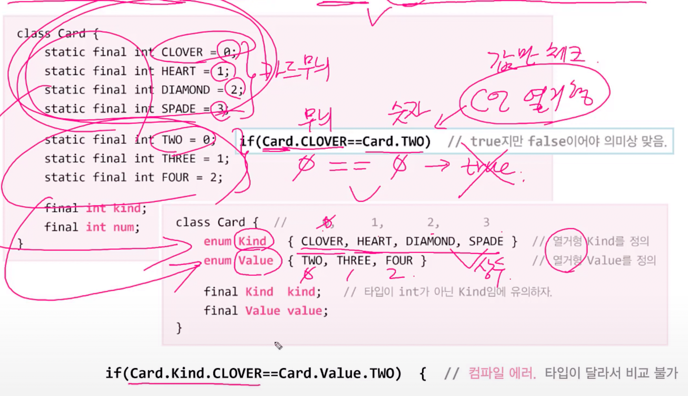
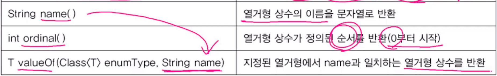
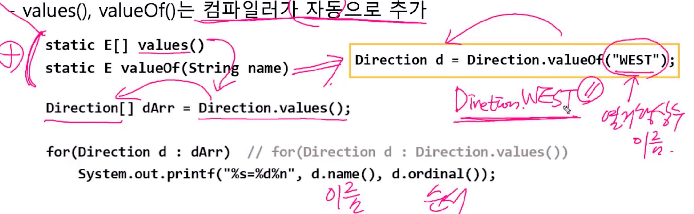

# Enum(열거형)

- 관련된 상수들을 같이 묶어 놓은 것. Java는 타입에 안전한 열거형을 제공

  - 
  - 열거형을 사용함으로써 위와 같이 종류가 다른 것들을 구별 가능하다.

- 열거형을 정의하는 방법

  - ```java
    enum 열거형이름 {상수명1, 상수명2, ...};
    enum Direction {EAST, SOUTH, WEST, NORTH}; // 0 1 2 3
    ```

- 열거형 타입의 변수를 선언하고 사용하는 방법

  - ```java
    class Unit{
      
      int x, y; // 유닛의 위치
      Direction dir; // 열거형 인스턴스 변수를 선언
      
      void init(){
    		dir = Direction.EAST; // 유닛의 방향을 EAST로 초기화
      }
    }
    ```

- 열거형 상수의 비교에 ==와 compareTo() 사용가능

  - ```java
    if(dir == Direction.EAST){
      x++;
    }else if(dir > Direction.WEST){ //Error. 열거형 상수에 비교연산자 사용 불가
      ...
    } else if (dir.compareTo(Direction.WEST) > 0){ // compareTo() 가 왼쪽대 양수, 같으면 0, 오른쪽대 음수.
      
      
    }
    ```

- 열거형의 조상 - java.lang.Enum(클래스)

  - 모든 열거형은 Enum의 자손이며, 아래의 메서드를 상속받는다.

  - 
  - 


- 열거형에 멤버 추가하기

  - 불연속적인 열거형 상수의 경우, 원하는 값을 괄호()안에 적는다.

  - 원래는 자동으로 0,1,2,3,4...로 채워짐.

  - 괄호()를 사용하려면, 인스턴스 변수와 생성자를 새로 추가해 줘야 한다.

  - ```java
    enum Direction{
      EAST(1), SOUTH(5), WEST(-1), NORTH(10);
      
      private final int value; // 정수를 저장할 필드(인스턴스 변수)를 추가
      Direction(int value){ this.value = value;} //생성자를 추가
      
      public int getValue(){return value;}
    }
    ```

  - 열거형 생성자는 묵시적으로 private이므로, 외부에서 객체생성 불가

    - ```java
      Direction d = new Direction(1); // ERROR. 열거형의 생성자는 외부에서 생성 불가
      ```

      