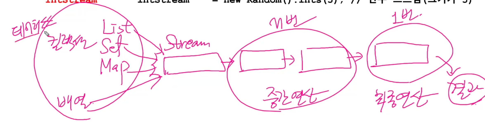
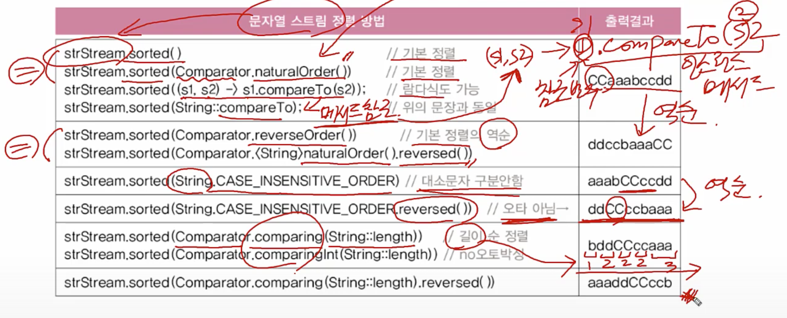
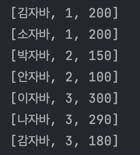
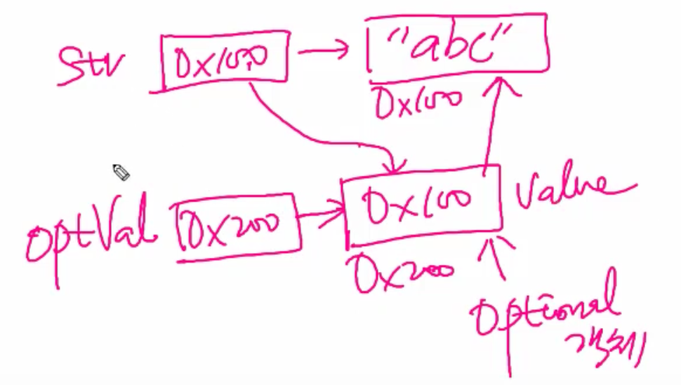

# 람다


## 함수형 인터페이스(Functional Interface)

1. 정의 : 추상 메소드 하나를 가지고 있는 Interface를 함수형 인터페이스라고 한다.

```java
public interface FunctionalInterface {
    public abstract void doSomething(String text);
}
```


2. 사용하는 이유

   Java의 람다식은 함수형 인터페이스로만 접근이 가능하다.

3. Java의 기본적인 함수형 인터페이스

   - `Runnable`

     - 인자를 받지 않고 리턴값도 없는 인터페이스

   - `Supplier<T>`

     - 인자를 받지 않고 T 타입의 객체를 리턴

     - ```java
       public interface Supplier<T> {
           T get();
       }
       ```

     - ```java
       Supplier<String> getString = () -> "Happy new year!"; // T인 String 객체를 리턴
       String str = getString.get();
       System.out.println(str);
       // 결과
       // Happy new year!
       ```

   - `Consumer<T>`

     - T 타입의 객체를 인자로 받고 리턴 값은 없는 인터페이스

     - ```java
       public interface Consumer<T> {
           void accept(T t);
       
           default Consumer<T> andThen(Consumer<? super T> after) {
               Objects.requireNonNull(after);
               return (T t) -> { accept(t); after.accept(t); };
           }
       }
       ```

     - ```java
       Consumer<String> printString = text -> System.out.println("Miss " + text + "?");
       //String(T) text를 인자로 받고 리턴값은 없다.
       printString.accept("me");
       // 결과
       // Miss me?
       ```

   - `Function<T, R>`

     - T타입의 인자를 받고, R타입의 객체를 리턴하는 인터페이스

     - ```java
       public interface Function<T, R> {
           R apply(T t);
       
           default <V> Function<V, R> compose(Function<? super V, ? extends T> before) {
               Objects.requireNonNull(before);
               return (V v) -> apply(before.apply(v));
           }
       
           default <V> Function<T, V> andThen(Function<? super R, ? extends V> after) {
               Objects.requireNonNull(after);
               return (T t) -> after.apply(apply(t));
           }
       
           static <T> Function<T, T> identity() {
               return t -> t;
           }
       }
       ```

     - ```java
       Function<Integer, Integer> multiply = (value) -> value * 2;
       Function<Integer, Integer> add      = (value) -> value + 3;
       //Integer(T) value를 Integer(R) value*2, value*3 객체로 리턴
       Function<Integer, Integer> addThenMultiply = multiply.compose(add);
       
       Integer result1 = addThenMultiply.apply(3);
       System.out.println(result1);
       // 결과
       // 12
       ```

   - `Predicate<T>`

     - T타입의 인자를 받고 결과로 `boolean`을 리턴하는 인터페이스

     - 

     - ```java
       public interface Predicate<T> {
           boolean test(T t);
       
           default Predicate<T> and(Predicate<? super T> other) {
               Objects.requireNonNull(other);
               return (t) -> test(t) && other.test(t);
           }
       
           default Predicate<T> negate() {
               return (t) -> !test(t);
           }
       
           default Predicate<T> or(Predicate<? super T> other) {
               Objects.requireNonNull(other);
               return (t) -> test(t) || other.test(t);
           }
       
           static <T> Predicate<T> isEqual(Object targetRef) {
               return (null == targetRef)
                       ? Objects::isNull
                       : object -> targetRef.equals(object);
           }
       }
       ```

     - ```java
       Predicate<Integer> isBiggerThanFive = num -> num > 5;
       System.out.println("10 is bigger than 5? -> " + isBiggerThanFive.test(10));
       // 결과
       // 10 is bigger than 5? -> true
       ```

     


## Stream Api

java는 **객체지향 언어**이므로 기본적으로 **함수형 프로그래밍이 불가능**.

이러한 함수형 프로그래밍을 제공하기 위해서 JDK8부터는 Stream Api, 람다식, 함수형 인터페이스 등을 제공.

여기서 Stream Api는 데이터를 **추상화**하고 **처리**하는 데 **자주 사용되는 함수**들을 정의.

즉, 다양한 **데이터 소스(컬렉션, 배열)**를 표준화된 방법으로 다루기 위한 것.

​	`List Set Map`은 사용 방법이 다 달랐으나 JDK 1.8부터 Stream을 도입함으로 Stream으로 변환 후 통일된 방법으로 다룰 수 있다.



데이터 소스 -> Stream -> 중간 연산 -> 최종연산

### 특징

- 일회용.
- 원본의 데이터를 변경 x
- 내부 반복으로 작업 처리


### Stream의 3가지 단계

1. 생성
   - Stream 객체 생성
   - Stream은 재사용이 불가능하므로 닫히면 재생성
2. 가공
   - 원본 데이터를 특정 데이터로 가공하기 위한 연산
   - 위 연산 결과를 Stream으로 반환하기 때문에 연속해서 연산을 이어갈 수 있음
     - 이렇게 연산을 이어가는 것을 `연산 파이프라인`이라고 한다
3. 결과
   - 가공한 데이터를 원하는 결과로 만들기 위한 최종 연산
   - Stream의 요소를 소모하면서 연산 수행하므로 1번만 처리 가능.


예시

```java
    List<String> list = Arrays.asList("a1", "b1", "c1", "c3");

    long result = list
        .stream() 												//생성 단계 : Stream 객체 생성
        .filter(s -> s.startsWith("c"))		//가공 단계 : c로 시작하는 것으로 필터링, Stream 반환
        .map(String::toUpperCase)					//가공 단계
        .sorted()													//가공 단계
        .count();													//결과 

    System.out.println(result);
```


위에서 볼 수 있듯이 Stream 연산들은 **매개변수로 함수형 인터페이스**를 받도록 되어있다.


## 람다란

Stream 연산들은 매개변수로 **함수형 인터페이스**(Functional Interface)를 받도록 되어있다. 그리고 람다식은 **반환값으로 함수형 인터페이스를 반환**하고 있다. 그렇기 때문에 우리는 Stream API를 정확히 이해하기 위해 람다식과 함수형 인터페이스에 대해 알고 있어야 한다.

즉, **함수를 하나의 식으로 표현한 것**

함수를 람다식으로 표현하면 메소드의 이름이 필요 없기 때문에 람다식을 **익명 함수(Anonymous Function)의 한 종류**라고 볼 수 있다.


## 함수형 인터페이스


### 자주 사용되는 함수형 인터페이스

- `Runable`

  - 파라미터  x, 리턴  x

  - ```java
    Runable runable = () -> System.out.println("Runable run");
    runable.run();
    ```

    

- `Supplier<T>`

  - 파라미터 x, 리턴  o

  - ```java
    Supplier<String> supplier = () -> "리턴이 있다";
    System.out.println(supplier.get());
    ```

    

- `Consumer<T>`

  - 파라미터 o, 리턴 x

  - ```java
    Consumer<String> con = text -> System.out.println(text);
    con.accept("hi");
    //hi
    ```

    

- `Function<T,R>`

  - 파라미터 o, 리턴 o

  - 주로  T -> R

  - ```java
    Function<Integer, Integer> sumFunction = (value) -> value + 5;
    Integer result = sumFunction.apply(10);
    System.out.println(result);
    ```

    

- `Predicate<T>`

  - 파라미터  o, 리턴값이  boolean


## Stream 생성하기

타입(Collection, Array)에 대해서 Stream 생성하는 방식이 달라짐.

- `Stream<Integer> inStream = list.stream()`
- `Stream<String> strStream = Stream.of(new String[]{"a", "b", "c"})`
- `Stream<Integer> evenStream = Stream.iterate(0, n->n+2)`
- `Stream<Double> randomStream = Stream.generate(Math::random)`
- `IntStream intStream = new Random().ints(5)`


1. Collection의 Stream 생성

   `Collection` 인터페이스에는 `stream()`이 정의되어 있다.

   그렇기에 `Colleciton의 stream()`메소드를 사용하여 stream을 생성한다.

   ```java
   Stream<E> stream()//Collection인터페이스의 메서드
   
   List<Integer> list = Arrays.asList(1,2,3,4,5);
   Stream<Integer> intStream = list.stream(); //list를 스트림으로 변환
   
   List<String> list = Arrays.asList("a", "b", "c");
   Stream<String> listStream = list.stream();
   
   //스트림의 모든 요소를 출력
   intStream.forEach(System.out::print); //12345 메서드 참조 (i)->System.out.print(i)
   intStream.forEach(System.out::print); //error. 최종연산인 forEach를 실행했기에 스트림이 이미 닫혔다.
   ```

   

2. Array(배열)의 Stream 생성

   - 배열의 원소들을 소스로하는 Stream을 생성하기 위해서 `Stream의 of`메소드나 `Arrays의 stream`메소드를 사용

   - 객체 배열로부터 스트림 생성하기

     - ```java
       // 배열로부터 스트림을 생성
       String[] array = new String[]{"a", "b", "c"};
       Stream<String>stream = Arrays.stream(array);
       Stream<String>stream = Arrays.stream(array, 1, 3);//인덱스 1포함, 3 제외("b," "c");
       
       //Stream.of, Arrays.stream 편한걸로 사용
       Stream<T> Stream.of(T... values); //가변인자
       Stream<T> Stream.of(T[]);
       Stream<T> Arrays.stream(T[]);
       Stream<T> Arrays.stream(T[] array, int startInclusive, int endExclusive);
         
       Stream<String> stream = Stream.of("a", "b", "c"); //가변인자
       Stream<String> stream = Stream.of(new String[] {"a", "b", "c"});
       Stream<String> stream = Arrays.stream(new String[] {"a", "b", "c"});
       Stream<String> stream = Arrays.stream(new String[] {"a", "b", "c"}, 0, 3); //end범위 포함 x
       ```

       

   

3. 원시 Stream 생성

   - int, double과 같은 원시 자료형들은 특수한 종류의 Stream(IntStream, LongStream, DoubleStream)들을 사용할 수 있으며, IntStream같은 경우 `range()`함수를 사용하여 기존의 for문을 대체할 수 있다.

   - ```java
     IntStream IntStream.of(int... values); //Stream이 아니라 IntStream
     IntStream IntStream.of(int[]);
     IntStream Arrays.stream(int[]);
     IntStream Arrays.stream(int[] array, int startInclusive, int endExclusive);
     
     //Stream.of, Arrays.stream 편한걸로 사용
     IntStream IntStream.of(1,2,3,4);
     IntStream IntStream.of(new int[]{1,2,3,4});
     IntStream Arrays.stream(new int[]{1,2,3,4});
     IntStream Arrays.stream(new int[]{1,2,3,4}, 0, 3);
     
     IntStream stream = IntStream.range(4,10);
     ```

     


- `int, Integer`

  - ```java
    int[] intArr = {1,2,3,4,5};
    IntStream intStream = Arrays.stream(intArr);
    intStream.forEach(System.out::println);
    
    Integer[] intArr = {1,2,3,4,5}; // new Integer[]{1,2,3,4,5} 오토박싱으로 인해 생략가능
    Stream<Integer> intStream = Arrays.stream(intArr);
    intStream.forEach(System.out::println);
    ```

  - `int` 기본형은 숫자로 다뤄지는 것이므로 `sum()`, `average()` ... 가능

  - `Integer`는 객체로 여러 타입의 스트림이 가능해야하므로 숫자 스트림에서 사용할 수 있는 `sum()`, `average()`를 넣지 않은 것.

    - `count()` 가능


- 특정 범위의 정수를 요소로 갖는 스트림 생성하기(IntStream, LongStream)

  - ```java
    IntStream IntStream.range(int begin, int end);
    IntStream IntStream.rangeClosed(int begin, int end);
    
    IntStream intStream = IntStream.range(1, 5); //1, 2, 3, 4
    IntStream intStream = IntStream.rangeClosed(1, 5); // 1, 2, 3, 4, 5
    ```

    


4. 임의의 수

   - 난수를 요쇼로 갖는 스트림 생성 - `ints()`, `longs()`, `doubles()` ...

     - ```java
       IntStream intStream = new Random().ints(); // 무한 스트림
       intStream.limit(5).forEach(System.out::println); //5개의 요소만 출력한다.
       
       IntStream intStream = new Random().ints(5); //크기가 5인 난수 스트림을 반환
       ```

     - `Integer.MIN_VALUE` <= `ints()` <= `Integer.MAX_VALUE`

     - `Long.MIN_VALUE` <= `longs()` <= `Long.MAX_VALUE`

     - 0.0 <= `doubles()` < 1.0

   - 지정된 범위의 난수를 요소로 갖는 스트림 생성하는 메서드(Random클래스)

     - ```java
       // 무한 스트림
       IntStream ints(int begin, int end);
       LongStream longs(long begin, long end);
       DoubleStream doubles(double begin, double end);
       
       // 유한 스트림
       IntStream ints(long streamSize, int begin, int end);
       LongStream longs(long streamSize, long begin, long end);
       DoubleStream doubles(long streamSize, double begin, double end);
       ```


5. 람다식을 소스로하는 스트림 생성하기 - `iterate()`, `generate()`

   - ```java
     // 무한 스트림
     static <T> Stream<T> iterate(T seed, UnaryOperator<T> f); // 이전 요소에 종속, seed = 초기값
     static <T> Stream<T> generate(Supplier<T> s); // 이전 요소에 독립적
     
     Stream<Integer> evenStream = Stream.iterate(0, n -> n+2); // 0, 2, 4, 6 ...
     
     Stream<Double> randomStream = Stream.generate(Math::random); // () -> Math.random()
     Stream<Integer> oneStream = Stream.generate(() -> 1); // 1, 1, 1, 1, 1, ...
     ```


6. 파일과 빈 스트림

   - 파일을 소스로 하는 스트림 생성하기

     - ```java
       Stream<Path> Files.list(Path dir); // Path는 파일 또는 디렉토리
       
       Stream<String> Files.lines(Path path);
       Stream<String> Files.lines(Path path, Charset cs);
       Stream<String> lines(); // BufferedReader 클래스의 메서드
       ```

   - 비어있는 스트림 생성하기

     - ```java
       Stream emptyStream = Stream.empty(); // empty()는 빈 스트림을 생성해서 반환한다.
       long count = emptyStream.count(); // count의 값은 0
       ```

       

## Stream 가공하기


1. 스트림의 요소 걸러내기 

   - 조건에 맞게 데이터들을 정제하여 더 작은 컬렉션으로 만들어 내는 연산

   - `filter()` - 필터링

   - `distinct()` - 중복제거

   - ```java
     Stream<T> filter(Predicate<T> predicate); // Predicate<T> predicate = 조건식, 조건에 맞지 않는 요소 제거
     Stream<T> distinct(); //중복제거
     
     IntStream intStream = IntStream.of(1,2,2,3,3,3,4,5,5,6);
     intStream.distinct().forEach(System.out::print); //123456
     
     IntStream intStream = IntStream.rangeClosed(1, 10); //12345678910
     intStream.filter(i -> i%2==0).forEach(System.out::print); // i%2==0은 2의 배수 , 246810
     
     intStream.filter(i -> i%2!=0 && i%3!=0).forEach(System.out::print);
     intStream.filter(i -> i%2!=0).filter(i -> i%3!=0).forEach(System.out::print);
     //위 두개는 같다. 2의 배수 아닌 것과 3의배수 아닌 것. 1, 5, 7
     
     Stream<String> stream = 
       list.stream()
       .filter(name -> name.contains("a"))
     ```

     


1. `map()` - 스트림의 요소 변환 , 데이터 변환

   기존 Stream 요소들을 변환하여 새로운 Stream으로 형성하는 연산.

   `Function`를 인자로 받음.

   예로 String을 요소로 갖는 Stream을 모두 대문자 String의 요소들로 변환하고자 할 때 사용

   ```java
   Stream<R> map(Function<T, R> mapper); // Stream<T> -> Stream<R>
   Stream<String> stream = 
     list.stream()
     .map(s -> s.toUpperCase())
   ```

   - ```java
     //Stream<File> -> Stream<String>
     Stream<File> fileStream = Stream.of(new File("Ex1.java"), new File ("Ex2.java"));
     
     Stream<String> filenameStream = fileStream.map(File::getName);
     filenameStream.forEach(System.out::println);
     
     //ex) 파일 스트림(Stream<File>)에서 파일 확장자(대문자)를 중복없이 뽑아내기
     fileStream.map(File::getName)							// Stream<File> -> Stream<String>
       .filter(s -> s.indexOf('.') != -1)			// 확장자가 없는 것은 제외
       .map(s -> s.substring(s.indexOf('.')+1))// Stream<String> -> Stream<String>
       .map(String::toUpperCase)								// Stream<String> -> Stream<String>
       .distinct()															// 중복제거
       .forEach(System.out::print); 
     ```

   - ```java
     //Stream<String> -> Stream<Integer>(객체로 다루는 것.)
     String[] strArr = {"Inheritance", "java", "Lambda", "Stream", "sum", "IntStream"};
     
     Stream<Integer> integerStream = Stream.of(strArr).map(String::length);
     
     //Stream<String> -> IntStream(기본형 스트림, 기본형으로 다루는 것.)
     //IntStream과 Stream<Integer>는 결국 같은 것이지만 성능 때문에 IntStream을 사용.
     IntStream intStream = Stream.of(strArr).mapToInt(String::length); //IntStream을 만들 때는 mapToInt()를 사용
     ```

     

2. `sorted()` - 스트림 정렬하기

   - ```java
     Stream<T> sorted(); // 스트림 요소의 기본 정렬(Comparable)로 정렬
     Stream<T> sorted(Comparator<T> comparator); // 지정된 Comparator로 정렬
     ```

     

   - 

   - ```java
       public static void main(String[] args) {
         Stream<Student> studentStream = Stream.of(
             new Student("이자바", 3, 300),
             new Student("김자바", 1, 200),
             new Student("안자바", 2, 100),
             new Student("박자바", 2, 150),
             new Student("소자바", 1, 200),
             new Student("나자바", 3, 290),
             new Student("감자바", 3, 180)
         );
     
         studentStream.sorted(Comparator.comparing(Student::getBan) // 반별 정렬
             .thenComparing(Comparator.naturalOrder())) // 기본 정렬(Student에서 내가 정의한 compareTo())
             .forEach(System.out::println);
         //위에서 반대로 정렬(내림에서 오름차순)
         studentStream.sorted(Comparator.comparing(Student::getBan).reversed()
             .thenComparing(Comparator.naturalOrder()).reversed())
             .forEach(System.out::println);
       }
     
     
       static class Student implements Comparable<Student> {
     
         String name;
         int ban;
         int totalScore;
     
         public Student(String name, int ban, int totalScore) {
           this.name = name;
           this.ban = ban;
           this.totalScore = totalScore;
         }
         public String getName() {return name;}
     
         
     
         public int getTotalScore() {return totalScore;}
     
     
     
         public String toString(){
           return String.format("[%s, %d, %d]", name, ban, totalScore);
         }
     
         // 총점 내림차순을 기본 정렬로 한다.
         public int compareTo(Student s) {
           return s.totalScore - this.totalScore;
         }
     
       }
     ```

     

     - 위에서 메소드 참조 정리

       ```java
       Student::getBan => () -> 참조변수.getBan() => (Student s) -> s.getBan()
       ```

       

5. `peek()` - 스트림의 요소를 소비하지 않고 엿보기, 특정 연산 수행(보통 중간 결과를 보기위해 사용한다. )

   ```java
   Stream<T> peek(Consumer<T> action); // 중간 연산(스트림 요소를 소비x)
   
   fileStream.map(File::getName) //Stream<File> -> Stream<String>
     .filter(s -> s.indexOf('.') != -1) // 확장자가 없는 것은 제외
     .peek(s -> System.out.printf("filename=%s%n", s)) // 파일명을 출력
     .map(s -> s.substring(s.indexOf('.')+1)) //확장자만 추출
     .peek(s -> System.out.printf("extension=%s%n", s)) // 확장자를 출력
     .forEach(System.out::println); //최종연산 스트림을 소비
   ```


6. 스트림 자르기

   - limit - 스트림의 일부를 잘라낸다.
   - skip - 스트림의 일부를 건너뛴다.

   ```java
   Stream<T> limit(long maxSize); // maxSize 이후의 요소는 잘라냄
   Stream<T> skip(long n); // 앞에서부터 n개 건너뛰기
   
   IntStream intSream = IntStream.rangeClosed(1, 10); //12345678910
   intStream.skip(3).limit(5).forEach(System.out::println); // 45678
   //3번인덱스까지 스킵 123스킵 4부터 limit(5) 5개까지. 
   ```


7. `flatMap()` - 스트림의 스트림을 스트림으로 변환

   - ```java
     //Stream<String[]> -> Stream<String>으로 되길 원한다.
     
     Stream<String[]> strArrStrm = Stream.of(new String[]{"abc", "def", "ghi"},
                                            new String[]{"ABC", "GHI", "JKLMN"});
     Stream<String> strStrStrm = strArrStrm.flatMap(Arrays::stream); //Arrays.stream(T[]) : static 메소드
     																																//(arr) -> Arrays.stream(arr)
      
     ```

   - ```java
     //Stream<Integer> -> Stream<Integer[]>
     //ex) 두 숫자 조합 - [1,3], [1,4], ...
     
     private static final List<Integer> numbers1 = Arrays.asList(1, 2, 3);
     private static final List<Integer> numbers2 = Arrays.asList(3, 4);
     
     Stream<Integer[]> intArrayInteger 
       = number1.stream().flatMap(n -> number2.stream().map(m -> new Integer[](n, m)))
       .collect(Collectors.toList());
     
     ```

     


1. 원시 Stream <-> Stream


## Stream 결과 만들기(최종 연산)


1. 스트림의 모든 요소에 지정된 작업을 수행 - `forEach()`, `forEachOrdered()`

   - ```java
     void forEach(Consumer<? super T> action); //병렬스트림인 경우 순서가 보장되지 않는다.
     void forEachOrdered(Consumer<? super T> action); //병렬스트림인 경우에도 순서가 보장됨
     
     IntStream.range(1,10).sequential().forEach(System.out::print); //123456789, sequential() : 직렬스트림
     IntStream.range(1,10).sequential().forEachOrdered(System.out::print); //123456789
     
     IntStream.range(1,10).parallel().forEach(System.out::print); // 683295714, parallel() : 병렬스트림
     IntStream.range(1,10).parallel().forEachOrdered(System.out::print); // 123456789 
     ```


2. 조건 검사

   - 조건 검사 - `allMatch()`, `anyMatch()`, `noneMatch()`

     - ```java
       //predicate : 조건식
       boolean allMatch(Predicate<? super T> predicate); // 모든 요소가 조건을 만족시키면 true
       boolean anyMatch(Predicate<? super T> predicate); // 한 요소라도 조건을 만족시키면 true
       boolean noneMatch(Predicate<? super T> predicate); // 모든 요소가 조건을 만족시키지 않으면 true
       
       boolean hasFailedStu = stuStream.anyMatch(s -> s.getTotalScore() <= 100); // 낙제자가 있는지?
       ```

   - 조건에 일치하는 요소 찾기 - `findFirst()`, `findAny()`

     - ```java
       Optional<T> findFirst(); // 첫 번째 요소를 반환. 순차 스트림에 사용
       Optional<T> findAny();  // 아무거나 하나를 반환. 병렬 스트림에 사용
       
       Optional<Student> result = stuStream.filter(s -> s.getTotalScore() <= 100).findFirst();
       Optional<Student> result = parallelStream.filter(s -> s.getTotalScore() <= 100).findAny();
       ```

       

3. 스트림의 요소를 하나씩 줄여가며 누적연산 수행 - `reduce()`

   - ```java
     // identity : 초기값
     // accumulator : 이전 연산결과와 스트림의 요소에 수행할 연산
     // combiner : 병렬처리된 결과를 합치는데 사용할 연산(병렬 스트림)
     
     Optional<T> reduce(BinaryOperator<T> accumulator); //초기값이 없으므로 비어있는 Stream은 null반환.
     T reduce(T identity, BinaryOperator<T> accumulator); //비어있는 Stream일 경우, identity(초기값)를 반환.
     
     //int reduce(int identity, IntBinaryOperator op)
     // (a,b)에서 a는 누적결과 저장 변수. b는 순차적으로 도는 변수
     int count = intStream.reduce(0, (a,b) -> a+1);// count()
     int sum = intStream.reduce(0, (a,b) -> a+b); // sum()
     int max = intStream.reduce(Integer.MIN_VALUE, (a,b) -> a > b ? a : b); //max()
     int min = intStream.reduce(Integer.MAX_VALUE, (a,b) -> a < b ? a : b); //min()
     ```

     - ```java
       int sum = intStream.reduce(0, (a,b) -> a+b);
       /////////////////////////////////////////////// 위를 풀면 아래와 같다.
       int a = identity;
       for(int b : stream)
         a = a + b; // sum()
       ```

       


4. 스트림을 컬렉션, 배열로 변환

   - 스트림을 컬렉션으로 변환 - `toList()`, `toSet()`, `toMap()`, `toCollection()`

     - 

     ```java
     List<String> names = stuStream.map(Student::getName) //Stream<Student> -> Stream<String>
     															.collect(Collectors.toList());//Stream<String> -> List<String>
     
     ArrayList<String> list = names.stream()
       											.collect(Collectors.toCollection(ArrayList::new));// Stream<String> -> ArrayList<String>
     
     Map<String, Person> map = personStream
       										.collect(Collectors.toMap(p->p.getRegId(), p->p));//Stream<Person>->Map<String,Person>
     
     
     ```

     - `Collectors.toMap(p->p.getRegId(), p->p)` : `p.getRegId()` = key, `p->p` = value(항등함수)

     - ```java
       Collectors.toMap(Function keyMapper, Function valueMapper);
       Collectors.toMap(Function keyMapper, Function valueMapper, BinaryOperator mergeFunction); // mergeFunction은 키값이 중복일때 벨류값을 어떻게할지 정의.
       
       
       Map<String, Integer> itemMap = items.stream()
         .collect(Collectors.toMap(Item::getName, Item::getPrice, Integer::sum));
       ```

       

   - 스트림을 배열로 변환 - `toArray()`

     - ```java
       Student[] stuNames = studentStream.toArray(Student[]::new); //Ok 가장많이 쓰임. 
       Student[] stuNames = studentStream.toArray(); // error 자동 형변환이 안됨. 4번은 가능.
       Object[] stuNames = studentStream.toArray(); // OK.
       Student[] stuNames = (Student[])studentStream.toArray(); // OK.
       
       ```

       

5. 스트림의 통계

   - 스트림의 통계정보 제공 - `counting()`, `summingInt()`, `maxBy()`, `minBy()`, ...

     - ```java
       long count = stuStream.count() // 전체
       long count = stuStream.collect(counting()); //그룹별, Collectors.counting()에서 Collectors. 생략
       ```

     - ```java
       long totalScore = stuStream.mapToInt(Student::getTotalScore).sum(); //IntStream의 sum()
       long totalScore = stuStream.collect(summingInt(Student::getTotalScore));//1번2번같음.
       ```

     - ```java
       //3개가 같다.
       OptionalInt topScore = studentStream.mapToInt(Student::getTotalScore).max();
       Optional<Student> topStudent = stuStream
         																.max(Comparator.comparingInt(Student::getTotalScore));
       Optional<Student> topStudent = stuStream
         									.collect(maxBy(Comparator.comparingInt(Student::getTotalScore)));
       ```


6. 스트림을 리듀싱 - `reducing()`

   - Collectors가 제공하는 것.

   - `reduce()`와 같지만 `reducing()`은 그룹별 리듀싱 가능하다.

   - ```java
     Collector reducing(BinaryOperator<T> op);
     Collector reducing(T identity, BinaryOperator<T> op); // reduce와 같이 초기값, 누적계산
     Collector reducing(U identity, Function<T, U> mapper, BinaryOperator<U> op); //map+reduce 변환작업까지 필요하다면.
     
     IntStream intStream = new Random().ints(1,46).distinct().limit(6);
     
     OptionalInt max = intStream.reduce(Integer::max);//전체리듀싱
     Optional<Integer> max = intStream.boxed().collect(reducing(Integer::max));
     ```

7. 문자열 스트림의 요소를 모두 연결 - `joining()`

   - Collectors가 제공하는 것.

   - ```java
     //Stream<Student> -> Stream<String> -> String
     String studentNames = stuStream.map(Student::getName).collect(joining());
     String studentNames = stuStream.map(Student::getName).collect(joining(",")); //구분자. 홍길동, 김정우, ...
     String studentNames = stuStream.map(Student::getName).collect(joining(",", "[", "]"));// [홍길동, 김정우, ...]
     
     ```

8. 스트림의 분할

   - `Collectors`의 메소드

   - `partitioningBy()`

     - 스트림의 요소를 2분할

     - ```java
       Collector partitioningBy(Predicate predicate);
       Collector partitioningBy(Predicate predicate, Collector downstream);// 분할대상 종류(List,Map...)
       
       Map<Boolean, List<Student>> stuBySex = stuStream
         .collect(partitioningBy(Student::isMale, Collector.toList())); //학생들을 성별로 분할, toList 생략가능.
       List<Student> maleStudent = stuBySex.get(true); //Map에서 남학생 목록을 얻는다.
       List<Student> maleStudent = stuBySex.get(false); //Map에서 여학생 목록을 얻는다.
       
       Map<Boolean, Long> stuNumBySex = stuStream
         .collect(partitioningBy(Student::isMale, Collectors.counting())); //분할 + 통계
       System.out.println("남학생 수 :" + stuNumBySex.get(true)); //남학생 수 : 8
       System.out.println("여학생 수 :" + stuNumBySex.get(false)); //여학생 수 : 10
       
       //다중 분할 : 학생을 남녀로 나누고 남녀를 합격 불합격으로 나눔
       Map<Boolean, Map<Boolean,List<Student>>> failedStuBySex = stuStream
         .collect(partitioningBy(Student::isMale, //1. 성별로 분할
                                partitioningBy(s -> s.getScore() < 150))); // 2. 성적으로 분할
       List<Student> failedMaleStu = failedStuBySex.get(true).get(true);
       List<Student> failedFemaleStu = failedStuBySex.get(false).get(true);
       
       ```

   - `groupingBy()`

     - n분할

     - ```java
        Collector groupingBy(Function classifier);
        Collector groupingBy(Function classifier, Collector downstream);
        Collector groupingBy(Function classifier, Supplier mapFctory, Collector downstream);
       
       Map<Integer, List<Student>> stuByBan = stuStream //학생을 반별로 그룹화
         .collect(Collectors.groupingBy(Student::getBan, Collector.toList())); //toList()생략가능.
       
       
       //다중 그룹화
       Map<Integer, Map<Integer, List<Student>> stuByHakAndBan = stuStream
         .collect(groupingBy(Student::getHak, //1. 학년별 그룹화
                            groupingBy(Stduent::getBan) //2. 반별 그룹화
                            ));
       
       //다중 그룹화, 학년, 반별로 나누고 학생의 점수에 따라서 등급을 매김(HIGH, MID, LOW)
       
       Map<Integer, Map<Integer, Set<Student.Level>>> stuByHakAndBan = stuStream
         .collect(
       			groupingBy(Student::getHak, groupingBy(Student::Ban,
                                                   mapping(s -> { // List<Student> Set<Student.Level>
                                                     //enum Level {HIGH, MID, LOW}
                                                     if(s.getScore() >= 200) return Student.Level.HIGH;
                                                     else if(s.getScore() >= 100) return Student.Level.MID;
                                                     else return Student.Level.LOW;
                                                   }, toSet()) //mapping(),            
                                                   ))			//groupingBy()
       ); //collect()
       
       ```

     - `Collector downstream`

       - `Collector`의 정의된 메소드를 사용 가능.
       - 예로 `Map<Integer, List<T>>`을 원한다면 `List`를 뽑기 위해서 downstream 변수에 `Collectors.toList()`를 사용
       - 예로 반별 총점 `Map<Integer, Integer>`에서  Integer를 뽑아내야하기에  `Collectors.summingInt(Stduent::getScore)`를 사용


`IntStream -> Stream<Integer>`로 변경

- 원시형 int의 스트림은 `IntStream`이다.

- 객체 Integer의 스트림은 `Stream<Integer>`

- ```java
  //IntStream -> Stream<Integer>
  
  theIntStream
    .boxed() // 가공하기 IntStream -> Stream<Integer>
    .collect(Collectors.toList());
  
  ```

  


## collect()와 Collectors

1. `collect()`는 Collector를 매개변수로 하는 스트림의 **최종연산**

   - ```java
     Object collect(Collector collector) // Collector를 구현한 클래스의 객체를 매개변수로
     Object collect(Supplier supplier, BiConsumer accumulator, BiConsumer combiner) //잘 안쓰임
     ```

   - 


2. `Collector`는 수집(collect)에 필요한 메서드를 정의해 놓은 **인터페이스**

   - ```java
     public interface Collector<T, A, R> { //T(요소)를 A에 누적한 다음, 결과 R로 변환해서 반환
       Supplier<A> supplier(); //StringBuilder::new //누적할 곳
       BiConsumer<A, T> accumulator(); // (sb, s) -> sb.append(s) //누적방법
       BinaryOperator<A> combiner(); //(sb1, sb2) -> sb1.append(sb2) //결합방법(병렬)
       Function<A, R> finisher(); // sb -> sb.toString() // 최종변환
     }
     ```

   3. `Collectors`클래스는 다양한 기능의 컬렉터(**Collector의 구현체**)를 제공
      - 변환
        - `mapping()`, `toList()`, `toSet()`, `toMap()`, `toCollection()`, ...
      - 통계
        - `counting()`, `summingInt()`, `averagingInt()`, `maxBy()`, `minBy()`, ...
      - 문자열 결합
        - `joining()`
      - 리듀싱
        - `reducing()`
      - 그릅화와 분할
        - `groupingBy()`, `partitioningBy()`, `collectingAndThen()`


## Optional<T>

- T 타입 객체의 래퍼클래스 - `Optional<T>`

- ```java
  public final class Optional<T>{
    private final T value; // T타입의 참조변수, 모든 종류의 객체 저장 가능. null도 가능
  }
  ```

- 사용이유

  - 간접적으로 null 다룰 수 있음. null을 직접 다루는 것은 위험하므로(`NullPointerException`)
  - null체크. if문 필수-> 코드가 지저분.

- `Optional<T>`객체를 생성하는 다양한 방법

  - ```java
    String str = "abc";
    Optional<String> optVal = Optaional.of(str);
    Optional<String> optVal = Optional.of("abc");
    Optioanl<String> optVal = Optional.of(null); //X, NullPointerException 발생
    Optioanl<String> optVal = Optioanl.ofNullable(null); //OK
    
    //null 대신 빈 Optional<T>객체를 사용하자
    Optioanl<String> optVal = null; //X, 바람직하지 않음
    Optioanl<String> optVal = Optional.empty(); //빈객체로 초기화
    
    //Optional과 관련 없지만 좋은 코딩
    String str = null; // X
    String str = ""; // O
    int[] arr = null; //X
    int[] arr = int[0]; // O
    Object objArr = null; //X
    Object objArr = new Object[0]; //O
    ```

    

- Optional 객체의 값 가져오기 - `get()`, `orElse()`, `orElseGet()`, `orElseThrow()`

  - ```java
    Optional<String> optVal = Optional.of("abc");
    
    String str1 = optVal.get(); //optVal에 저장된 값을 반환. null이면 예외발생
    String str2 = optVal.orElse(""); //optVal에 저장된 값이 null일 때는, ""를 반환
    String str3 = optVal.orElseGet(String::new); // 람다식 사용가능 () -> new String()
    String str4 = optVal.orElseThrow(NullPointerException::new); // null이면 예외발생
    ```

- `isPresent()` - Optional 객체의 값이 null이면  false, 아니면 true를 반환

  - ```java
    if(Optional.ofNullable(str).isPresent()){
      System.out.println(str);
    }
    
    //위와 같은 것이지만 람다식을 사용하면
    
    Optional.ofNullable(str).ifPresent(System.out::println);
    ```

- 기본형 값을 감싸는 래퍼클래스 - `OptioanlInt`, `OptioanlLong`, `OptionalDouble`

  - 그냥 Optional 사용해도 되지만 더 높은 성능 이유로 사용.

  - ```java
    public final class OptionalInt{
      
      private final boolean isPresent; //값이 저장되어 있으면 true
      private final int value; //int 타입의 변수
      
    }
    
    ///////////////////////////////////////////////////////////
    OptionalInt opt = OptionalInt.of(0); // OptionalInt에 0을 저장
    OptionalInt opt2 = OptionalInt.empty(); //OPtionalInt에 0을 저장
    //위 두개 다 0이 들어가 있지만 하나는 엠티고 하나는 0이다. 구별 어떻게?
    System.out.println(opt.isPresent()); // true
    System.out.println(opt2.isPresent()); //false 
    System.out.println(opt.equals(opt2)); //false
    ```

    


