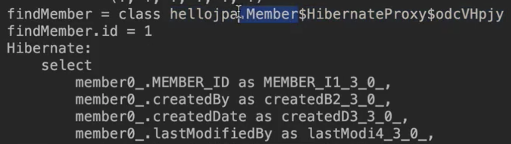

# 프록시


## 1. 왜 사용하는지?

- Team과 연관관계가 있는 Member를 조회할 때 Team도 함께 조회해야 할까?
- 어떻게 해야 Member만 가져올 수 있게 최적화를 할 수 있을까?


## 2. 프록시 기초

- em.find() vs em.getReference()

  - em.find() : 데이터베이스를 통해서 실제 엔티티 객체 조회

    - em.find()이 실행되는 시점에 쿼리가 날라감.

  - em.getReference(): **데이터베이스 조회를 미루는 가짜(프록시) 엔티티 객체 조회**

    - DB에 쿼리가 안 날라가는 데, 조회가 되는 것.

    - 즉 실제로 사용될 때, 쿼리가 날라감

    - ```java
      Member findMember = em.getReference(Member.class, member.getId());//이 시점에는 쿼리 x
      System.out.println(findMember.getUsername());//이 시점에서 select 쿼리가 날라감
      ```

    - 저 findMember의 클래스를 보면

    - 

    - Hibernate가 만든 Proxy 객체 임을 알 수 있다.