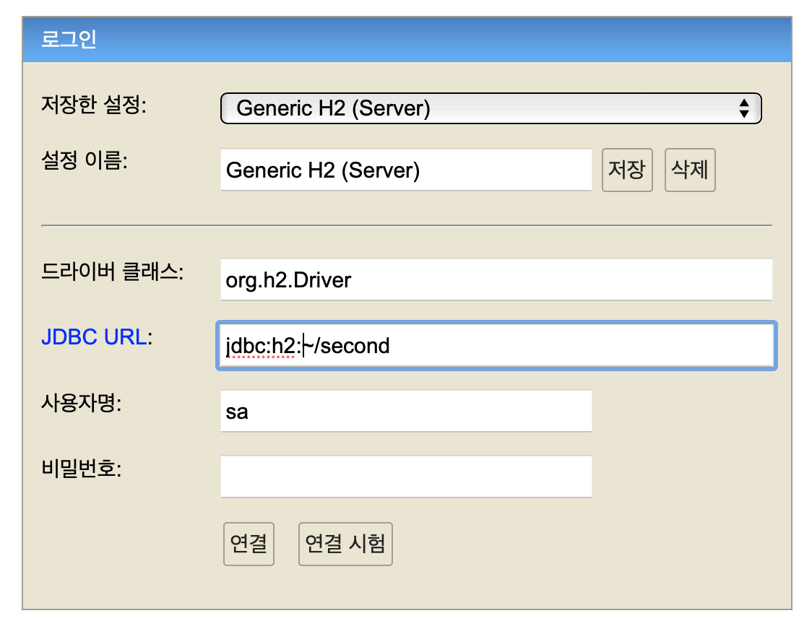
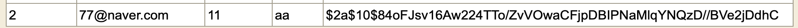
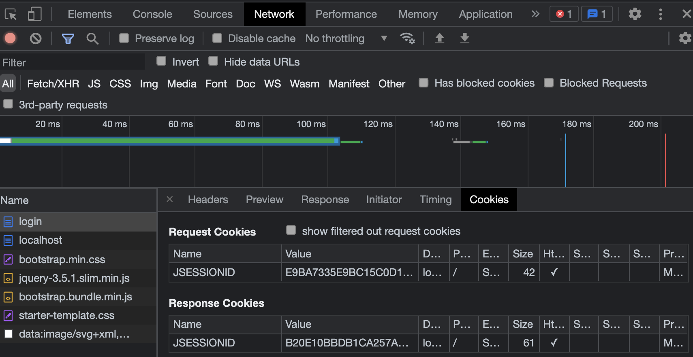
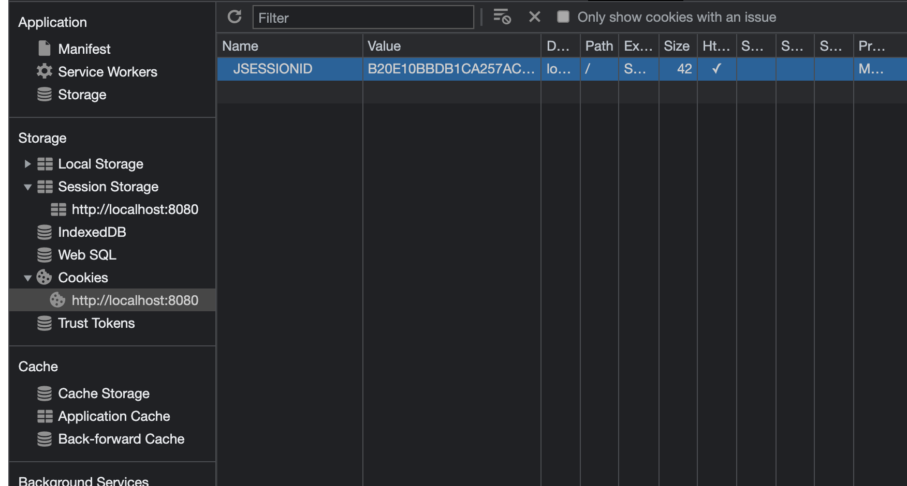

# 웹(Web)
## environment
* IDE : IntelliJ
* Database : H2
* Build Tool : Gradle
* Java.ver : 8
* Framework : spring - boot 2.5.6


## function

1. 회원
   1. 회원 등록
   
   2. 로그인
   
   3. 회원 목록 - Admin 전용
   
   4. 회원 추방 -  Admin 전용
   
   5. 회원 탈퇴
   
2. 상품
   1. 상품 등록 - Provider 전용
   2. 상품 제거 - Provider, Admin 전용
   3. 상품 목록
   4. 상품 장바구니
   5. 상품 관리 - Provider, Admin 전용
3. 주문
   1. 주문 목록
   2. 상품 주문
   3. 주문 취소
   4. 주문 반품
   5. 상품 주문 목록 - 누가 몇개 샀는지(Provider 전용)
4. 기타
   1. QnA 게시판 - Comment로 답변
   2. 이메일 질문(1:1) - Admin 이메일로 전송.


## Dependency
```
dependencies {
    implementation 'org.springframework.boot:spring-boot-starter-data-jpa'
    implementation 'org.springframework.boot:spring-boot-starter-thymeleaf'
    implementation 'org.springframework.boot:spring-boot-starter-web'
    implementation 'org.springframework.boot:spring-boot-devtools'
    compileOnly 'org.projectlombok:lombok'
    runtimeOnly 'com.h2database:h2'
    annotationProcessor 'org.projectlombok:lombok'
    testImplementation 'org.springframework.boot:spring-boot-starter-test'
}
```


## H2 DB 생성

1. https://www.h2database.com/로 접속 후 자신에게 맞는 버전 설치.
2. 압축 풀고 터미널로 h2 실행
   - ./h2.sh
3. 실행하기 전에 h2.sh의 권한을 사용할 수 있게 풀어 준다
   - chmod +x h2.sh
4. DB 생성
   - 
   - 위에 스샷에서 second가 DB 이름이다.
5. DB 접속 
   - JDBC URL에 jdbc:h2:tcp://localhost/~/second 입력 후 연결.


## 1 - 1. 회원 등록

- 구현 안한 것
  - 시큐리티
  - 에러 처리(validated)

- User Entity

  ```java
  package com.example.secondproject.domain.user;
  
  import lombok.AllArgsConstructor;
  import lombok.Getter;
  import lombok.NoArgsConstructor;
  import lombok.Setter;
  
  import javax.persistence.*;
  
  @Entity
  @Getter
  @Setter
  @NoArgsConstructor
  public class User {
  
      @Id
      @GeneratedValue(strategy = GenerationType.IDENTITY)
      @Column(name = "USER_ID")
      private Long id;
  
      private String loginid;
  
      private String name;
  
      private String password;
  
      private String email;
  
      public User(String loginid, String name, String password, String email) {
          this.loginid = loginid;
          this.name = name;
          this.password = password;
          this.email = email;
      }
  
      //주소는 api사용
  
  }
  
  ```

  

- User Dto(//RegisterForm.class)

- ```java
  package com.example.secondproject.dto;
  
  import lombok.Data;
  import lombok.Getter;
  
  import javax.validation.constraints.Email;
  import javax.validation.constraints.NotBlank;
  import javax.validation.constraints.Size;
  
  @Data
  public class RegisterForm {
  
      @NotBlank(message = "id를 꼭 입력해 주세요")
      @Size(min = 5, max = 15, message = "id는 최소 5, 최대 15글자를 입력해주세요")
      private String loginId;
  
      @NotBlank
      private String password;
  
      @NotBlank
      private String name;
  
      @Email(message = "이메일 양식에 맞춰서 입력해주세요")
      @NotBlank(message = "이메일을 입력해주세요")//@Email이 null도 허용
      private String email;
  
      //@Pattern(regexp = "(01[016789])(\\d{3,4})(\\d{4})", message = "올바른 휴대폰 번호를 입력해주세요.")
      //핸드폰 번호
  
  }
  
  ```

  - 우선 NotBlank로 항상 비어있어서는 안된다는 조건을 단다. NotBlank는 "" " "도 캐치하므로 NotBlank를 사용하는 것이 좋다.
  - Email은 javax에서 email형식을 맞춰서 제약조건을 걸어준다.

- User Repository

```java
package com.example.secondproject.repository;

import com.example.secondproject.domain.user.User;
import org.springframework.data.jpa.repository.JpaRepository;
import org.springframework.stereotype.Repository;

import java.util.Optional;

@Repository
public interface UserRepository extends JpaRepository<User, Long>{

    User findByLoginid(String loginid);

}

```

- User Service

```java
package com.example.secondproject.service;

import com.example.secondproject.domain.user.User;
import com.example.secondproject.repository.UserRepository;
import lombok.RequiredArgsConstructor;
import lombok.extern.slf4j.Slf4j;
import org.springframework.security.crypto.password.PasswordEncoder;
import org.springframework.stereotype.Service;
import org.springframework.transaction.annotation.Transactional;

import javax.annotation.PostConstruct;
import java.util.List;


@Service
@Slf4j
@RequiredArgsConstructor
public class UserService {

    private final UserRepository userRepository;

    private final PasswordEncoder passwordEncoder;

    @Transactional
    public void createUser(User user) {
        //password 암호화.
        String encodedPassword = passwordEncoder.encode(user.getPassword());
        user.setPassword(encodedPassword);
        userRepository.save(user);
    }

    //password가 일치하지 않을 경우, null 반환.
    //findByLoginId의 반환이 optional이므로 null 반환 가능
    public boolean validationLogin(String loginId, String password) {
        User loginUser = userRepository.findByLoginid(loginId);

        if(loginUser == null){
            System.out.println("해당 아이디의 유저가 존재하지 않습니다");
            return false;
        }

        if (!passwordEncoder.matches(password, loginUser.getPassword())) {
            System.out.println("비밀번호가 일치하지 않습니다.");
            return false;
        }

        return true;
    }


    @Transactional
    @PostConstruct
    public void initUserDb() {
        User user = new User("test", "김정우",
                "test", "test@naver.com");
        String encodedPassword = passwordEncoder.encode(user.getPassword());
        user.setPassword(encodedPassword);
        userRepository.save(user);
    }


    public List<User> findAllUsers() {return userRepository.findAll();}

}
```


- Join Form (회원 등록할 때 사용하는 Dto)


```java
package com.example.secondproject.dto;

import lombok.Data;

@Data
public class LoginForm {
    private String loginid;
    private String password;
}

```


- 쿠키, 세션
  - 

- 아이디, 이메일 중복 체크

```

```


- 암호화

  - 암화화는 아래와 같이 config class를 만들어서 WebSecurityConfigurerAdapter를 상속받으면 PasswordEncoder 객체를 만들 수 있음. 객체를 사용하여 BCryptPasswordEncoder()객체를 받음.

  - ```java
    @Configuration
    @EnableWebSecurity
    public class WebSecurityConfig extends WebSecurityConfigurerAdapter {
    
        @Bean
        public PasswordEncoder getPasswordEncoder() {
            return new BCryptPasswordEncoder();
        }
    
        @Override
        protected void configure(HttpSecurity http) throws Exception {
            http.cors().disable()
                    .csrf().disable()
                    .formLogin().disable()
                    .headers().frameOptions().disable();
        }
    
    
    }
    ```

    

  


## 1 - 2. 로그인

1. 구현 안한 것
   1. 시큐리티
   2. 에러 처리(validated)
   3. 세션, 쿠키


우선 시큐리티를 적용하기 전에 간단하게 용어 정리 먼저 해야한다.

- Authentication
  - 인증
  - 애플리케이션에서는 인증에서 사용되는 객체


기본적으로 스프링 시큐리티는 **쿠키-세션 방식**을 사용한다. 대략적으로 설명하자면 클라이언트가 /login 요청을하여 로그인을 한다면 key-value로 spring security의 인메모리 세션저장소인 SecurityContextHolder에 저장한다. 로그인id가 value로 들어가고 랜덤한 값이 SessionId(key)에 들어간다.

서버에서 로그인이 정상적으로 된다면 응답 메시지에 set-cookie에 SessionId를 넣어서 보내준다.

클라이언트는 SessionId를 가지고 있는 쿠키를 브라우저에 있는 쿠키 저장소에 저장한다. 그 다음 클라이언트가 새로운 요청을 한다면 요청 Http에 SessionId를 포함한 값을 같이 보낸다. 

그러면 서버는 db에 저장되어있는 SessionId를 가지고 인증을 한 후에 응답을 한다.



위 스크린 샷은 로그인 성공한 응답을 받은 후의 모습이다. Request Cookies에 value값이 E9~이지만 로그인 인증 후에는 응답에 유저에 해당하는 랜덤한 SessionId값이 주어진 것을 알 수 있다.




위 스크린샷은 브라우저의 저장소를 보면 쿠키 저장소에 JSESSIONID값이 위에 응답 쿠키 value랑 같은 것을 알 수 있다.


쿠키-세션 방식의 장점은 서버쪽에서 Session 관리를 할 수 있으며 네트워크 부하가 적다는 것이 장점이다. 단점으로는 세션 저장소를 사용함으로써 서버에 부하가 간다는 것이다.


나중에 쿠키-세션 방식이 아닌 다른 방식으로도 하는 것을 추가로 업데이트할 예정이다.


위에서 만들었던 회원등록도 post 방식으로 form 전송을 하므로 csrf를 사용한다. 그래서 현재 상태에서는 정상적으로 작동을 하지 않는다. 그렇기에 disable을 하여 csrf를 작동하지 못하게 한다.

csrf는 데이터 변조 공격이므로 csrf을 적용 후에는 모든 POST방식의 데이터 전송에 토큰 값이 있어야 한다. GET 방식을 제외한 POST, PATCH, DELETE 메서드에만 적용됩니다.

토큰 값을 세션에 지정된 이름으로 저장돼있기 때문에 아래와 같이 Form 태그 안에 삽입해주면 된다.

```html
<input type="hidden" name="${_csrf.parameterName}" value="${_csrf.token}" />
```


sec의 태그를 사용하기 위해서는 

```
implementation group: 'org.thymeleaf.extras', name: 'thymeleaf-extras-springsecurity5', version: '3.0.4.RELEASE'
```

```java
@Bean
    public SpringSecurityDialect springSecurityDialect() {
        return new SpringSecurityDialect();
    }
```

를 추가하고 html파일에 

```html
<html lang="en" xmlns:th="http://www.thymeleaf.org/" xmlns:sec="http://www.thymeleaf.org/extras/spring-security">

```

을 작성하면 sec태그를 사용할 수 있다.

버튼에 아래와 같은 코드를 추가로 입력할 하면 권한이나 인증된 상태에 따라서 해당 버튼이 보이거나 안 보이게 할 수 있다.

```html
sec:authorize="isAnonymous()"
sec:authorize="isAuthenticated()"
sec:authorize="hasRole()"
```

- isAnonymous() : 익명의 사용자
- isAuthenticated() : 인증된 사용자(로그인된 회원)
- hasRole() : 부여된 특정 롤에 따라서 보여짐.
  - sec:authorize="hasRole("ROLE_ADMIN")" : admin 롤을 가진 회원에게 보여짐.

```html
<a sec:authorize="isAnonymous()" class="btn btn-secondary mr-2 my-2 my-sm-0" th:href="@{/register}">회원가입</a>
        <a sec:authorize="isAnonymous()" class="btn btn-secondary my-2 my-sm-0" th:href="@{/login}">로그인</a> <!-- 로그인이 안된 경우  -->
        <a sec:authorize="isAuthenticated()" class="btn btn-secondary my-2 my-sm-0" th:href="@{/logout}">로그아웃</a> <!-- 로그인이 안된 경우  -->
```

로그인 전에는 모든 사용자가 볼 수 있도록 설정한 상태, 로그인 후에는 로그아웃만 보여지게 만든 것.


WebSecurityConfig.java

```java
package com.example.secondproject.config;

import com.example.secondproject.login.CustomUserDetailsService;
import lombok.AllArgsConstructor;
import org.springframework.context.annotation.Bean;
import org.springframework.context.annotation.Configuration;
import org.springframework.security.config.annotation.authentication.builders.AuthenticationManagerBuilder;
import org.springframework.security.config.annotation.web.builders.HttpSecurity;
import org.springframework.security.config.annotation.web.configuration.EnableWebSecurity;
import org.springframework.security.config.annotation.web.configuration.WebSecurityConfigurerAdapter;
import org.springframework.security.crypto.bcrypt.BCryptPasswordEncoder;
import org.springframework.security.crypto.password.PasswordEncoder;
import org.thymeleaf.extras.springsecurity5.dialect.SpringSecurityDialect;

@Configuration
@EnableWebSecurity
@AllArgsConstructor
public class WebSecurityConfig extends WebSecurityConfigurerAdapter {

    private final CustomUserDetailsService customUserDetailsService;

    @Bean
    public SpringSecurityDialect springSecurityDialect() {
        return new SpringSecurityDialect();
    }

    @Bean
    public PasswordEncoder passwordEncoder() {
        return new BCryptPasswordEncoder();
    }

    @Override
    protected void configure(HttpSecurity http) throws Exception {
        http.csrf().disable().authorizeRequests()
                .antMatchers("/users").hasRole("ADMIN")//자동으로 ROLE_이 붙어서 ROLE_ADMIN으로 됨.
                .antMatchers("/**").permitAll()
                .and()
                .formLogin()
                .loginPage("/login")
                .defaultSuccessUrl("/")
                .permitAll()
                .and()
                .logout()
                .logoutSuccessUrl("/")
                .invalidateHttpSession(true)
                .and()
                .exceptionHandling().accessDeniedPage("/users/denied");

    }

    @Override
    protected void configure(AuthenticationManagerBuilder auth) throws Exception {
        auth.userDetailsService(customUserDetailsService).passwordEncoder(passwordEncoder());
    }

}

```

Member.java

```java
package com.example.secondproject.domain.user;

import lombok.*;

import javax.persistence.*;
import java.util.List;

@Entity
@Getter
@Setter
@NoArgsConstructor
public class Member {

    @Id
    @GeneratedValue(strategy = GenerationType.IDENTITY)
    @Column(name = "MEMBER_ID")
    private Long id;

    private String loginid;

    private String name;

    private String password;

    private String email;

    private String role;


    public Member(String loginid, String name, String password, String email, String role) {

        this.loginid = loginid;
        this.name = name;
        this.password = password;
        this.email = email;
        this.role = role;
    }

    //주소는 api사용

}

```

MemberController.java

```java
package com.example.secondproject.controller;

import com.example.secondproject.domain.user.Member;
import com.example.secondproject.dto.RegisterForm;
import com.example.secondproject.service.MemberService;
import lombok.AllArgsConstructor;
import lombok.extern.slf4j.Slf4j;
import org.springframework.security.core.context.SecurityContextHolder;
import org.springframework.security.web.authentication.logout.SecurityContextLogoutHandler;
import org.springframework.stereotype.Controller;
import org.springframework.ui.Model;
import org.springframework.validation.BindingResult;
import org.springframework.validation.annotation.Validated;
import org.springframework.web.bind.annotation.GetMapping;
import org.springframework.web.bind.annotation.ModelAttribute;
import org.springframework.web.bind.annotation.PostMapping;

import javax.servlet.http.HttpServletRequest;
import javax.servlet.http.HttpServletResponse;
import java.util.List;

@Controller
@Slf4j
@AllArgsConstructor
public class MemberController {

    private final MemberService memberService;
    //회원가입
    @GetMapping("/register")
    public String joinForm(@ModelAttribute RegisterForm registerForm) {
        return "users/register";
    }

    @PostMapping("/register")
    public String join(@ModelAttribute @Validated RegisterForm registerForm,
                       BindingResult bindingResult)
    {
        if (bindingResult.hasErrors()) {
            log.info(bindingResult.toString());
            return "users/register";
        }

        Member newMember = new Member(registerForm.getLoginid(), registerForm.getName(),
                registerForm.getPassword(), registerForm.getEmail(), "MEMBER");
//        newMember.setLoginid(registerForm.getLoginid());
//        newMember.setName(registerForm.getName());
//        newMember.setPassword(registerForm.getPassword());
//        newMember.setEmail(registerForm.getEmail());

        memberService.createUser(newMember);

        return "redirect:/";
    }

//로그인
    @GetMapping("/login")
    public String memberLogin() {
        return "users/loginForm";
    }

    @GetMapping("/login/denied")
    public String memberLoginDenied(){
        return "/users/denied";
    }

    @GetMapping("/logout")
    public String memberLogout(HttpServletRequest request, HttpServletResponse response) {
        new SecurityContextLogoutHandler().logout(request, response, SecurityContextHolder.getContext().getAuthentication());
        return "redirect:/";
    }


    //유저 목록
    @GetMapping("/users")
    public String userList(Model model) {

        List<Member> members = memberService.findAllMembers();

        model.addAttribute("users", members);

        return "users/list";
    }


}

```


CustomUserDetailsService.java

```java
package com.example.secondproject.login;

import com.example.secondproject.domain.user.Member;
import com.example.secondproject.repository.MemberRepository;
import lombok.AllArgsConstructor;
import org.springframework.security.core.GrantedAuthority;
import org.springframework.security.core.authority.SimpleGrantedAuthority;
import org.springframework.security.core.userdetails.UserDetails;
import org.springframework.security.core.userdetails.UserDetailsService;
import org.springframework.security.core.userdetails.UsernameNotFoundException;
import org.springframework.stereotype.Service;

import java.util.ArrayList;
import java.util.List;
import java.util.Optional;

@Service
@AllArgsConstructor
public class CustomUserDetailsService implements UserDetailsService {

    private final MemberRepository memberRepository;


    @Override
    public UserDetails loadUserByUsername(String loginId) throws UsernameNotFoundException {
        Optional<Member> memberEntityWrapper = memberRepository.findByLoginid(loginId);
        Member member = memberEntityWrapper.get();


        List<GrantedAuthority> authorities = new ArrayList<>();
        authorities.add(new SimpleGrantedAuthority("ROLE_"+member.getRole()));


        return new MemberAccount(member, authorities);
    }
}

```


MemberAccount.java

```java
package com.example.secondproject.login;

import com.example.secondproject.domain.user.Member;
import org.springframework.security.core.GrantedAuthority;
import org.springframework.security.core.userdetails.User;

import java.util.Collection;

public class MemberAccount extends User {
    private final Member member;
    public MemberAccount(Member member, Collection<? extends GrantedAuthority> authorities) {
        super(member.getLoginid(), member.getPassword(), authorities);
        this.member = member;
    }

    public Member getMember() {
        return member;
    }

}

```


loginForm.html

```html
<!doctype html>
<html xmlns:th="http://www.thymeleaf.org">
<head th:replace="fragments/common ::head('Second')">

</head>

<body>
<nav class="navbar navbar-expand-md navbar-dark bg-dark fixed-top" th:replace="fragments/common :: menu('board')">
</nav>

<div class="container">

    <div class="py-5 text-center">
        <h2>로그인</h2>
    </div>
    <form role="form" action="/login" method="post">
        <div>
            <label>로그인 ID</label>
            <input type="text" name="username">
        </div>
        <div>
            <label>비밀번호</label>
            <input type="password" name="password">
        </div>

        <hr class="my-4">

        <div class="row">
            <div class="col">
                <button class="w-50 btn btn-primary btn-lg" type="submit">로그인</button>
            </div>
            <div class="col">
                <button class="w-50 btn btn-secondary btn-lg" onclick="location.href='items.html'"
                        th:onclick="|location.href='@{/}'|"
                        type="button">취소</button>
            </div>
        </div>

    </form>
    <script src="https://code.jquery.com/jquery-3.5.1.slim.min.js" integrity="sha384-DfXdz2htPH0lsSSs5nCTpuj/zy4C+OGpamoFVy38MVBnE+IbbVYUew+OrCXaRkfj" crossorigin="anonymous"></script>
    <script>window.jQuery || document.write('<script src="/docs/4.5/assets/js/vendor/jquery.slim.min.js"><\/script>')</script><script src="/docs/4.5/dist/js/bootstrap.bundle.min.js" integrity="sha384-ho+j7jyWK8fNQe+A12Hb8AhRq26LrZ/JpcUGGOn+Y7RsweNrtN/tE3MoK7ZeZDyx" crossorigin="anonymous"></script>
    <script src="form-validation.js"></script>
</body>

</html>
```


- 참고 : log로 http 메시지 보기
  - 인터셉터를 사용
  - 


## 1 - 3. 회원 목록


회원 목록에 페이징을 사용하여 페이지를 분할할 것이다. 우선 현재 토이프로젝트에서는 view도 타임리프로 대략적으로 개발중이라서 타임리프에서 대부분 개발을 하지만 추후에 api로 paging하는 방법도 업로드할 예정이다.

페이징에는 querydsl와 스프링 데이터 jpa를 사용하여 개발할 것이다.

querydsl을 사용하기 위해서는 아래와 같이 build.gradle을 세팅한다.

```
plugins {
    id 'org.springframework.boot' version '2.5.6'
    id 'io.spring.dependency-management' version '1.0.11.RELEASE'
    id "com.ewerk.gradle.plugins.querydsl" version "1.0.10"
    id 'java'
}

group = 'com.example'
version = '0.0.1-SNAPSHOT'
sourceCompatibility = '1.8'

configurations {
    compileOnly {
        extendsFrom annotationProcessor
    }
}

repositories {
    mavenCentral()
}

dependencies {
    implementation 'org.springframework.boot:spring-boot-starter-data-jpa'
    implementation 'org.springframework.boot:spring-boot-starter-thymeleaf'
    implementation 'org.springframework.boot:spring-boot-starter-web'
    implementation 'org.springframework.boot:spring-boot-devtools'
    implementation 'org.springframework.boot:spring-boot-starter-validation'
    implementation 'org.springframework.boot:spring-boot-starter-security'
    implementation 'junit:junit:4.13.1'
    implementation group: 'org.thymeleaf.extras', name: 'thymeleaf-extras-springsecurity5', version: '3.0.4.RELEASE'
    implementation 'com.querydsl:querydsl-jpa'
    compileOnly 'org.projectlombok:lombok'
    runtimeOnly 'com.h2database:h2'
    annotationProcessor 'org.projectlombok:lombok'
    testImplementation 'org.springframework.boot:spring-boot-starter-test'

}

test {
    useJUnitPlatform()
}

//querydsl 추가 시작
def querydslDir = "$buildDir/generated/querydsl"
querydsl {
    jpa = true
    querydslSourcesDir = querydslDir
}
sourceSets {
    main.java.srcDir querydslDir
}
configurations {
    querydsl.extendsFrom compileClasspath }
compileQuerydsl {
    options.annotationProcessorPath = configurations.querydsl
}
//querydsl 추가 끝
```


## 1 - 4. 회원 추방


MemberController.java

```java
@DeleteMapping("/users/{memberId}/delete")
    public String deleteForm(@PathVariable("memberId") Long memberId) {
        log.info("BoardController DeleteMapping deleteForm");
        memberService.deleteMember(memberId);
        return "redirect:/admin/users";
    }
```

MemberService.java

```java
@Transactional
    public void deleteMember(Long memberId) {
        memberRepository.deleteById(memberId);
    }
```

MemberRepository.java

```java
@Repository
public interface MemberRepository extends JpaRepository<Member, Long>{

    Optional<Member> findByLoginid(String LoginId);

    Member findOneById(Long id);
}
```

memberDetail.java

```html
<!doctype html>
<html xmlns:th="http://www.thymeleaf.org">
<head th:replace="fragments/common ::head('My frist')">
</head>


<body>
<nav class="navbar navbar-expand-md navbar-dark bg-dark fixed-top" th:replace="fragments/common :: menu('join')">
</nav>
<script src="https://code.jquery.com/jquery-3.5.1.slim.min.js" integrity="sha384-DfXdz2htPH0lsSSs5nCTpuj/zy4C+OGpamoFVy38MVBnE+IbbVYUew+OrCXaRkfj" crossorigin="anonymous"></script>
<script src="https://cdn.jsdelivr.net/npm/bootstrap@4.5.3/dist/js/bootstrap.bundle.min.js" integrity="sha384-ho+j7jyWK8fNQe+A12Hb8AhRq26LrZ/JpcUGGOn+Y7RsweNrtN/tE3MoK7ZeZDyx" crossorigin="anonymous"></script>
</body>

<!--내용-->
<style>
    .fieldError {
        border-color: #bd2130;
    }
</style>
<body class="bg-light">
<div class="container">
    <hr/>
    <div class="row">
        <div class="col-md-10">
            <table class="table table-condensed">
                <thead>
                <tr>
                    <th>이름</th>
                    <td th:text="${memberForm.name}"></td>
                </tr>
                </thead>
                <tbody>
                <tr>
                    <th>아이디</th>
                    <td th:text="${memberForm.loginid}"></td>
                </tr>
                <tr>
                    <th>이메일</th>
                    <td th:text="${memberForm.email}"></td>
                </tr>
                <tr>
                    <th>권한</th>
                    <td th:text="${memberForm.role}"></td>
                </tr>
                <tr>
                    <th>주소</th>
                </tr>
                <tr>
                    <th>연락처</th>
                </tr>
                </tbody>
            </table>
            <div class="text-right">
                <a type="button" class="btn btn-primary" th:href="@{/users/{id}/edit(id=${memberForm.id})}" methods="get">수정</a>
                <form id="delete-form" th:action="@{/users/{id}/delete(id=${memberForm.id})}" method="post">
                    <input type="hidden" name="_method" value="delete"/>
                    <button type="submit" class="btn btn-primary">회원 추방</button>
                </form>
                <!--            <a type="button" class="btn btn-primary" th:href="@{/boards/{id}/delete(id=${boardForm.id})}">삭제</a>-->
                <a type="button" class="btn btn-primary" th:href="@{/admin/users}">회원 목록</a>
            </div>
        </div>
    </div>
    <hr/>
</div>
<script src="https://code.jquery.com/jquery-3.5.1.slim.min.js" integrity="sha384-DfXdz2htPH0lsSSs5nCTpuj/zy4C+OGpamoFVy38MVBnE+IbbVYUew+OrCXaRkfj" crossorigin="anonymous"></script>
<script>window.jQuery || document.write('<script src="/docs/4.5/assets/js/vendor/jquery.slim.min.js"><\/script>')</script><script src="/docs/4.5/dist/js/bootstrap.bundle.min.js" integrity="sha384-ho+j7jyWK8fNQe+A12Hb8AhRq26LrZ/JpcUGGOn+Y7RsweNrtN/tE3MoK7ZeZDyx" crossorigin="anonymous"></script>
<script src="form-validation.js"></script>
</body>

</html>
```


## 1 - 5. 회원 탈퇴

