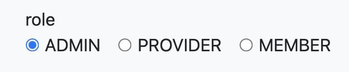

# 웹(Web)
## environment
* IDE : IntelliJ
* Database : H2
* Build Tool : Gradle
* Java.ver : 8
* Framework : spring - boot 2.5.6


## function

1. 회원
   1. 회원 등록
   
   2. 로그인
   
   3. 회원 목록 - Admin 전용
   
   4. 회원 추방 -  Admin 전용
   
   5. 회원 탈퇴
   
2. 상품
   1. 상품 등록 - Provider 전용
   2. 상품 제거 - Provider, Admin 전용
   3. 상품 목록
   4. 상품 장바구니
   5. 상품 관리 - Provider, Admin 전용
3. 주문
   1. 주문 목록
   2. 상품 주문
   3. 주문 취소
   4. 주문 반품
   5. 상품 주문 목록 - 누가 몇개 샀는지(Provider 전용)
4. 기타
   1. QnA 게시판 - Comment로 답변
   2. 이메일 질문(1:1) - Admin 이메일로 전송.


- 리팩토링 할 때, 엔티티 @Setter 제거하기

- 모든 연관관계는 지연로딩, XtoOne은 기본이 EAGER

- EAGER가 필요하다면 fetch join 또는 엔티티 그래프 기능 사용

  

## Dependency
```
dependencies {
    implementation 'org.springframework.boot:spring-boot-starter-data-jpa'
    implementation 'org.springframework.boot:spring-boot-starter-thymeleaf'
    implementation 'org.springframework.boot:spring-boot-starter-web'
    implementation 'org.springframework.boot:spring-boot-devtools'
    compileOnly 'org.projectlombok:lombok'
    runtimeOnly 'com.h2database:h2'
    annotationProcessor 'org.projectlombok:lombok'
    testImplementation 'org.springframework.boot:spring-boot-starter-test'
}
```


## H2 DB 생성

1. https://www.h2database.com/로 접속 후 자신에게 맞는 버전 설치.
2. 압축 풀고 터미널로 h2 실행
   - ./h2.sh
3. 실행하기 전에 h2.sh의 권한을 사용할 수 있게 풀어 준다
   - chmod +x h2.sh
4. DB 생성
   - 
   - 위에 스샷에서 second가 DB 이름이다.
5. DB 접속 
   - JDBC URL에 jdbc:h2:tcp://localhost/~/second 입력 후 연결.


## 1 - 1. 회원 등록

- 구현 안한 것
  - 시큐리티
  - 에러 처리(validated)

- User Entity

  ```java
  package com.example.secondproject.domain.user;
  
  import lombok.AllArgsConstructor;
  import lombok.Getter;
  import lombok.NoArgsConstructor;
  import lombok.Setter;
  
  import javax.persistence.*;
  
  @Entity
  @Getter
  @Setter
  @NoArgsConstructor
  public class User {
  
      @Id
      @GeneratedValue(strategy = GenerationType.IDENTITY)
      @Column(name = "USER_ID")
      private Long id;
  
      private String loginid;
  
      private String name;
  
      private String password;
  
      private String email;
  
      public User(String loginid, String name, String password, String email) {
          this.loginid = loginid;
          this.name = name;
          this.password = password;
          this.email = email;
      }
  
      //주소는 api사용
  
  }
  
  ```

  

- User Dto(//RegisterForm.class)

- ```java
  package com.example.secondproject.dto;
  
  import lombok.Data;
  import lombok.Getter;
  
  import javax.validation.constraints.Email;
  import javax.validation.constraints.NotBlank;
  import javax.validation.constraints.Size;
  
  @Data
  public class RegisterForm {
  
      @NotBlank(message = "id를 꼭 입력해 주세요")
      @Size(min = 5, max = 15, message = "id는 최소 5, 최대 15글자를 입력해주세요")
      private String loginId;
  
      @NotBlank
      private String password;
  
      @NotBlank
      private String name;
  
      @Email(message = "이메일 양식에 맞춰서 입력해주세요")
      @NotBlank(message = "이메일을 입력해주세요")//@Email이 null도 허용
      private String email;
  
      //@Pattern(regexp = "(01[016789])(\\d{3,4})(\\d{4})", message = "올바른 휴대폰 번호를 입력해주세요.")
      //핸드폰 번호
  
  }
  
  ```

  - 우선 NotBlank로 항상 비어있어서는 안된다는 조건을 단다. NotBlank는 "" " "도 캐치하므로 NotBlank를 사용하는 것이 좋다.
  - Email은 javax에서 email형식을 맞춰서 제약조건을 걸어준다.

- User Repository

```java
package com.example.secondproject.repository;

import com.example.secondproject.domain.user.User;
import org.springframework.data.jpa.repository.JpaRepository;
import org.springframework.stereotype.Repository;

import java.util.Optional;

@Repository
public interface UserRepository extends JpaRepository<User, Long>{

    User findByLoginid(String loginid);

}

```

- User Service

```java
package com.example.secondproject.service;

import com.example.secondproject.domain.user.User;
import com.example.secondproject.repository.UserRepository;
import lombok.RequiredArgsConstructor;
import lombok.extern.slf4j.Slf4j;
import org.springframework.security.crypto.password.PasswordEncoder;
import org.springframework.stereotype.Service;
import org.springframework.transaction.annotation.Transactional;

import javax.annotation.PostConstruct;
import java.util.List;


@Service
@Slf4j
@RequiredArgsConstructor
public class UserService {

    private final UserRepository userRepository;

    private final PasswordEncoder passwordEncoder;

    @Transactional
    public void createUser(User user) {
        //password 암호화.
        String encodedPassword = passwordEncoder.encode(user.getPassword());
        user.setPassword(encodedPassword);
        userRepository.save(user);
    }

    //password가 일치하지 않을 경우, null 반환.
    //findByLoginId의 반환이 optional이므로 null 반환 가능
    public boolean validationLogin(String loginId, String password) {
        User loginUser = userRepository.findByLoginid(loginId);

        if(loginUser == null){
            System.out.println("해당 아이디의 유저가 존재하지 않습니다");
            return false;
        }

        if (!passwordEncoder.matches(password, loginUser.getPassword())) {
            System.out.println("비밀번호가 일치하지 않습니다.");
            return false;
        }

        return true;
    }


    @Transactional
    @PostConstruct
    public void initUserDb() {
        User user = new User("test", "김정우",
                "test", "test@naver.com");
        String encodedPassword = passwordEncoder.encode(user.getPassword());
        user.setPassword(encodedPassword);
        userRepository.save(user);
    }


    public List<User> findAllUsers() {return userRepository.findAll();}

}
```


- Join Form (회원 등록할 때 사용하는 Dto)


```java
package com.example.secondproject.dto;

import lombok.Data;

@Data
public class LoginForm {
    private String loginid;
    private String password;
}

```


- 쿠키, 세션
  - 

- 아이디, 이메일 중복 체크

```

```


- 암호화

  - 암화화는 아래와 같이 config class를 만들어서 WebSecurityConfigurerAdapter를 상속받으면 PasswordEncoder 객체를 만들 수 있음. 객체를 사용하여 BCryptPasswordEncoder()객체를 받음.

  - ```java
    @Configuration
    @EnableWebSecurity
    public class WebSecurityConfig extends WebSecurityConfigurerAdapter {
    
        @Bean
        public PasswordEncoder getPasswordEncoder() {
            return new BCryptPasswordEncoder();
        }
    
        @Override
        protected void configure(HttpSecurity http) throws Exception {
            http.cors().disable()
                    .csrf().disable()
                    .formLogin().disable()
                    .headers().frameOptions().disable();
        }
    
    
    }
    ```

    

  


## 1 - 2. 로그인

1. 구현 안한 것
   1. 시큐리티
   2. 에러 처리(validated)
   3. 세션, 쿠키


우선 시큐리티를 적용하기 전에 간단하게 용어 정리 먼저 해야한다.

- Authentication
  - 인증
  - 애플리케이션에서는 인증에서 사용되는 객체


기본적으로 스프링 시큐리티는 **쿠키-세션 방식**을 사용한다. 대략적으로 설명하자면 클라이언트가 /login 요청을하여 로그인을 한다면 key-value로 spring security의 인메모리 세션저장소인 SecurityContextHolder에 저장한다. 로그인id가 value로 들어가고 랜덤한 값이 SessionId(key)에 들어간다.

서버에서 로그인이 정상적으로 된다면 응답 메시지에 set-cookie에 SessionId를 넣어서 보내준다.

클라이언트는 SessionId를 가지고 있는 쿠키를 브라우저에 있는 쿠키 저장소에 저장한다. 그 다음 클라이언트가 새로운 요청을 한다면 요청 Http에 SessionId를 포함한 값을 같이 보낸다. 

그러면 서버는 db에 저장되어있는 SessionId를 가지고 인증을 한 후에 응답을 한다.


위 스크린 샷은 로그인 성공한 응답을 받은 후의 모습이다. Request Cookies에 value값이 E9~이지만 로그인 인증 후에는 응답에 유저에 해당하는 랜덤한 SessionId값이 주어진 것을 알 수 있다.


위 스크린샷은 브라우저의 저장소를 보면 쿠키 저장소에 JSESSIONID값이 위에 응답 쿠키 value랑 같은 것을 알 수 있다.


쿠키-세션 방식의 장점은 서버쪽에서 Session 관리를 할 수 있으며 네트워크 부하가 적다는 것이 장점이다. 단점으로는 세션 저장소를 사용함으로써 서버에 부하가 간다는 것이다.


나중에 쿠키-세션 방식이 아닌 다른 방식으로도 하는 것을 추가로 업데이트할 예정이다.


위에서 만들었던 회원등록도 post 방식으로 form 전송을 하므로 csrf를 사용한다. 그래서 현재 상태에서는 정상적으로 작동을 하지 않는다. 그렇기에 disable을 하여 csrf를 작동하지 못하게 한다.

csrf는 데이터 변조 공격이므로 csrf을 적용 후에는 모든 POST방식의 데이터 전송에 토큰 값이 있어야 한다. GET 방식을 제외한 POST, PATCH, DELETE 메서드에만 적용됩니다.

토큰 값을 세션에 지정된 이름으로 저장돼있기 때문에 아래와 같이 Form 태그 안에 삽입해주면 된다.

```html
<input type="hidden" name="${_csrf.parameterName}" value="${_csrf.token}" />
```


sec의 태그를 사용하기 위해서는 

```
implementation group: 'org.thymeleaf.extras', name: 'thymeleaf-extras-springsecurity5', version: '3.0.4.RELEASE'
```

```java
@Bean
    public SpringSecurityDialect springSecurityDialect() {
        return new SpringSecurityDialect();
    }
```

를 추가하고 html파일에 

```html
<html lang="en" xmlns:th="http://www.thymeleaf.org/" xmlns:sec="http://www.thymeleaf.org/extras/spring-security">

```

을 작성하면 sec태그를 사용할 수 있다.

버튼에 아래와 같은 코드를 추가로 입력할 하면 권한이나 인증된 상태에 따라서 해당 버튼이 보이거나 안 보이게 할 수 있다.

```html
sec:authorize="isAnonymous()"
sec:authorize="isAuthenticated()"
sec:authorize="hasRole()"
```

- isAnonymous() : 익명의 사용자
- isAuthenticated() : 인증된 사용자(로그인된 회원)
- hasRole() : 부여된 특정 롤에 따라서 보여짐.
  - sec:authorize="hasRole("ROLE_ADMIN")" : admin 롤을 가진 회원에게 보여짐.

```html
<a sec:authorize="isAnonymous()" class="btn btn-secondary mr-2 my-2 my-sm-0" th:href="@{/register}">회원가입</a>
        <a sec:authorize="isAnonymous()" class="btn btn-secondary my-2 my-sm-0" th:href="@{/login}">로그인</a> <!-- 로그인이 안된 경우  -->
        <a sec:authorize="isAuthenticated()" class="btn btn-secondary my-2 my-sm-0" th:href="@{/logout}">로그아웃</a> <!-- 로그인이 안된 경우  -->
```

로그인 전에는 모든 사용자가 볼 수 있도록 설정한 상태, 로그인 후에는 로그아웃만 보여지게 만든 것.


WebSecurityConfig.java

```java
package com.example.secondproject.config;

import com.example.secondproject.login.CustomUserDetailsService;
import lombok.AllArgsConstructor;
import org.springframework.context.annotation.Bean;
import org.springframework.context.annotation.Configuration;
import org.springframework.security.config.annotation.authentication.builders.AuthenticationManagerBuilder;
import org.springframework.security.config.annotation.web.builders.HttpSecurity;
import org.springframework.security.config.annotation.web.configuration.EnableWebSecurity;
import org.springframework.security.config.annotation.web.configuration.WebSecurityConfigurerAdapter;
import org.springframework.security.crypto.bcrypt.BCryptPasswordEncoder;
import org.springframework.security.crypto.password.PasswordEncoder;
import org.thymeleaf.extras.springsecurity5.dialect.SpringSecurityDialect;

@Configuration
@EnableWebSecurity
@AllArgsConstructor
public class WebSecurityConfig extends WebSecurityConfigurerAdapter {

    private final CustomUserDetailsService customUserDetailsService;

    @Bean
    public SpringSecurityDialect springSecurityDialect() {
        return new SpringSecurityDialect();
    }

    @Bean
    public PasswordEncoder passwordEncoder() {
        return new BCryptPasswordEncoder();
    }

    @Override
    protected void configure(HttpSecurity http) throws Exception {
        http.csrf().disable().authorizeRequests()
                .antMatchers("/users").hasRole("ADMIN")//자동으로 ROLE_이 붙어서 ROLE_ADMIN으로 됨.
                .antMatchers("/**").permitAll()
                .and()
                .formLogin()
                .loginPage("/login")
                .defaultSuccessUrl("/")
                .permitAll()
                .and()
                .logout()
                .logoutSuccessUrl("/")
                .invalidateHttpSession(true)
                .and()
                .exceptionHandling().accessDeniedPage("/users/denied");

    }

    @Override
    protected void configure(AuthenticationManagerBuilder auth) throws Exception {
        auth.userDetailsService(customUserDetailsService).passwordEncoder(passwordEncoder());
    }

}

```

로그인 처리 방식은 form 로그인 처리 방식을 사용하였다. `UsernamePasswordAuthenticationFilter`에서 form 로그인 처리를 담당하는 필터이다.


Member.java

```java
package com.example.secondproject.domain.user;

import lombok.*;

import javax.persistence.*;
import java.util.List;

@Entity
@Getter
@Setter
@NoArgsConstructor
public class Member {

    @Id
    @GeneratedValue(strategy = GenerationType.IDENTITY)
    @Column(name = "MEMBER_ID")
    private Long id;

    private String loginid;

    private String name;

    private String password;

    private String email;

    private String role;


    public Member(String loginid, String name, String password, String email, String role) {

        this.loginid = loginid;
        this.name = name;
        this.password = password;
        this.email = email;
        this.role = role;
    }

    //주소는 api사용

}

```

MemberController.java

```java
package com.example.secondproject.controller;

import com.example.secondproject.domain.user.Member;
import com.example.secondproject.dto.RegisterForm;
import com.example.secondproject.service.MemberService;
import lombok.AllArgsConstructor;
import lombok.extern.slf4j.Slf4j;
import org.springframework.security.core.context.SecurityContextHolder;
import org.springframework.security.web.authentication.logout.SecurityContextLogoutHandler;
import org.springframework.stereotype.Controller;
import org.springframework.ui.Model;
import org.springframework.validation.BindingResult;
import org.springframework.validation.annotation.Validated;
import org.springframework.web.bind.annotation.GetMapping;
import org.springframework.web.bind.annotation.ModelAttribute;
import org.springframework.web.bind.annotation.PostMapping;

import javax.servlet.http.HttpServletRequest;
import javax.servlet.http.HttpServletResponse;
import java.util.List;

@Controller
@Slf4j
@AllArgsConstructor
public class MemberController {

    private final MemberService memberService;
    //회원가입
    @GetMapping("/register")
    public String joinForm(@ModelAttribute RegisterForm registerForm) {
        return "users/register";
    }

    @PostMapping("/register")
    public String join(@ModelAttribute @Validated RegisterForm registerForm,
                       BindingResult bindingResult)
    {
        if (bindingResult.hasErrors()) {
            log.info(bindingResult.toString());
            return "users/register";
        }

        Member newMember = new Member(registerForm.getLoginid(), registerForm.getName(),
                registerForm.getPassword(), registerForm.getEmail(), "MEMBER");
//        newMember.setLoginid(registerForm.getLoginid());
//        newMember.setName(registerForm.getName());
//        newMember.setPassword(registerForm.getPassword());
//        newMember.setEmail(registerForm.getEmail());

        memberService.createUser(newMember);

        return "redirect:/";
    }

//로그인
    @GetMapping("/login")
    public String memberLogin() {
        return "users/loginForm";
    }

    @GetMapping("/login/denied")
    public String memberLoginDenied(){
        return "/users/denied";
    }

    @GetMapping("/logout")
    public String memberLogout(HttpServletRequest request, HttpServletResponse response) {
        new SecurityContextLogoutHandler().logout(request, response, SecurityContextHolder.getContext().getAuthentication());
        return "redirect:/";
    }


    //유저 목록
    @GetMapping("/users")
    public String userList(Model model) {

        List<Member> members = memberService.findAllMembers();

        model.addAttribute("users", members);

        return "users/list";
    }


}

```


CustomUserDetailsService.java

```java
package com.example.secondproject.login;

import com.example.secondproject.domain.user.Member;
import com.example.secondproject.repository.MemberRepository;
import lombok.AllArgsConstructor;
import org.springframework.security.core.GrantedAuthority;
import org.springframework.security.core.authority.SimpleGrantedAuthority;
import org.springframework.security.core.userdetails.UserDetails;
import org.springframework.security.core.userdetails.UserDetailsService;
import org.springframework.security.core.userdetails.UsernameNotFoundException;
import org.springframework.stereotype.Service;

import java.util.ArrayList;
import java.util.List;
import java.util.Optional;

@Service
@AllArgsConstructor
public class CustomUserDetailsService implements UserDetailsService {

    private final MemberRepository memberRepository;


    @Override
    public UserDetails loadUserByUsername(String loginId) throws UsernameNotFoundException {
        Optional<Member> memberEntityWrapper = memberRepository.findByLoginid(loginId);
        Member member = memberEntityWrapper.get();


        List<GrantedAuthority> authorities = new ArrayList<>();
        authorities.add(new SimpleGrantedAuthority("ROLE_"+member.getRole()));


        return new MemberAccount(member, authorities);
    }
}

```


MemberAccount.java

```java
package com.example.secondproject.login;

import com.example.secondproject.domain.user.Member;
import org.springframework.security.core.GrantedAuthority;
import org.springframework.security.core.userdetails.User;

import java.util.Collection;

public class MemberAccount extends User {
    private final Member member;
    public MemberAccount(Member member, Collection<? extends GrantedAuthority> authorities) {
        super(member.getLoginid(), member.getPassword(), authorities);
        this.member = member;
    }

    public Member getMember() {
        return member;
    }

}

```


loginForm.html

```html
<!doctype html>
<html xmlns:th="http://www.thymeleaf.org">
<head th:replace="fragments/common ::head('Second')">

</head>

<body>
<nav class="navbar navbar-expand-md navbar-dark bg-dark fixed-top" th:replace="fragments/common :: menu('board')">
</nav>

<div class="container">

    <div class="py-5 text-center">
        <h2>로그인</h2>
    </div>
    <form role="form" action="/login" method="post">
        <div>
            <label>로그인 ID</label>
            <input type="text" name="username">
        </div>
        <div>
            <label>비밀번호</label>
            <input type="password" name="password">
        </div>

        <hr class="my-4">

        <div class="row">
            <div class="col">
                <button class="w-50 btn btn-primary btn-lg" type="submit">로그인</button>
            </div>
            <div class="col">
                <button class="w-50 btn btn-secondary btn-lg" onclick="location.href='items.html'"
                        th:onclick="|location.href='@{/}'|"
                        type="button">취소</button>
            </div>
        </div>

    </form>
    <script src="https://code.jquery.com/jquery-3.5.1.slim.min.js" integrity="sha384-DfXdz2htPH0lsSSs5nCTpuj/zy4C+OGpamoFVy38MVBnE+IbbVYUew+OrCXaRkfj" crossorigin="anonymous"></script>
    <script>window.jQuery || document.write('<script src="/docs/4.5/assets/js/vendor/jquery.slim.min.js"><\/script>')</script><script src="/docs/4.5/dist/js/bootstrap.bundle.min.js" integrity="sha384-ho+j7jyWK8fNQe+A12Hb8AhRq26LrZ/JpcUGGOn+Y7RsweNrtN/tE3MoK7ZeZDyx" crossorigin="anonymous"></script>
    <script src="form-validation.js"></script>
</body>

</html>
```


- 참고 : log로 http 메시지 보기
  - 인터셉터를 사용
  - 


##### ROLE 계층 만들기.

현재 만든 ROLE은 ADMIN, MEMBER이다. 추가로 상품을 등록하고 팔 수 있는 권한을 가진 PROVIDER라는 ROLE을 추가로 만들 것이다. 또한 인가 설정에서 `antMatchers.hasRole`을 사용하여 인가할 때, MEMBER가 할 수 있는 역할은 ADMIN, PROVIDER 또한 가능해야 할 것이다. 그러기에 계층을 만들어서 PROVIDER Role을 가진 자가 MEMBER의 권한을 가진 것도 같이 사용할 수 있게 만든다.


스프링 시큐리티에서는 `RoleHierarchy`인터페이스를 제공한다. 

`ROLE_A > ROLE_B > ROLE_C`으로 표현을 한다. 


WebSecurityConfig에 다음과 같이 빈을 추가한다.

```java
    @Bean
    RoleHierarchy roleHierarchy() {
        RoleHierarchyImpl roleHierarchy = new RoleHierarchyImpl();
        roleHierarchy.setHierarchy("ROLE_ADMIN > ROLE_PROVIDER > ROLE_MEMBER");
        return roleHierarchy;
    }
```

위와 같이 설정하면 ROLE_ADMIN의 role을 가진 멤버는 ROLE_MEMBER가 접근 가능한 자원에 접근이 가능할 것이다.


## 1 - 3. 회원 목록


회원 목록에 페이징을 사용하여 페이지를 분할할 것이다. 우선 현재 토이프로젝트에서는 view도 타임리프로 대략적으로 개발중이라서 타임리프에서 대부분 개발을 하지만 추후에 api로 paging하는 방법도 업로드할 예정이다.

페이징에는 querydsl와 스프링 데이터 jpa를 사용하여 개발할 것이다.

querydsl을 사용하기 위해서는 아래 링크를 타서 설정을 한다.


회원의 role을 수정하기 위해서는 radio를 설정한다. 

여기서는 Enum을 사용하여 우선 role을 정한다. 

```java
public enum RoleTypes {
    ADMIN, PROVIDER, MEMBER
}
```

컨트롤러에서 아래와 같이 코딩한다.

```java
@GetMapping("/admin/users/edit/{memberId}")
    public String updateUserForm(@PathVariable("memberId") Long memberId,
                                 Model model) {

        Member findOne = memberService.findOneById(memberId);

        MemberDto result = new MemberDto(memberId, findOne.getName(), findOne.getLoginid(),
                findOne.getEmail(), findOne.getRole());

        model.addAttribute("memberDto", result);
        model.addAttribute("roleTypes", RoleTypes.values());

        return "users/admin/updateUserByAdmin";
    }
```

Enum타입에 `.value()`을 사용하면 Enum 데이터가 모두 나온다. 

roleTypes이름으로 모델에 담는다.

렌더링 전.

```html
<div class="form-group">
    <div>role</div>
    <div th:each="type : ${roleTypes}" class="form-check form-check-inline">
        <input type="radio" th:field="*{role}" th:value="${type.name()}" class="form-check-input">
        <label th:for="${#ids.prev('role')}" th:text="${type.name()}" class="form-check-label">
        </label>
    </div>
</div>
```

렌더링 후.

```html

<div class="form-group">
                <div>role</div>
                <div class="form-check form-check-inline">
                    <input type="radio" value="ADMIN" class="form-check-input" id="role1" name="role">
                    <label for="role1" class="form-check-label">ADMIN</label>
                </div>
                <div class="form-check form-check-inline">
                    <input type="radio" value="PROVIDER" class="form-check-input" id="role2" name="role">
                    <label for="role2" class="form-check-label">PROVIDER</label>
                </div>
                <div class="form-check form-check-inline">
                    <input type="radio" value="MEMBER" class="form-check-input" id="role3" name="role" checked="checked">
                    <label for="role3" class="form-check-label">MEMBER</label>
                </div>
            </div>
```

우선 총 3개에 role type이 존재하므로 타임리프 each문을 사용하여 각각의 라디오 버튼을 생성한다.

모델에 `roleTypes`라는 이름으로 담았기에 `th:each="type : ${roleTypes}"`을 이용하여 하나씩 꺼낸다.

`th:object="${memberDto}"`이므로 `th:field="*{role}"`로 설정하여 우리가 radio에서 체크하는 것으로 form에 담는다.



```java
    @PostMapping("/admin/users/edit/{memberId}")
    public String updateUserByAdmin(@PathVariable("memberId") Long memberId,
                                    @ModelAttribute("memberDto") MemberDto memberDto) {

        memberService.updateByAdmin(memberId, memberDto.getName(), memberDto.getLoginid(),
                memberDto.getEmail(), memberDto.getRole());

        return "redirect:/admin/users";
    }
```

form 태그 안에 라디오가 있으므로 폼에 담겨지고 

html 파일에서 `th:object="${memberDto}"`로 하였기에 Post 메서드에서 memberDto로 모델을 가져온다.


#추가해야 할것

-  admin은 최소 한명은 있어야한다.
- admin이 풀리는 순간


## 1 - 4. 회원 추방


MemberController.java

```java
@DeleteMapping("/users/{memberId}/delete")
    public String deleteForm(@PathVariable("memberId") Long memberId) {
        log.info("BoardController DeleteMapping deleteForm");
        memberService.deleteMember(memberId);
        return "redirect:/admin/users";
    }
```

MemberService.java

```java
@Transactional
    public void deleteMember(Long memberId) {
        memberRepository.deleteById(memberId);
    }
```

MemberRepository.java

```java
@Repository
public interface MemberRepository extends JpaRepository<Member, Long>{

    Optional<Member> findByLoginid(String LoginId);

    Member findOneById(Long id);
}
```

memberDetail.java

```html
<!doctype html>
<html xmlns:th="http://www.thymeleaf.org">
<head th:replace="fragments/common ::head('My frist')">
</head>


<body>
<nav class="navbar navbar-expand-md navbar-dark bg-dark fixed-top" th:replace="fragments/common :: menu('join')">
</nav>
<script src="https://code.jquery.com/jquery-3.5.1.slim.min.js" integrity="sha384-DfXdz2htPH0lsSSs5nCTpuj/zy4C+OGpamoFVy38MVBnE+IbbVYUew+OrCXaRkfj" crossorigin="anonymous"></script>
<script src="https://cdn.jsdelivr.net/npm/bootstrap@4.5.3/dist/js/bootstrap.bundle.min.js" integrity="sha384-ho+j7jyWK8fNQe+A12Hb8AhRq26LrZ/JpcUGGOn+Y7RsweNrtN/tE3MoK7ZeZDyx" crossorigin="anonymous"></script>
</body>

<!--내용-->
<style>
    .fieldError {
        border-color: #bd2130;
    }
</style>
<body class="bg-light">
<div class="container">
    <hr/>
    <div class="row">
        <div class="col-md-10">
            <table class="table table-condensed">
                <thead>
                <tr>
                    <th>이름</th>
                    <td th:text="${memberForm.name}"></td>
                </tr>
                </thead>
                <tbody>
                <tr>
                    <th>아이디</th>
                    <td th:text="${memberForm.loginid}"></td>
                </tr>
                <tr>
                    <th>이메일</th>
                    <td th:text="${memberForm.email}"></td>
                </tr>
                <tr>
                    <th>권한</th>
                    <td th:text="${memberForm.role}"></td>
                </tr>
                <tr>
                    <th>주소</th>
                </tr>
                <tr>
                    <th>연락처</th>
                </tr>
                </tbody>
            </table>
            <div class="text-right">
                <a type="button" class="btn btn-primary" th:href="@{/users/{id}/edit(id=${memberForm.id})}" methods="get">수정</a>
                <form id="delete-form" th:action="@{/users/{id}/delete(id=${memberForm.id})}" method="post">
                    <input type="hidden" name="_method" value="delete"/>
                    <button type="submit" class="btn btn-primary">회원 추방</button>
                </form>
                <!--            <a type="button" class="btn btn-primary" th:href="@{/boards/{id}/delete(id=${boardForm.id})}">삭제</a>-->
                <a type="button" class="btn btn-primary" th:href="@{/admin/users}">회원 목록</a>
            </div>
        </div>
    </div>
    <hr/>
</div>
<script src="https://code.jquery.com/jquery-3.5.1.slim.min.js" integrity="sha384-DfXdz2htPH0lsSSs5nCTpuj/zy4C+OGpamoFVy38MVBnE+IbbVYUew+OrCXaRkfj" crossorigin="anonymous"></script>
<script>window.jQuery || document.write('<script src="/docs/4.5/assets/js/vendor/jquery.slim.min.js"><\/script>')</script><script src="/docs/4.5/dist/js/bootstrap.bundle.min.js" integrity="sha384-ho+j7jyWK8fNQe+A12Hb8AhRq26LrZ/JpcUGGOn+Y7RsweNrtN/tE3MoK7ZeZDyx" crossorigin="anonymous"></script>
<script src="form-validation.js"></script>
</body>

</html>
```


## 1 - 5. 회원 탈퇴


회원 탈퇴는 자기 자신 회원 정보를 보는 것을 구현 후에 구현할 예정. 


## 1 - 6. 회원 상세(ADMIN)


회원 상세는 admin 권한을 가진 유저가 회원을 상세히 볼 수 있으며 그 곳에서 권한이나 여러가지를 변경할 수 있다.

또한 회원이 작성한 글들도 볼 수 있으며 작성한 댓글도 볼 수 있다.


2. 우선은 회원이 작성한 글들도 회원 상세 페이지에서 볼 수 있도록

그럴려면 일대다 양방향의 연관 관계를 가져야한다고 판단하여 하나의 멤버로 부터 여러개의 게시물과 연관관계를 맺게 하였다. 또한 게시판에서 게시물에 있는 멤버로 부터 멤버를 조회하기 위해서 사용할 것이다.

제가 만든 토이프로젝트에서는 게시물에서 중복을 허용하지 않는 닉네임을 사용하지 않고 다른 회원과 중복이 가능한 주민등록번호 상의 실제 이름으로 하였으므로 좀 더 복잡한 쿼리를 사용한다. 왜냐하면 중복이 허용하지 않는 닉네임을 사용할 경우에는 닉네임을 가지고 닉네임을 가지고만 select만 하면된기 때문에 더욱 쉽다. 


---------------------------------------------

## 2-1 게시판

1. 게시판은 회원 가입한 사용자만 사용가능.
2. 게시물 수정, 삭제는 admin이면 아무 개시물이든지 가능 또는 본인 게시물만 가능


아래는 페이징을 사용하여 게시판을 만든 것이다.


```java
@Entity
@Getter @Setter
@NoArgsConstructor
public class Board {

    @Id
    @GeneratedValue(strategy = GenerationType.IDENTITY)
    @Column(name = "BOARD_ID")
    private Long id;

    private String title;

    private String name;//멤버의 name.

    //외래키.
    private String loginid;

    @Lob
    private String content;


    public Board(String title, String name, String content, String loginid) {
        this.title = title;
        this.name = name;
        this.content = content;
        this.loginid = loginid;
    }

    //비지니스로직
    //객체지향 디자인 방법중에 GRASP.
  	// 각 객체에 책임을 부여하는 것.
    //정보를 가장 잘 알고 있는 곳에 로직(메서드)가 있어야 한다는 것.
    //Board가 해당 필드 정보를 가장 잘 알기 떄문에 여기에 비지니스 로직을 짠다.
    public void change(String title, String name, String content, String loginid) {
        this.setTitle(title);
        this.setName(name);
        this.setContent(content);
        this.setLoginid(loginid);
    }

}
```


//BoardRepositoryCustom.java

```java
public interface BoardRepositoryCustom {
    Page<BoardDto> findAllPageSort(Pageable pageable);
}

```

//BoardRepositoryImpl.java

```java
import static com.example.secondproject.domain.board.QBoard.board;

@RequiredArgsConstructor
public class BoardRepositoryImpl implements BoardRepositoryCustom {

    private final JPAQueryFactory jpaQueryFactory;


    @Override
    public Page<BoardDto> findAllPageSort(Pageable pageable) {
        JPAQuery<BoardDto> query = jpaQueryFactory
                .select(new QBoardDto(
                        board.id.as("id"),
                        board.title.as("title"),
                        board.name.as("name")
                ))
                .from(board)
                .offset(pageable.getOffset())
                .limit(pageable.getPageSize());
        for (Sort.Order o : pageable.getSort()) {
            PathBuilder pathBuilder = new PathBuilder(board.getType(), board.getMetadata());
            query.orderBy(new OrderSpecifier(o.isAscending() ? Order.ASC : Order.DESC,
                    pathBuilder.get(o.getProperty())));
        }

        QueryResults<BoardDto> results = query.fetchResults();
        List<BoardDto> content = results.getResults();
        long total = results.getTotal();

        return new PageImpl(content, pageable, total);

    }
}
```


//BoardDto.java

```java
@NoArgsConstructor
@Getter
@Setter
public class BoardDto {
    private Long id;
    private String title;
    private String name;

    @QueryProjection
    public BoardDto(Long id, String title, String name) {
        this.id = id;
        this.title = title;
        this.name = name;
    }


}
```

BoardDto를 QBoardDto 생성을 위해서는 @QueryProjection을 사용하여 QBoardDto를 생성한다.

사용법은 해당 클래스의 생성자에 선언해서 사용한다. 생성자에 따라서 사용할 곳에서 new하여 사용한다.

위 스크립트 같이 작성하고 빌드를 반드시 해서 QClass를 생성한다.


//PageDto.java

```java
@Data
public class PageDto {
    private final int PAGENUM = 10;
    private int pageSize; // 페이지당 몇개 표시할건지
    private int startPage;
    private int endPage;
    private int curPage;
    private boolean prev, next;

    private long total;

    public PageDto() {
    }

    public PageDto(long total, Pageable pageable) {
        this.total = total;
        this.curPage = pageable.getPageNumber();
        this.pageSize = pageable.getPageSize();

        this.endPage = (int) (Math.ceil((curPage+1) / 10.0)) * 10; // 일단 endPage를 10단위로 세팅, view는 1부터 시작이므로 curPage+1
        this.startPage = this.endPage - (PAGENUM - 1); // 10단위 endPage에서 9를 빼면 시작페이지 구할 수 있음

        int realEnd = (int) (Math.ceil((total * 1.0) / pageSize));

        if (realEnd < this.endPage) { // 페이지가 10단위로 나누어 떨어지지 않을때 real endPage
            this.endPage = realEnd;
        }

        this.prev = (curPage+1) > 1; // view에서는 1부터 시작이므로
        this.next = (curPage+1) < realEnd; // view에서는 1부터 시작이므로
    }
}

```

PageDto은 뷰로 넘겨줄 때, 뷰에서 페이징에 필요한 데이터를 넘겨줄 Dto다.

- startPage, endPage
- pageSize
  - 총 몇 페이지가 나오는지.
  - pageable에 우리가 값을 넣으면 알아서 계산해줌.
- curPage
  - 
- prev, next
  - boolean 타입으로 다음 페이지가 있는지 없는지 알 수 있음.

생성자로 total, pageable을 인자로 받는다.

total은 총 갯수를 말한다. 즉, 컨텐츠의 총 갯수.

pageable은 페이징할 컨텐츠의 갯수(size), 정렬 기준, 정렬 방향을 Pageable로 인자로 받는다.


//BoardController.java


```java
@Controller
@RequiredArgsConstructor
@Slf4j
public class BoardController {

    private final BoardService boardService;
    private final BoardRepository boardRepository;
    private final MemberService memberService;
  
//    @GetMapping("/boards")
//    public String list(Model model) {
//        log.info("BoardController getmapping list");
//
//
//        List<Board> boards = boardService.findAll();
//
//        //모델을 boards/list.html로 넘김. html에서 ${boards}이름으로 사용 가능.
//        model.addAttribute("boards", boards);
//
//        return "boards/list";
//    }
  
  /*
    Paging
    */
    @GetMapping("/boards")
    public String list(Model model, @PageableDefault(size = 4, sort = "id",
            direction = Sort.Direction.DESC) Pageable pageable) {
        log.info("BoardController getmapping list");

        Page<BoardDto> results = boardRepository.findAllPageSort(pageable);

        //모델을 boards/list.html로 넘김. html에서 ${boards}이름으로 사용 가능.
        model.addAttribute("boards", results.getContent());
        model.addAttribute("page", new PageDto(results.getTotalElements(), pageable));
//        return "boards/list";
        return "boards/pagingList";
    }
  
  
}
```


주석 처리한 부분은 페이징 기능이 들어가지 않은 게시판이다.


@PageableDefault 어노테이션을 사용하여 한 페이지에 몇개의 컨텐츠를 보여줄지(size), sort를 어떤 기준으로 할지, 그 기준에 따라서 오름차순, 내림차순으로 정렬할지 설정한다.

Page 객체에 getContent() 메서드를 사용하여 컨텐츠에 접근한다. 즉, BoardDto를 얻는다.

model에 PageDto와 BoardDto를 담아서 뷰로 넘겨준다.


pagingList.html

```java
<div class="text-center">
        <nav aria-label="Page navigation">
            <ul class="pagination pagination-sm">
                <li th:if="${page.isPrev()}" class="page-item"><a th:href="@{/boards?page={page}(page = ${page.getCurPage()-1})}" class="page-link" href="#">Prev</a></li>
                <li th:unless="${page.isPrev()}" class="page-item disabled"><a class="page-link">Prev</a></li>
                <li class="page-item" th:each="num, index: ${#numbers.sequence(page.getStartPage(), page.getEndPage())}">
                    <a th:href="@{/boards?page={page}(page = ${index.current-1})}" th:text="${num}" class="page-link" href="">1</a>
                </li>
                <li th:if="${page.isNext()}" class="page-item"><a th:href="@{/boards?page={page}(page = ${page.getCurPage()+1})}" class="page-link" href="#">Next</a></li>
                <li th:unless="${page.isNext()}" class="page-item disabled"><a class="page-link">Next</a></li>
            </ul>
        </nav>
    </div>
```


## 2-2 게시물 등록, 읽기


```java
public class BoardController {

    private final BoardService boardService;
    private final BoardRepository boardRepository;
    private final MemberService memberService;
  
   //...
  
    @GetMapping("/boards/new")
    public String createForm(Model model) {
        log.info("BoardController getmapping createForm");


        //모델을 boards/writeboard.html로 넘김. html에서 ${boardForm}으로 사용 가능.
        model.addAttribute("boardForm", new BoardForm());

        return "/boards/writeBoard";
    }

    @PostMapping("/boards/new")
    public String createBoard(@Validated BoardForm form,
                              Principal principal,
                              BindingResult bindingResult) {

        log.info("BoardController postmapping createForm");

        String name = memberService.findByLoginid(principal.getName()).getName();

        Board board = new Board();
//        board.setName(form.getName());
        board.setName(name);
        board.setTitle(form.getTitle());
        board.setContent(form.getContent());
        board.setLoginid(principal.getName());


        boardService.save(board);

        return "redirect:/boards";
    }

    @GetMapping("/boards/{boardId}")//{boardId} : boardId를 바인딩
    public String readBoardForm(@PathVariable("boardId") Long id, Model model) {
        log.info("BoardController GetMapping readBoardForm");

        Board board = boardService.findById(id);

        model.addAttribute("boardForm", board);
        return "/boards/readBoard";
    }  
}
```


게시물 읽기와 등록의 컨트롤러는 위와 같다.

게시물 등록은 `/boards/new`로 진입시 Get방식으로 빈 껍데기를 생성하여 view로 넘긴다.

그렇다면 사용자가 브라우저에서 입력한 것이 Form에 담겨서 Post방식으로 createBoard 컨트롤러가 실행 될 것이다.

아래는 BoardForm과 writeBoard.html을 보여준다.

```java
@Data
public class BoardForm {

    private Long id;

//    @NotBlank(message = "작성자를 입력해주세요.")
    private String name;

    private String loginid;

    @NotBlank(message = "제목을 입력해주세요.")
    private String title;

    @NotBlank(message = "내용을 입력해주세요.")
    @Lob
    private String content;

}

```


```html
<!doctype html>
<html xmlns:th="http://www.thymeleaf.org">
<head th:replace="fragments/common ::head('Second')">
</head>
<body>
<nav class="navbar navbar-expand-md navbar-dark bg-dark fixed-top" th:replace="fragments/common :: menu('join')">
</nav>
<script src="https://code.jquery.com/jquery-3.5.1.slim.min.js" integrity="sha384-DfXdz2htPH0lsSSs5nCTpuj/zy4C+OGpamoFVy38MVBnE+IbbVYUew+OrCXaRkfj" crossorigin="anonymous"></script>
<script src="https://cdn.jsdelivr.net/npm/bootstrap@4.5.3/dist/js/bootstrap.bundle.min.js" integrity="sha384-ho+j7jyWK8fNQe+A12Hb8AhRq26LrZ/JpcUGGOn+Y7RsweNrtN/tE3MoK7ZeZDyx" crossorigin="anonymous"></script>
</body>

<!--내용-->
<style>
    .fieldError {
        border-color: #bd2130;
    }
</style>
<body class="bg-light">
<div class="container">
    <h2>게시판</h2>
    <form role="form" th:action="@{/boards/new}" th:object="${boardForm}" method="post">
        <div class="form-group">
            <div class="form-group">
                <label for="title">제목</label>
                <input type="text" class="form-control" id="title" th:field="*{title}" placeholder="">
            </div>
            <label for="content">내용</label>
            <textarea class="form-control" id="content" th:field="*{content}" rows="10"></textarea>
        </div>
        <div class="text-right">
            <button type="submit" class="btn btn-primary">확인</button>
            <a type="button" class="btn btn-primary" th:href="@{/boards}">취소</a>
        </div>
    </form>
</div>
<script src="https://code.jquery.com/jquery-3.5.1.slim.min.js" integrity="sha384-DfXdz2htPH0lsSSs5nCTpuj/zy4C+OGpamoFVy38MVBnE+IbbVYUew+OrCXaRkfj" crossorigin="anonymous"></script>
<script>window.jQuery || document.write('<script src="/docs/4.5/assets/js/vendor/jquery.slim.min.js"><\/script>')</script><script src="/docs/4.5/dist/js/bootstrap.bundle.min.js" integrity="sha384-ho+j7jyWK8fNQe+A12Hb8AhRq26LrZ/JpcUGGOn+Y7RsweNrtN/tE3MoK7ZeZDyx" crossorigin="anonymous"></script>
<script src="form-validation.js"></script>
</body>

</html>
```


어차피 게시판 사용은 회원제이므로 작성자를 굳이 view에 넣을 필요가 없다. 그러나 데이터베이스에 저장할 때, 어떤 사용자가 작성을 하였는지 알아야 하기에 컨트롤러 부분을 보면 `String name = memberService.findByLoginid(principal.getName()).getName();` 부분에서 현재 세션에 사용자 이름을 통하여 어떤 사용자인지 찾아내고 BoardForm에 담는다. 그런 후에 DB에 저장한다.


------------------------

읽기는 간단하다.

board의 id로 데이터베이스에서 찾아 view로 띄워주기만 하면 된다.

```java
    @GetMapping("/boards/{boardId}")//{boardId} : boardId를 바인딩
    public String readBoardForm(@PathVariable("boardId") Long id, Model model) {
        log.info("BoardController GetMapping readBoardForm");

        Board board = boardService.findById(id);

        model.addAttribute("boardForm", board);
        return "/boards/readBoard";
    }  
```

url에 나온 게시물 번호가 board의 id를 나타내므로 `@PathVariable`을 사용하여 해당 데이터를 Long id로 받아오고 그 id를 통하여 찾아서 모델에 담는다. 모델에 담은 후 view로 보내 사용자에게 보여주기만 하면 된다.

```html
<div class="container">
    <hr/>
    <div class="row">
        <div class="col-md-10">
            <table class="table table-condensed">
                <thead>
                <tr>
                    <th>제목</th>
                    <td th:text="${boardForm.title}"></td>
                </tr>
                </thead>
                <tbody>
                <tr>
                    <th>글쓴이</th>
                    <td th:text="${boardForm.name}"></td>
                </tr>
                <tr>
                    <td colspan="2" th:text="${boardForm.content}"></td>
                </tr>
                </tbody>
            </table>
            <div class="text-right">
                <a type="button" class="btn btn-primary" th:href="@{/boards/{id}/edit(id=${boardForm.id})}" methods="get">수정</a>
                <form id="delete-form" th:action="@{/boards/{id}/delete(id=${boardForm.id})}" method="post">
                    <input type="hidden" name="_method" value="delete"/>
                    <button type="submit" class="btn btn-primary">삭제</button>
                </form>
                <!--            <a type="button" class="btn btn-primary" th:href="@{/boards/{id}/delete(id=${boardForm.id})}">삭제</a>-->
                <a type="button" class="btn btn-primary" th:href="@{/boards}">목록</a>
            </div>
        </div>
    </div>
    <hr/>
</div>
```


## 2-3 게시물 수정, 삭제

게시물 작성자 이름

게시물을 수정할 때, 두가지 방식을 생각했다. 게시물 작성시 게시물 비밀번호도 받아서 삭제나 수정할 시 그 비밀번호를 사용하는 것, 다른 방법은 작성한 유저 또는 admin 유저만 수정 삭제가 가능하도록 구현하는 방식이다. 그러나 어차피 로그인하여야 게시물 작성을 하므로 두번째 방법이 맞는 것 같다고 생각했고 비밀번호를 받아서 수정 삭제하는 방식은 게시물 작성을 비회원도 작성 가능한 곳에서 더 유용할 것같다고 생각했다.


Board 엔티티는 아래와 같다.

```java
@Entity
@Getter @Setter
@NoArgsConstructor
public class Board {

    @Id
    @GeneratedValue(strategy = GenerationType.IDENTITY)
    @Column(name = "BOARD_ID")
    private Long id;

    private String title;

    private String name;//멤버의 name.

    //외래키.
    private String loginid;

    @Lob
    private String content;


    public Board(String title, String name, String content, String loginid) {
        this.title = title;
        this.name = name;
        this.content = content;
        this.loginid = loginid;
    }

    //비지니스로직
    //객체지향 디자인 방법중에 GRASP.
  	// 각 객체에 책임을 부여하는 것.
    //정보를 가장 잘 알고 있는 곳에 로직(메서드)가 있어야 한다는 것.
    //Board가 해당 필드 정보를 가장 잘 알기 떄문에 여기에 비지니스 로직을 짠다.
    public void change(String title, String name, String content, String loginid) {
        this.setTitle(title);
        this.setName(name);
        this.setContent(content);
        this.setLoginid(loginid);
    }

}
```

name은 주민등록번호상의 실제 이름이고 loginid는 실제로 로그인하는 id이다. 나중에 깔끔하게 변경할 예정이다.

게시판에 게시물 작성은 회원한 유저만 작성이 가능하며 게시판에는 name과 titile이 보여진다.

loginid를 엔티티에 추가한 이유는 컨트롤러에서 현재 게시물을 수정하거나 삭제를 하면 남이 작성한 글에는 접근 권한이 없어야한다. 그러므로 유니크한 값이 필요하여서 loginid를 사용하였다. 이러한 방식은 깔끔한 방식이 아닌 것 같으므로 **그러나 나중에 멤버 엔티티와 Board 엔티티 연관관계를 맺으면서 새로운 방식으로 리팩토링할 예정이다.**

```java
    @GetMapping("/boards/{boardId}/edit")
    public String updateBoardForm(@PathVariable("boardId") Long boardId,
                                  Model model,
                                  Principal principal) {
        log.info("BoardController GetMapping updateBoardForm");

        Board one = boardService.findById(boardId);
        //admin이 아니고 작성자도 아니면.
        if (!one.getLoginid().equals(principal.getName()) && !hasAdminRole()) {
            return "redirect:/boards/"+boardId;
        }


        BoardForm form = new BoardForm();//업데이트하는데 Board 엔티티를 안보내고 Board 폼을 보낼 것이다.

        form.setId(one.getId());
        form.setName(one.getName());
        form.setContent(one.getContent());
        form.setTitle(one.getTitle());
        form.setLoginid(one.getLoginid());

        model.addAttribute("boardForm", form);
        return "boards/updateBoardForm";
    }


    @PostMapping("/boards/{boardId}/edit")//뷰(readBoard.html)로부터 form이 넘어옴. 파라미터로 받음
    public String updateForm(@PathVariable("boardId") Long boardId,
                             @ModelAttribute("boardForm") BoardForm boardForm) {

        //준영속 엔티티다.
        //getId해서 setId하였기에 한번 들어갔다 나왔기에 준영속 엔티티다.
        //왜냐하면 데이터베이스가 식별할 수 있는 Id를 가지고 있음.
        //JPA가 관리하지 않음. 그렇기에 변경 감지를 하지 않음.
        //준영속 엔티티를 수정하는 2가지 방법.
        //1. 변경 감지 기능 사용(더티체크)
        //2. 병합(merge) 사용
//        Board board = new Board();
//        board.setId(boardForm.getId());
//        board.setTitle(boardForm.getTitle());
//        board.setWriter(boardForm.getWriter());
//        board.setContent(boardForm.getContent());
//
//        boardService.updateBoard(boardForm.getId(), board);

        log.info("BoardService PostMapping updateForm");
        boardService.update(boardId, boardForm.getTitle(), boardForm.getName(),
                boardForm.getContent(), boardForm.getLoginid());

        return "redirect:/boards/"+boardId;

    }
```


//CustomUserDetailsService.java

```java
  public static boolean hasAdminRole()
    {
        Authentication authentication = SecurityContextHolder.getContext().getAuthentication();
        Collection<? extends GrantedAuthority> authorities = authentication.getAuthorities();
        return authorities.stream().filter(o -> o.getAuthority().equals("ROLE_ADMIN")).findAny().isPresent();
    }
```

현재 세션에 있는 유저가 권한이 admin인지 아닌지 확인하는 메서드이다.


```html
<!doctype html>
<html xmlns:th="http://www.thymeleaf.org">
<head th:replace="fragments/common ::head('My frist')">
</head>


<body>
<nav class="navbar navbar-expand-md navbar-dark bg-dark fixed-top" th:replace="fragments/common :: menu('join')">
</nav>
<script src="https://code.jquery.com/jquery-3.5.1.slim.min.js" integrity="sha384-DfXdz2htPH0lsSSs5nCTpuj/zy4C+OGpamoFVy38MVBnE+IbbVYUew+OrCXaRkfj" crossorigin="anonymous"></script>
<script src="https://cdn.jsdelivr.net/npm/bootstrap@4.5.3/dist/js/bootstrap.bundle.min.js" integrity="sha384-ho+j7jyWK8fNQe+A12Hb8AhRq26LrZ/JpcUGGOn+Y7RsweNrtN/tE3MoK7ZeZDyx" crossorigin="anonymous"></script>
</body>

<!--내용-->
<style>
    .fieldError {
        border-color: #bd2130;
    }
</style>
<body class="bg-light">
<div class="container">
    <h2>게시판</h2>
<!--    th:action="/boards/{boardId}/edit" 이렇게 사용 x {}가 있으므로-->
<!--    action 생략 가능. 같은 url이므로 post가.-->
    <form role="form" th:action="@{/boards/{boardId}/edit(boardId=${boardForm.id})}" th:object="${boardForm}" method="post">
        <div class="form-group">
            <input type = "hidden" th:field="*{id}" />
            <div class="form-group">
                <label for="title">제목</label>
                <input type="text" class="form-control" id="title" th:field="*{title}" placeholder="">
            </div>
            <div class="form-group">
                <input type="hidden" th:field="*{name}" />
            </div>
            <div class="form-group">
                <input type="hidden" th:field="*{loginid}" />
            </div>
            <label for="content">내용</label>
            <textarea class="form-control" id="content" th:field="*{content}" rows="10"></textarea>
        </div>
        <div class="text-right">
            <button type="submit" class="btn btn-primary">확인</button>
            <a type="button" class="btn btn-primary" th:href="@{/boards}">취소</a>
        </div>
    </form>
</div>
<script src="https://code.jquery.com/jquery-3.5.1.slim.min.js" integrity="sha384-DfXdz2htPH0lsSSs5nCTpuj/zy4C+OGpamoFVy38MVBnE+IbbVYUew+OrCXaRkfj" crossorigin="anonymous"></script>
<script>window.jQuery || document.write('<script src="/docs/4.5/assets/js/vendor/jquery.slim.min.js"><\/script>')</script><script src="/docs/4.5/dist/js/bootstrap.bundle.min.js" integrity="sha384-ho+j7jyWK8fNQe+A12Hb8AhRq26LrZ/JpcUGGOn+Y7RsweNrtN/tE3MoK7ZeZDyx" crossorigin="anonymous"></script>
<script src="form-validation.js"></script>
</body>

</html>
```

```html
            <div class="form-group">
                <input type="hidden" th:field="*{name}" />
            </div>
            <div class="form-group">
                <input type="hidden" th:field="*{loginid}" />
            </div>
```

이렇게 `type="hidden"`을 사용하여 실제 유저가 볼 필요가 굳이 없으므로 안 보이게하였다. 

타임리프가 부족하여 계속 name과 loginid 값이 넘어가지를 않았다. 그래서 `th:field="*{name}"`를 작성하였더니 값이 넘어가졌다. 타임리프에 field를 사용해야 form에 값이 들어가서 값이 넘어가진다. 참고로 `th:object=${boardForm}`을 하였기에 그냥 `th:field="*{name}"`을 사용하면 되고 `th:object=${boardForm}`을 사용하지 않았다면 `th:field="${boardForm.name}"`으로 사용해야한다.


### 각 속성 별 사용 예시

### id 속성

"애플리케이션의 고유 영역 식별자"

> '뉴스' 영역과 '히어로즈' 영역을 구분 짓는 고유한 이름

```
<section id="front-end-news">
  <h1>프론트엔드 개발 뉴스</h1>
  ...
</section>

<section id="front-end-heroes">
  <h1>프론트엔드 개발 히어로즈</h1>
  ...
</section>
```

------

"레이블과 인풋 컨트롤을 연결하기 위한 식별자"

> '이메일' 레이블 텍스트와 연결된 이메일 인풋 컨트롤

```
<div class="form-control">
  <label for="email">이메일</label>
  <input type="email" id="email">
</div>
```

------

"표와 표 설명을 연결하기 위한 식별자"

> 표 요소의 `aria-describedby` 속성과 연결된 표 설명

```
<p hidden id="table-desc">표 설명(요약)</p>

<table aria-describedby="table-desc">
  <caption>표 제목</caption>
  ...
</table>
```

------

### class 속성

"재사용을 목적으로 하는 애플리케이션 컴포넌트 식별자"

> 버튼 컴포넌트 스타일을 일괄적으로 반영하기 위한 클래스 이름

```
<button type="button" class="button">읽기</button>

<input type="button" class="button" value="읽기">

<a href class="button">읽기</a>
```

요소의 유형과 상관 없이 `class="button"` 설정 되면 일관된 디자인이 반영됩니다. (예: Bulma Element: [Button](https://bulma.io/documentation/elements/button/))

[](https://res.cloudinary.com/eightcruz/image/upload/v1542542089/icdwbzpax4yysjyt3qjb.png)

------

"재사용을 목적으로 하는 애플리케이션 레이아웃 식별자"

> 레이아웃 스타일을 일괄적으로 반영하기 위한 클래스 이름

```
<!-- 고정 너비를 가진 컨테이너 스타일을 반영하기 위한 식별자 -->
<div class="container">
  ...
</div>

<!-- 컨테이너 요소의 너비를 유연(fluid)하게 변경하는 식별자 추가 -->
<div class="container is-fluid">
  ...
</div>
```

------

"재사용을 목적으로 하는 애플리케이션 헬퍼 식별자"

> 공통 반영되는 헬퍼 스타일을 일괄적으로 반영하기 위한 클래스 이름

```
<body class="is-marginless">
  <div class="is-float-left is-clearfix">
    ...
  </div>
  ...
</body>
/* CSS */

.is-marginless {
  margin: 0;
}

.is-float-left > * {
  float: left;
}

.is-clearfix::after {
  content: '';
  display: table;
  clear: both;
}
```

------

### name 속성

"폼 전송 이벤트 발생 시, 서버로 데이터를 전송하기 위한 식별자"

> `<select`> 요소에 설정된 값을 식별하기 위한 이름

```
<form>
  <div class="select">
    <label for="source-of-info">정보 출처</label>
    <select 
      name="source-of-info" 
      id="source-of-info">
      <option>정보 출처를 선택해주세요.</option>
      <option>페이스북</option>
      <option>트위터</option>
      <option selected>인스타그램</option>
      ...
    </select>
  </div>
  ...
</form>
```

JavaScript 프로그래밍 코드를 사용하여 `<select>` 요소의 `name` 속성 값을 식별하여 사용자가 선택한 값을 가져와 출력할 수 있습니다.

```
// JavaScript

var form = document.querySelector('form');
var formData = new FormData(form);

// name="source-of-info" 정보 값을 출력
formData.get('source-of-info'); // 인스타그램
```


## 


## 


