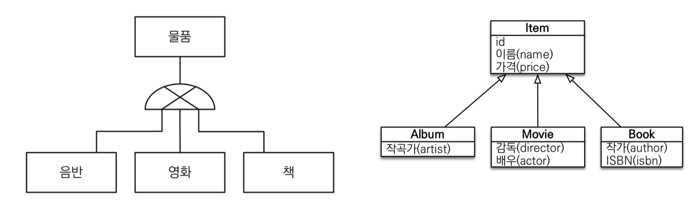

# 고급매핑


## 1. 상속 관계 매핑


#### 1) 상속 관계 매핑



- 관계형 DB 설계에는 논리모델(왼쪽)과 물리모델(오른쪽)이 존재.
  - 논리 모델 : 공통적인 속성을 묶어서 슈퍼타입 서브타입
  - 물리모델 : 객체는 상속관계가 있다. 

- 관계형 데이터베이스는 상속 관계 X
- 슈퍼타입 서브타입 관계라는 모델링 기법이 객체 상속과 유사
- 상속관계 매핑: 객체의 상속과 구조와 DB의 슈퍼타입 서브타입 관계를 매핑


#### 2) 상속관계 매핑

- 슈퍼타입 서브타입 논리 모델을 실제 물리 모델로 구현하는 방법
  - 각각테이블로변환 -> 조인전략
  - 통합 테이블로 변환 -> 단일 테이블 전략
  - 서브타입 테이블로 변환 -> 구현 클래스마다 테이블 전략


#### 3) 주요 어노테이션

- @Inhertiance(strategy=InheritanceType.XXX)
  - JPA의 장점으로 다른 소스 코드를 수정안하고 타입만 바꿔줘도 다른 전략으로 바로 사용 가능
  - JOINED : 조인 전략
  - SINGLE_TABLE : 단일 테이블 전략(Default 전략)
  - TABLE_PER_CLASS : 구현 클래스마다 테이블 전략
- @DiscriminatorColumn(name="DTYPE")
- @DiscriminatorValue(“XXX”)
  - DTYPE을 ALBUM은 A, MOVIE은 M, BOOK은 B로 테이블에 바꿔서 넣고 싶을 때 사용.


#### 3) 조인 전략


- 데이터를 ALBUM, MOVIE, BOOK 3개로 나눠서 ITEM 테이블 하나로 JOIN
  - DTYPE이 종류를 나타냄
- 정석 전략
- 장점
  - 테이블 정규화
  - 외래 키 참조 무결성 제약조건 활용가능
    - 예로 주문 테이블에서 5번 아이템을 조회할 때, ALBUM, MOVIE, BOOK 하나씩 볼 필요도 없이 ITEM만 보면된다.
  - 저장공간 효율화
- 단점
  - 조회시 조인을 많이 사용, 성능 저하
  - 조회 쿼리가 복잡함
  - 데이터 저장시 INSERT SQL 2번 호출
  - 쿼리가 두번씩 나가거나 조인을 사용하는 성능저하는 큰 성능저하가 아니다. 

```java
//Item.class
@Entity
@Inheritance(strategy = InheritanceType.JOINED)//조인 전략으로 설정.
@DiscriminatorColumn(name="DTYPE")
public class ITEM{
  
  @Id @GeneratedValue
  private Long id;
  
  private String name;
  private int price;
}
```

```java
//Album.class
@Entity
public class Album extends Item{
  private String artist;
}
```

```java
//Movie.class
@Entity
public class Movie extends Item{
  private String director;
  private String actor;
}
```

```java
//Book.class
@Entity
public class Album extends Item{
  private String author;
  private String isbn;
}
```

- Movie에 persist하면 id, name, price가 ITEM 테이블에 들어가고 Movie 테이블에 id, actor, director이 들어간다.

  - 조인되기 때문에 id도 무비테이블에 들어간다.

- 조회

  - ```java
    Movie findMovie = em.find(Movie.class, movie.getId());
    ```

  - 

  - JPA가 ITEM과 조인해서 가져오는 것을 알 수 있다.

  - 위에는 ITEM의 DTYPE을 안넣었다.

    - ITEM, 부모 클래스에 @DiscriminatorColumn(name="DTYPE")을 사용하면 생성한다.

    - DTYPE이 default 값

      

#### 4) 단일 테이블 전략


- 논리테이블을 하나의 물리 테이블로 만드는 것.
- DTYPE으로 Album인지 Movie인지 Book인지 구별한다.
  - 단일 테이블 전략을 사용하면 @DiscriminatorColumn을 안 사용해도 자동으로 JPA가 해준다.
- 해당 테이블과 상관없는 값들은 null값으로 들어간다.

- 장점
  - 조인이 필요 없으므로 일반적으로 조회 성능이 빠름
  - 조회 쿼리가 단순함
- 단점
  - 자식 엔티티가 매핑한 컬럼은 모두 null 허용
    - 데이터 무결성입장에서는 애매함
  - 단일 테이블에 모든 것을 저장하므로 테이블이 커질 수 있다. 상황에 따라서 조회 성능이 오히려 느려질 수 있다.


#### 5) 구현 클래스마다 테이블 전략


- 각각 NAME, PRICE를 가지고 있는 개별의 테이블.
- ITEM 테이블이 안 만들어짐. ITEM 테이블을 추상 클래스로 코딩
- **이 전략은 데이터베이스 설계자와 ORM 전문가 둘 다 추천X**
- 장점
  - 서브 타입을 명확하게 구분해서 처리할 때 효과적
  - not null 제약조건 사용 가능
- 단점
  - 여러 자식 테이블을 함께 조회할 때 성능이 느림(UNION SQL 필요)
    - 예로 5번 ID를 ITEM 클래스를 사용하여 find할 경우, ALBUM, MOVIE, BOOK 세가지 다 뒤져야함.
  - 자식 테이블을 통합해서 쿼리하기 어려움


## 2. @MappedSuperclass

- 공통 매핑 정보가 필요할 때 사용(id, name)
  - DB에서는 다른 데, 객체 입장에서 계속 똑같은 속성이 계속 나옴.
- 

- ```java
  //BaseEntity.class
  
  @MappedSuperclass
  public abstract BaseEntity{
    private String createBy;
    private LocalDateTime created;
  }
  ```

  ```java
  //Team.class
  
  @Entity
  public class Team extends BaseEntity{
  ///
  }
  ```

- 상속관계 매핑X, 엔티티X, 테이블과 매핑X

- 부모 클래스를 상속 받는 **자식 클래스에 매핑 정보만 제공**

- 조회, 검색 불가(**em.find(BaseEntity)** **불가**)'

- 직접 생성해서 사용할 일이 없으므로 **추상 클래스 권장**

- 테이블과 관계 없고, 단순히 엔티티가 공통으로 사용하는 매핑 정보를 모으는 역할

- 주로 등록일, 수정일, 등록자, 수정자 같은 전체 엔티티에서 공통으로 적용하는 정보를 모을 때 사용

- 참고: @Entity 클래스는 엔티티(속성관계매핑)나 @MappedSuperclass(속성만 상속)로 지정한 클래스만 상속 가능

- BaseEntity의 속성에 @Column(name = "xxx")을 사용하여도 상속받은 클래스에도 적용.

