# 다양한 연관관계 매핑


#### 1) 연관관계 매핑시 고려사항 3가지

- 다중성
- 단방향, 양방향
- 연관관계의 주인


#### 2) 다중성

- 다대일 : @ManyToOne
- 일대다 : @OneToMany
- 일대일 : @OneToOne
- 다대다 : @ManyToMany


#### 3) 단방향, 양방향

- 테이블

  - 외래 키 하나로 양쪽 조인 가능
  - 사실 방향이라는 개념이 없음

- 객체

  - 참조용 필드가 있는 쪽으로만 참조 가능

  - 한쪽만 참조하면 단방향

  - 양쪽이 서로 참조하면 양방향 

    - 객체 입장에서는 양방향이라는 것은 없다. 참조입장에서는 단방향 두개있는 것.

      


#### 4) 연관관계의 주인

- 테이블은 **외래 키 하나**로 두 테이블이 연관관계를 맺음
- 객체 양방향 관계는 A->B, B->A 처럼 **참조가** **2군데**
- 객체 양방향 관계는 참조가 2군데 있음. 둘중 테이블의 외래 키 를 관리할 곳을 지정해야함
- 연관관계의 주인: 외래 키를 관리하는 참조
- 주인의 반대편: 외래 키에 영향을 주지 않음, 단순 조회만 가능


## 1. 다대일 [N:1]


#### 1) 다대일 단방향

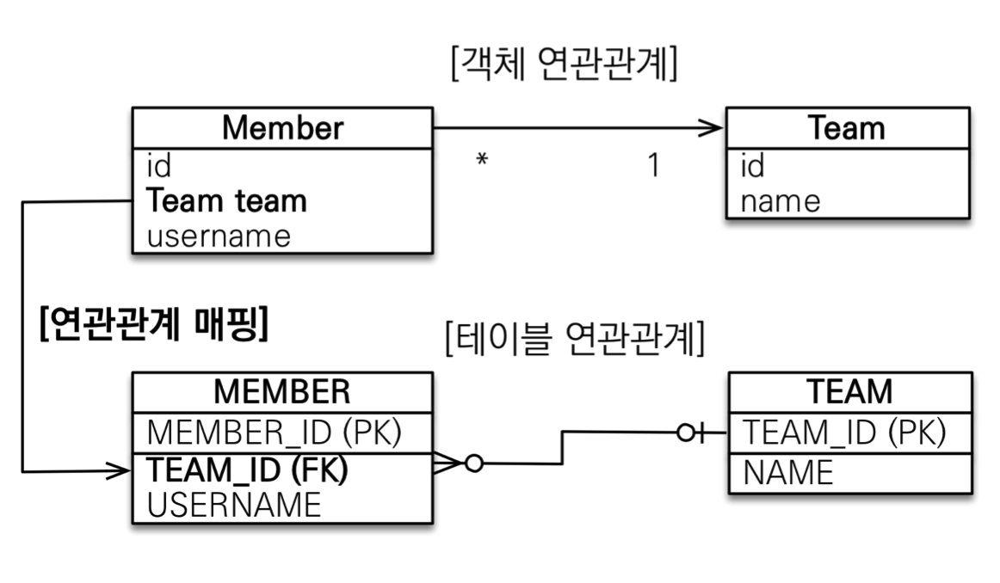

- 외래키는 항상 다 쪽에 있어야함.


#### 2) 다대일 단방향 정리

- 가장 많이 사용하는 연관관계
- 다대일의 반대는 일대다


#### 3) 다대일 양방향

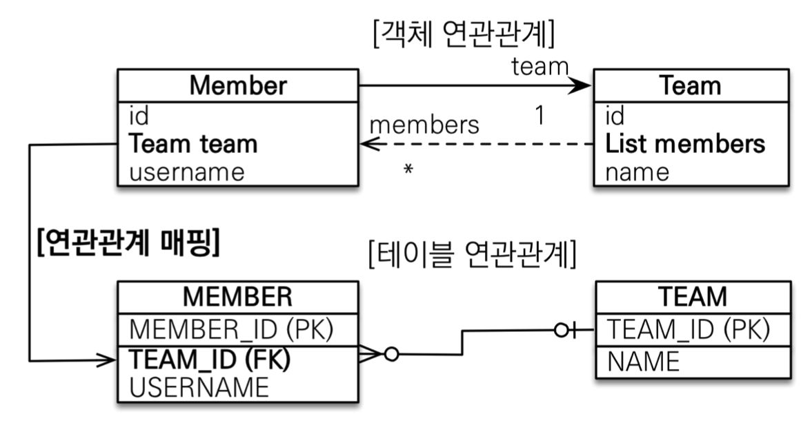

- 객체 연관관계에서 양방향으로하여 반대로 참조하여도 테이블 연관관계에서는 아무런 영향이 없다.

```java
//Member.class
@ManyToOne//멤버입장에서는 many to one. 여러 멤버가 하나의 팀을 가지기 때문에.
@JoinColumn(name = "TEAM_ID")//멤버 테이블 외래키인 TEAM_ID와 매핑을 하여야 하기에.
private Team team;
```

```java
//Team.class
@OneToMany(mappedBy = "team")
private List<Member> members = new ArrayList<>();
```


## 2. 일대다 [1:N]


#### 1) 일대다 단방향

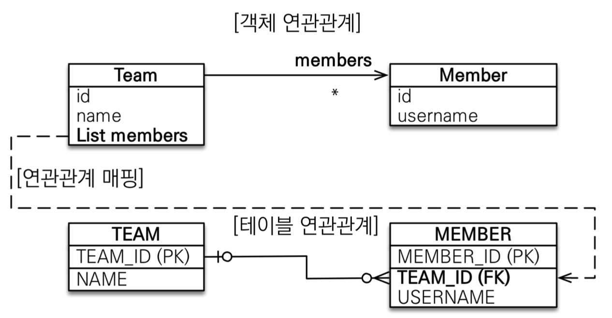

- 다대일과 반대로 1이 연관관계의 주인.

- 이 모델은 권장하지 않음.

  - 테이블 연관관계에서는 외래키는 MEMBER에 있기에 Team에서 넣고 멤버를 추가하면 

    MEMBER에 업데이트 쿼리가 하나 더 날라감.(단점)

  - 반대로 가는 레퍼런스가 필요하다면 일대다 단방향 매핑보다는 **다대일 양방향 매핑을 사용**

```java
//Team.class
@OneToMany
@JoinColumn(name = "TEAM_ID")
private List<Member> members = new ArrayList<>();

```


#### 2) 일대다 단방향 정리

- 일대다 단방향은 일대다(1:N)에서 **일(1)이 연관관계의 주인**

- 테이블 일대다 관계는 항상 **다(N) 쪽에 외래 키가 있음**

- 객체와 테이블의 차이 때문에 반대편 테이블의 외래 키를 관리하는 특이한 구조
- @JoinColumn을 꼭 사용해야함. 그렇지 않으면 조인 테이블 방식을 사용함(중간에 테이블을 하나 추가함)


#### 3) 일대다 양방향

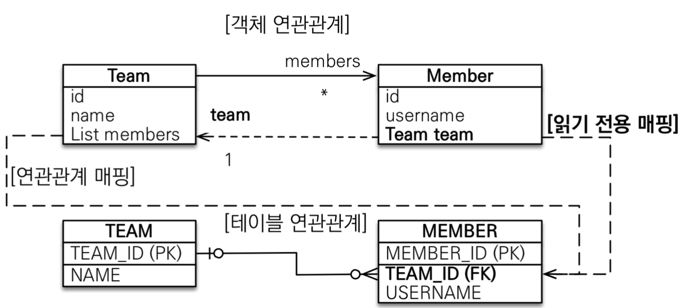


#### 4) 일대다 양방향 정리

- 이런 매핑은 공식적으로 존재X

- @JoinColumn(insertable=false, updatable=false)

  - ```java
    //Member.class
    @ManyToOne
    @JoinColumn(name = "TEAM_ID", insertable=false, updatable=false)
    private Team team;
    ```

  - 이런 설정을 넣으면 읽기전용으로 만드는 것.

- 읽기 전용 필드를 사용해서 양방향처럼 사용하는 방법

- 다대일 양방향을 사용하자


## 3. 일대일[1:1]


#### 1)일대일 관계

- 일대일 관계는 그 반대도 일대일
- 주 테이블이나 대상 테이블 중에 외래 키 선택 가능
  - 주 테이블에 외래 키(MEMBER)
  - 대상 테이블에 외래 키(TEAM)

- 외래 키에 데이터베이스 유니크(UNI) 제약 조건 추가


#### 2) 주 테이블에 외래 키 단방향

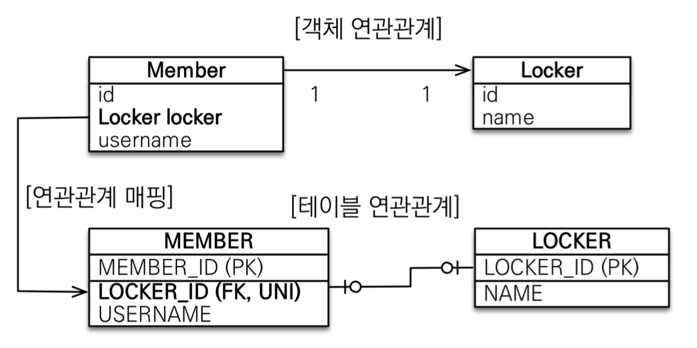

- Member가 주 테이블

- 위에 비지니스 룰은 한명은 딱 하나의 락커를 가지는 것

- ```java
  //Member.class
  @OneToOne
  @JoinColumn(name = "LOCKER_ID")
  private Locker locker;
  ```

  

#### 3) 주 테이블에 외래 키 단방향 정리

- 다대일 단방향 매핑과 유사


#### 4)  주 테이블에 외래 키 양방향

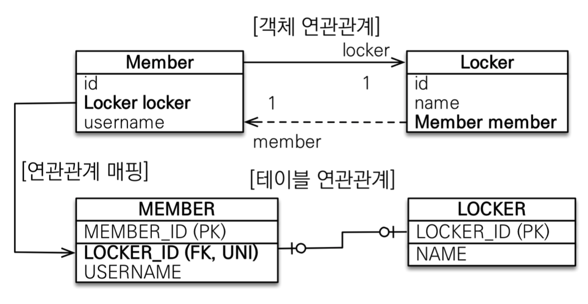

- **다대일 양방향처럼 외래 키가 있는 곳이 연관관계의 주인**

- 반대편은 mappedBy 적용

- ```java
  //Locker.class
  
  @OneToOne(mappedBy="locker")
  private Member member;
  ```

- Locker의 member는 읽기전용


#### 5) 대상 테이블에 외래 키 단방향

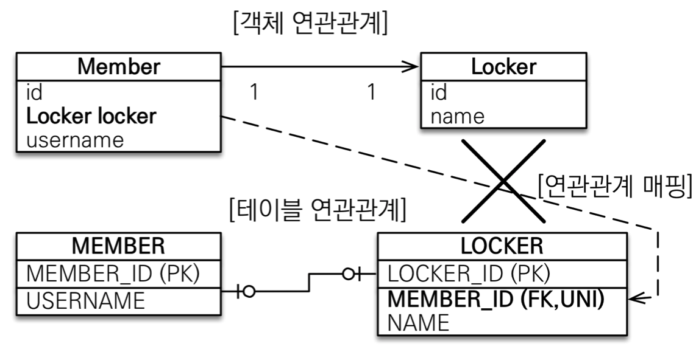

- 단방향 관계는 JPA에서 지원 X
- 양방향 관계는 지우너


#### 6) 대상 테이블에 외래 키 양방향

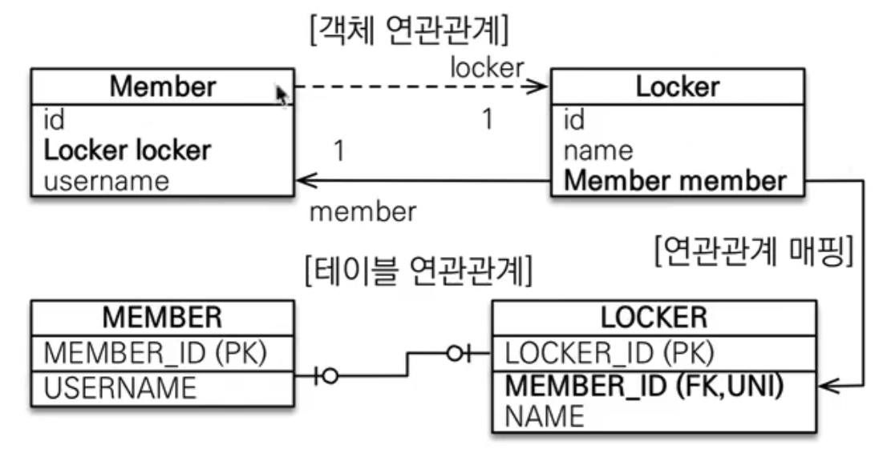

- 일대일 매핑은 간단하게 내가 내 것만 관리할 수 있다.
- Locker에 member를 주인으로 만들어 관리하고 Member의 locker를 읽기 전용으로 만들면된다.
- 일대일 주 테이블에 외래 키 양방향과 매핑 방법은 같다.


#### 7) 일대일 정리

- 주 테이블에 외래 키
  - 주 객체가 대상 객체의 참조를 가지는 것 처럼
 주 테이블에 외래 키를 두고 대상 테이블을 찾음
  - 객체지향 개발자 선호
  - JPA 매핑 편리
  - 장점: 주 테이블만 조회해도 대상 테이블에 데이터가 있는지 확인 가능
  - 단점: 값이 없으면 외래 키에 null 허용
- 대상 테이블에 외래 키
  - 대상 테이블에 외래 키가 존재
  - 전통적인 데이터베이스 개발자 선호
  - 장점: 주 테이블과 대상 테이블을 일대일에서 일대다 관계로 변경할 때 테이블 구조 유지
  - 단점: 프록시 기능의 한계로 **지연 로딩으로 설정해도 항상 즉시 로딩됨**(프록시는 뒤에서 설명)


## 4. 다대다[N:N]

- 관계형 데이터 베이스는 정규화된 테이블 2개로 다대다 관계를 표현할 수 없음
- 연결 테이블(중간 테이블)을 추가해서 일대다, 다대일 관계로 풀어내야함

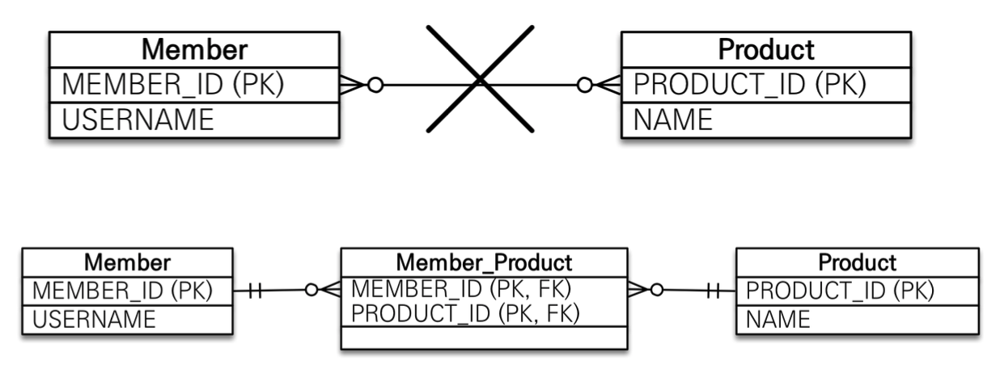

- 객체는 컬렉션을 사용해서 객체 2개로 다대다 관계 가능

  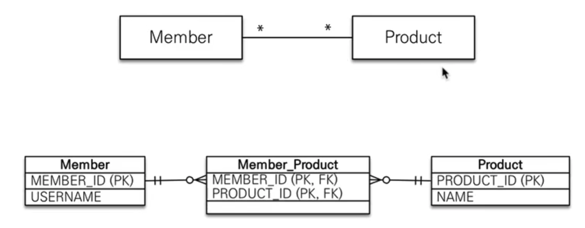

- @ManyToMany 사용

- @JoinTable로 연결 테이블 지정(중간 테이블)

- ```java
  //Member.class
  @ManyToMany
  @JoinTable(name = "MEMBER_PRODUCT")
  private List<Product> products = new ArrayList<>;
  ```

- 다대다 매핑 : 단방향, 양방향 가능


#### 1) 다대다 매핑의 한계

- **편리해 보이지만 실무에서 사용X**

- 연결 테이블이 단순히 연결만 하고 끝나지 않음

  - 주문시간, 수량같은 데이터가 들어올 수 있음

  - 추가 정보를 연결 테이블에 넣기가 안된다.

  - 쿼리도 내가 생각하지 못한 쿼리가 날라간다.

    

#### 2) 한계 극복

- 연결 테이블용 엔티티 추가(연결테이블을 엔티티로 승격)

- @ManyToMany -> @OneToMany, @ManyToOne

- ```java
  //Member.class
  @OneToMany(mappedBy = "member")
  private List<MemberProduct> memberProducts = new ArrayList<>();
  ```

  ```java
  //MemberProduct.class
  
  @ManyToOne
  @JoinColumn(name = "MEMBER_ID")
  private Member member;
  
  @ManyToOne
  @JoinColumn(name = "PRODUCT_ID")
  private Product product;
  ```

  ```java
  //Product.class
  @OneToMany(mappedBy = "product")
  private List<MemberProduct> memberProducts = new ArrayList<>();
  ```

  

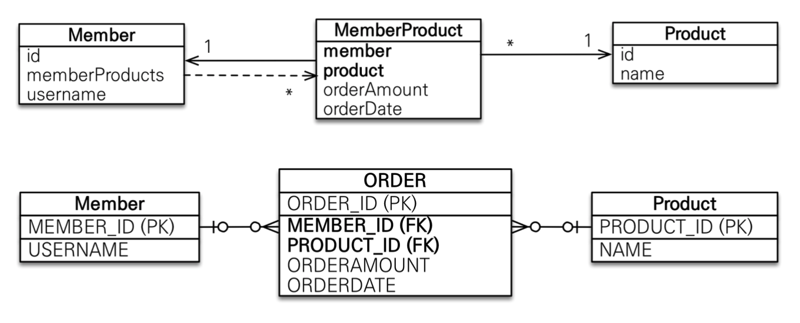

- 추가로 **@GenerateValue를 사용하여 의미없는 값인 ORDER_ID를 따로 사용**하는 것을 권장 PK와 FK를 묶어사 사용하는 것은 비추천

