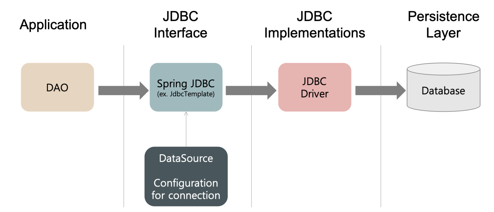
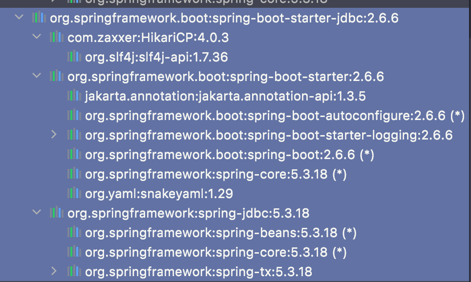
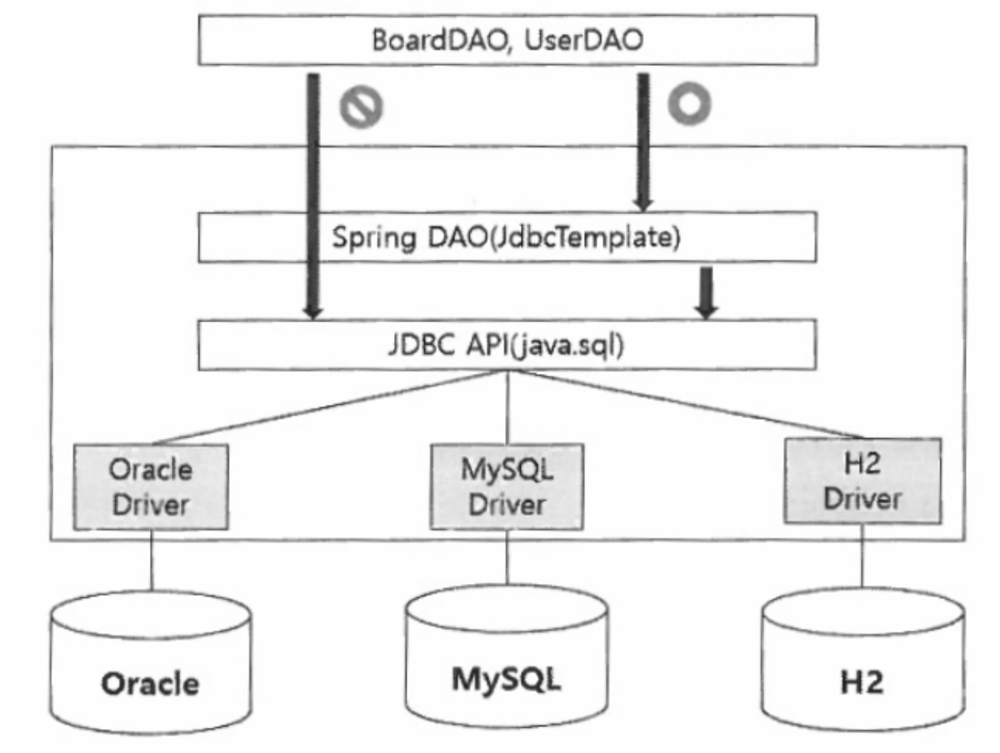
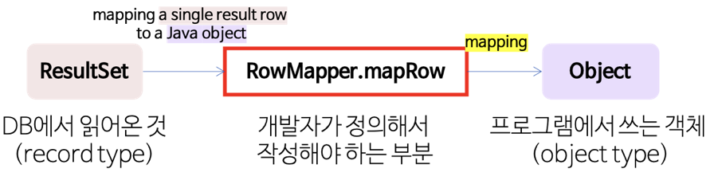
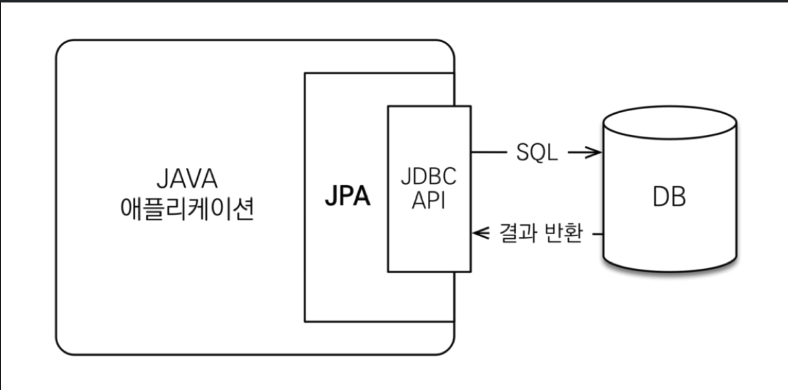

## JDBC


## 1. JDBC(Java DataBase Connectivity)


- JDBC

  - Spring 프레임워크를 사용하기 전, 일반 java 언어에서 DB에 연결하기 위해서 사용하는 것이 바로 JDBC.

  - jdbc는 자바에서 **데이터베이스**에 **접속**할 수 있도록 하는 **자바 API(Java 표준 인터페이스)**. 

  - jdbc api는 이 뒷단의 **Driver**가 **어떤 것인지에 관계 없이 일관적인 방식**을 사용할 수 있도록 해줌.

  - 매 요청마다 Database Connection에 대한 관리도 매 요청마다 이루어져야함.

    

- JDBC driver

  - 자바 프로그램의 요청을 DBMS(MySql, Oracle...)가 **이해할 수 있는 프로토콜**로 변환해주는 클라이언트 사이드 **어댑터**.
  - 각각의 DBMS는 자신에게 알맞은 JDBC Driver를 제공하고 있음.
  - **드라이버는 어떤 DB와 연결되느냐**에 따라 **MySQL, Oracle Driver**를 선택함.


```java
import java.sql.*;
import java.util.Objects;

public class JDBCTest {
    public static void main(String[] args) {
        String driver = "com.mysql.jdbc.Driver";
        String url = "jdbc:mysql://localhost:3000/JDBCTest";
        String sql = "select * from member";

        Connection con = null;
        PreparedStatement pstmt = null;
        ResultSet rs = null;

        try {
            Class.forName(driver);//드라이버 로드.
            con = DriverManager.getConnection(url, "root", "root");
            pstmt = con.prepareStatement(sql);
            rs = pstmt.executeQuery();

            while (rs.next()) {
                // 출력해 줄 때는 SQL에 정의한 테이블의 각 컬럼에 맞춰 get{type}을 사용해야 함.
                System.out.println(rs.getInt(1) + " " + rs.getString(2));
            }
        } catch (SQLException | ClassNotFoundException ex) {
            ex.printStackTrace();
        } finally {
            try { Objects.requireNonNull(rs).close(); } catch (SQLException ex) { ex.printStackTrace(); }
            try { Objects.requireNonNull(pstmt).close(); } catch (SQLException ex) { ex.printStackTrace(); }
            try { Objects.requireNonNull(con).close(); } catch (SQLException ex) { ex.printStackTrace(); }
        }
    }
}
```


### 1) JDBC에 사용되는 클래스, 인터페이스

1. DriverManager 클래스

   - DriverManager 클래스는 **JDBC 드라이버를 관리**하기 위한 클래스.
   - URL로 표현되는 데이터베이스에 연결할 수 있도록 드라이버의 위치를 알려주는 역할.

   - 또한 DriverManager 클래스는 데이터 원본에 JDBC 드라이버를 통하여 `Connection`객체를 만드는 역할을 한다.

   - 주요 메소드는 `getConnection()`메소드로 Connection 인터페이스의 구현 객체를 얻는다.

2. Connection 인터페이스

   - 어떤 SQL 문장을 실행시키기 전에 우선 Connection 객체가 있어야한다.

   - Connection 객체는 특정 데이터 원본과 연결된 커넥션을 나타내고, **특정한 SQL 문장을 정의**하고 실행시킬 수 있는 **Statement 객체, PreparedStatement 객체를 생성할 때** Connection 객체를 사용한다.

   - 주요 메소드는 `prepareStatement(sql)`이며 String 타입을 인자로 받으며 반환 값으로 PreparedStatement 객체를 반환한다.

3. Statement 인터페이스

   - Statement 인터페이스는 Connection 객체를 통해 프로그램에 리턴되는 객체에 의해 구현되는 일종의 메소드 집합을 정의한다. 

   - **SQL 구문을 실행하는 역할을 하며 스스로 SQL 구문 이해를 못한다. 단지 전달 역할을 하고 연결 정보를 가지고 있지 않는다.**

   - Statement 객체는 Statement 인터페이스를 구현한 객체로, 항상 인수가 없는 Connection 클래스의 `createStatement()` 메소드를 호춤함으로써 얻어진다.

4. PreparedStatement 객체

   - Statement 클래스의 기능 향상된 것.

   - PreparedStatement 인터페이스는 Connection 객체의 `prepareStatement()`메소드를 사용해서 객체를 생성한다.

   - **PreparedStatement 객체는 동일한 질의문을 특정 값만 바꾸어서 여러 번 실행해야 할 때, 많은 데이터를 다루기 때문에 query을 정리해야 할 필요가 있을 때, 인수가 많아서 질의문을 정리해야 할 필요가 있을 때 사용하면 유용하다.** 

   - Statement 객체의 SQL은 실행될 때, 매번 서버에서 분석되어야 하는 반면, PreparedStatement 객체는 미리 컴파일되기 때문에 한번 분석되면 재사용이 용이하다는 장점을 가지고 있다.

   - PreparedStatement 인터페이스는 각각의 인수에 대해 위치홀더(placeholder)를 사용하여 SQL 문장을 정의할 수 있다. 위치홀더는 물음표 `(?)`로 표현된다. 위치홀더는 SQL 문장에 나타나는 토큰(Token)인데, 이것은 SQL 문장이 실행되기 전에 실제 값으로 대체된다. 

     - ```java
       try{
         String sql = "INSERT INTO Member VALUES(? , ?)";
         pstmt = conn.prepareStatement(sql);
         pstmt.setString(1, id);
         pstmt.setString(2, pw);
       }catch(SQLException e){
         e.printStackTrace();
       }
       ```

   - 각각의 SQL 타입을 처리할 수 있는 `setXXX(num, var)` 메소드를 제공한다. 여기서 xxx는 해당 테이블의 해당 필드의 데이터 타입과 관련이 있다. 해당 필드의 데이터 타입이 문자열이면 `setString(num, var)`이 되고, 해당 필드의 데이터 타입이 int이면 `setInt(num, var)`가 된다. 인자로는 num과 var이 있으며 num은 파라미터 인덱스로서 위치홀더와 대응된다. var은 해당 필드에 저장할 데이터 값이다. 위에 예제에서는 sql은 결과적으로 `INSERT INTO Member VALUES(id, pw)`가 된다.

   - 주요 메소드로는 `executeQuery()`로 반환 값으로 ResultSet 객체를 반환한다.

   

5. ResultSet 객체

   - SQL 문에서 `SELECT` 문을 사용한 질의의 경우, 성공 시 결과물로 ResultSet을 반환함.

   - ResultSet은 SQL query에 의해 **생성된 테이블**을 담고 있다. 또한 커서(cursor)라고 불리는 것을 가지고 있는데, 그것으로 ResultSet에서 **특정 행에 대한 참조를 조작**할 수 있음.

   - 커서는 주로 첫번째 행의 직전을 가리키도록 되어있는데, 주로 `next()`메소드를 사용하고 이 메소드를 사용하면 다음 위치로 커서를 옮길 수 있음.

즉, 정리하자면

1. DriverManager 객체로 DB와 연결하고 Connection 객체를 얻는다.
2. Connection 객체로 PreparedStatement 객체를 얻는다.
3. PreparedStatement 객체로 query의 결과인 ResultSet 객체를 얻는다.
4. ResultSet의 커서를 이용하여 테이블의 row를 탐색한다.


### 2) 간단한 JDBC 작동 원리

1. JDBC driver load
2. Connection 객체 생성
3. Statemanet 또는 PreparedStatement 객체 생성
4. Query 실행
5. ResultSet 객체로부터 데이터 추출
6. ResultSet 객체 Close
7. Statement 객체 Close
8. Connection 객체 Close

그러나 커넥션을 종료할 때, `close`함수를 `Statement`, `Connection`, `ResultSet`에 모두 사용하여야, 메모리 누수를 막고 안전하게 종료할 수 있다. 그러기에 코드의 가독성이나 불편함이 존재하고 중복되는 코드가 많이 작성된다.


### 3) JDBC 정리

- DriverManager : 사용될 드라이버를 등록하거나 등록을 해제하는 기능과 DB와 연결하는 기능.

- Connection

  - DB 연결 객체
  - Statement 또는 PreparedStatemnet 객체 생성
  - SQL문을 DB에 전송 또는 SQL문을 커밋하거나 롤백하는데 사용
  - Connection 하나 당 트랜잭션 하나를 관리

- Statement 또는 PreparedStatement

  - SQL문 실행 객체

- ResultSet

  - 쿼리문의 결과를 가지는 객체

  


### 4) Connection Pool(https://steady-coding.tistory.com/564)

매번 사용자가 **요청을 할 때마다** 드라이버를 로드하고 Connection 객체를 생성하여 연결하고 종료하기 **매우 비효율적**이다.

이러한 **문제**를 해결하기 위해서 나온 것이 **Connection Pool**.

WAS가 실행되면서 일정량의 Connection 객체를 미리 만들어서 pool에 저장했다가, 클라이언트 요청이 오면 Connection 객체를 빌려주고 해당 객체의 임무가 완료되면 다시 반납받아서 pool에 저장하는 프로그래밍 기법.


## 2. Spring JDBC - JDBC Template


 Spring Jdbc에서는 **Dirver/DB 연결**과 **Connection 객체**의 관리등을 수행하는 **Data Source를 설정을 통해 생성**해주며, 직접 Jdbc API를 사용했을 때의 불편한 점들도 일부 완화.

JDBC Template은 Spring JDBC 접근 방법 중 하나로, 내부적으로는 Plain JDBC API를 사용하지만 JDBC API 문제점을 제거한 형태의 Spring에서 제공하는 class.

Spring JDBC가 제공하는 역할은 아래와 같다.

1. Connection을 열고 닫기
2. Statement를 준비하고 닫기
3. Statement의 실행
4. ResultSet 반복 처리
5. 에외 처리 반환
6. Transaction 처리



위 사진은 Spring JDBC의 Data Access Layer의 모습입니다.




Spring-boot-starter-jdbc 의존성을 추가하면 위의 모듈을 포함한다.

1. HikariCP

   1. Connection Pool로 Spring boot 2.0이하 버전에서는 Tomcat JDBC Connection Pool을 사용했으나 2.0이후부터는 HikariCP가 Default Connection Pool이 되었음.

   2. ```yml
      spring:
          datasource:
              hikari:
                  connectionTimeout : 30000
                  maximumPoolSize : 10
                  maxLifetime : 1800000
                  poolName : HikariCP
                  readOnly : false
                  connectionTestQuery : SELECT 1
      ```

   3. 옵션 설명 : https://bamdule.tistory.com/166

2. spring-tx

   1. transaction을 사용하기 위한 모듈


#### 1) Data Source, Connection Pool

- DataSource 인터페이스

  - java에서 제공하는 interface
  - DriverManager의 **발전된 형태**로 **DriverManager의 대안**이다.
  - Dirver/DB 연결, Connection 객체, 즉 **Connection pool를 관리**하는 역할.

  - 기본적인 정의 자체는 Jdbc 명세에 포함되어 있지만 각각의 SQL vendor들이 이 구현체들을 제공함.

  - 더 나아가, Spring Jdbc에서는 xml파일에 datasource에 대한 설정을 했을 때, DataSource Bean을 필요로 하는 부분에 주입할 수 있게 해줌
  - DataSource 인터페이스를 구현한 대표적인 클래스
    - BasicDataSource
    - PoolingDataSource
    - SingleConnectionDataSource
    - DriverManagerDataSource

  

- Connection Pool

  원래라면 **매 요청마다 연결, 해제를 반복**해야 했던 것을 **같은 연결을 재사용함**으로서 요청 처리에 대한 **오버헤드를 줄일** 수 있도록 해줌.

  Connection 객체를 **미리 여러개** 만들어 둔 뒤, **transaction에 진입**할 때 **하나의 연결 객체를 할당**하고, transaction이 종료되면 **Connection 객체를 다시 반납**하는 방식.

  Connection Pool에 대한 구현도 Hikari, Tomcat 등 여러 구현체들이 존재하지만, Spring boot Jdbc starter를 사용한다면 기본적으로 HikariCP를 사용하도록 되어있습니다.


####  2) JdbcTemplate



schema.sql : 테이블 생성 sql 스크립트 작성

data.sql : 테이블에 데이터 insert하는 스크립트 작성.





## 3. Spring Data Jdbc

https://stackoverflow.com/questions/51923060/spring-jdbc-vs-spring-data-jdbc-and-what-are-they-supporting


## 4. JPA(Java Persistence API)


- **java가 제공하는 API**, 인터페이스로 자바 프로그램 내에서 ORM을 사용하도록 지원.

- `javax.persistance` 패키지로 정의된 API 그 자체.

- 실제로 프로그래밍을 할 때에는 해당 JPA를 구현한 구현체를 임포트해서 사용.

- 중요 개념

  - Entity : `@Entity` 어노테이션을 사용하면 엔티티 클래스로 등록.
  - EntityManager
    - entity instance를 생성/삭제하거나 탐색하기 위한 매니저 객체
    - 객체의 persistency를 관리하는 객체를 Persistence context라고 부름.

- 사용자가 원하는 JPA 구현체를 선택해서 사용할 수 있다.

  - JPA 구현체로는 **Hibernate**, EclipseLink, OpenJPA...

  - 이 구현체들을 **ORM Framework**라고 부른다.

    

### 1) ORM

지속성(persistence)을 유지하기 위해 도입된 개념.

자바 클래스를 관계형 데이터베이스에 매핑하는 기술.


### 2) 기본적인 CRUD

- Create

  - ```java
    Part part = new Part(partNumber,
            revision,
            description,
            revisionDate,
            specification,
            drawing);
    em.persist(part); // JPA 의 persistence context에 현재 데이터를 저장
    em.getTransaction().commit(); // 주의할 점. 실제 DB에 반영되는 시점은 커밋 시점!
    // em.flush(); - flush 라는 함수를 사용할 수도 있음
    ```

- Read

  - ```java
    CustomerOrder order = em.find(CustomerOrder.class, orderId);
    List<Customer> customers = em.createQuery("select customer from Customer customer")
                                                                .getResultList(); //JPQL
    ```

  - `find()`메소드를 사용하거나 `createQuery()` 메소드를 사용하여 직접 query문을 작성할 수 있다. 여기에서 사용되는 query문은 SQL문과 비슷하지만 약간 다른 **JPQL이라는 문법**이다.

- Update

  - ```java
    CustomerOrder order = em.find(CustomerOrder.class, orderId);
    order.setMenu("chicken"); // setter로 데이터 입력 후 commit 하면 자동으로 업데이트됨
    ```

  - `find()` 메소드를 호출 후에 `setter`메소드를 호출하면 자동으로 업데이트가 이루어진다.

  - 이는 entity manager가 해당 데이터를 관리하고 있어서 발생되는 결과이며 이를 더티 체킹이라고 한다.

- Delete

  - ```java
    CustomerOrder order = em.find(CustomerOrder.class, orderId);
    em.remove(order);
    ```


### 3) JPQL

- entity의 persistent state를 관리하기 위한 쿼리

- SQL이랑 유사한 문법을 사용함

- JPA 에서 복잡한 쿼리를 사용하려면 JPQL을 사용해야 함 → Spring Data JPA를 사용하는 이유 중 하나

- JPQL에는 두가지 쿼리가 존재

  - dynamic query : 쿼리가 비지니스 로직에 따라 동적으로 결정

    - ```java
      public List findWithName(String name) {
      return em.createQuery(
          "SELECT c FROM Customer c WHERE c.name LIKE :custName")
          .setParameter("custName", name)
          .setMaxResults(10)
          .getResultList();
      }
      ```

  - static query : 쿼리를 사전에 미리 정의해 놓는 것

    - ```java
      // @NamedQuery 어노테이션을 사용
      @NamedQuery(
          name="findAllCustomersWithName",
          query="SELECT c FROM Customer c WHERE c.name LIKE :custName"
      )
      
      /*...*/
      
      @PersistenceContext
      public EntityManager em;
      ...
      // createNamedQuery 함수 사용
      customers = em.createNamedQuery("findAllCustomersWithName") 
          .setParameter("custName", "Smith")
          .getResultList();
      ```

      


## 5. Spring data JPA


-------------------------------------------------------------


https://gmlwjd9405.github.io/2018/12/25/difference-jdbc-jpa-mybatis.html

JDBC

-  Plain JDBC, Spring JDBC가 있다.

- java에서 제공하는 DB 작업을 위한 표준.

- database access 표준.

- 

  


JDBC VS JPA

https://mydevdiary.tistory.com/121



기본적으로 JPA는 자파 프로그램과 JDBC API 사이에서 작동한다.

즉, JPA는 

https://mydevdiary.tistory.com/121

Persistence Framework

- SQL Mapper
  - Mybatis
  - JdbcTemplate
    - **Spring에서 제공**하는 class
    - Spring JDBC 접근 방법 중 하나
    - 내부적으로 Plain JDBC API를 사용
- ORM : 자바 클래스와 DB 테이블을 매핑.
  - JPA(Java Persistent API)
    - **java가 제공하는 API**, 인터페이스로 자바 프로그램 내에서 ORM을 사용하도록 지원.
    - `javax.persistance` 패키지로 정의된 API 그 자체.
    - 중요 개념
      - Entity : `@Entity` 어노테이션을 사용하면 엔티티 클래스로 등록.
      - EntityManager : entity instance를 생성/삭제하거나 탐색하기 위한 매니저 객체
    - 사용자가 원하는 JPA 구현체를 선택해서 사용할 수 있다.
      - JPA 구현체로는 **Hibernate**, EclipseLink, OpenJPA...
      - 이 구현체들을 **ORM Framework**라고 부른다.
  - Hibernate
    - **JPA의 구현체 중 하나**.
    - SQL을 개발자가 직접 사용하지 않지만 내부적으로 JDBC API가 동작.


Spring Data JPA

- Spring에서 제공하는 모듈 중 하나.

- JPA를 더 쉽고 편하게 사용할 수 있도록 도와줌.

- 핵심은 `Repository`

  - JPA를 한 단계 더 추상화 시킨 인터페이스

  - 구현에 있어서 JPA를 사용

  - `Repository` 인터페이스에 정해진 규칙대로 메소드를 사용하면, Spring이 알아서 해당 메소드 이름에 적합한 query를 날리는 구현체를 만들어서 Bean으로 등록.

  - `Repository` 인터페이스의 기본 구현체는 `SimpleJpaRepsoitory`

    -  `SimpleJpaRepsoitory` 내부적으로 `EntityManager`를 사용하고 있음. 

  - ```java
    @Repository
    public interface MemberRepository extends JpaRepository<Member, Long>{
      
    }
    ```

    


자바에서 만든 것 : jdbc, jpa

스프링에서 만든 것 : jdbctemplate(spring jdbc), spring data jpa