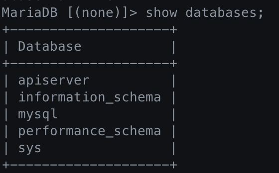
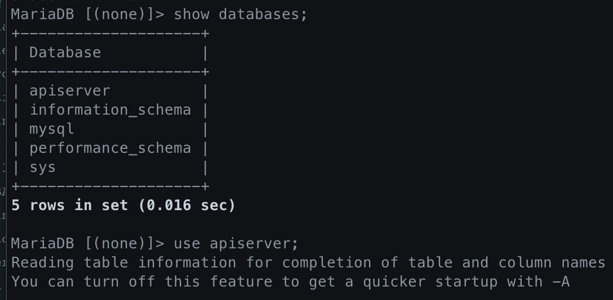
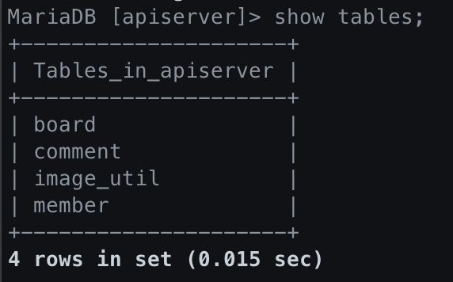
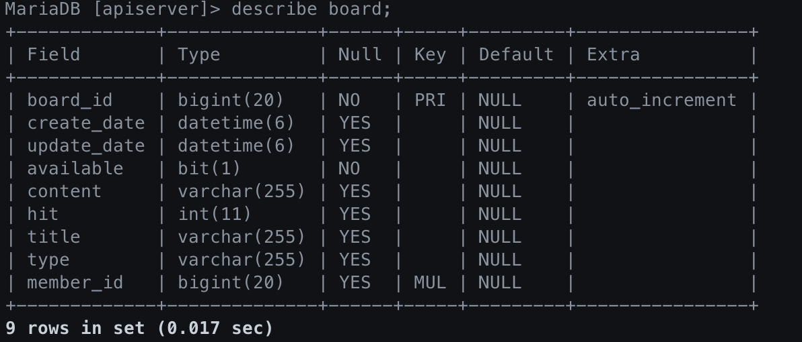
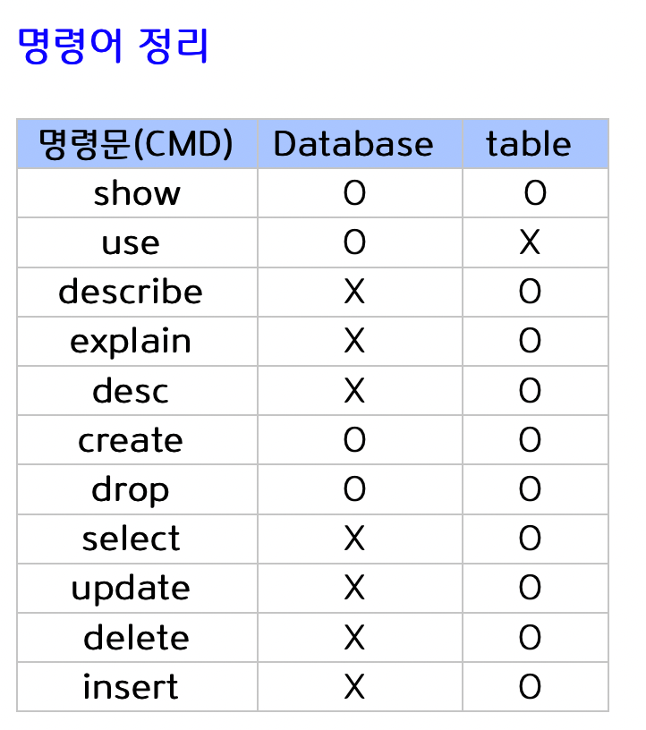

# Docker, MariaDB

## 도커 이미지 다운로드

`docker pull mariadb`

## DB 컨테이너 만들기

## 접속 방법

1. `docker ps`로 현재 실행중인 컨테이너 목록 확인
2. `container id`를 획득
3. `docker exec -it <container id> /bin/bash` 으로 해당 컨테이너로 접속
4. `mysql -u root -p`
5. `show databases;`

## MariaDB DB 보기, 생성, 삭제

1. DB보기
   - `show databases;`

2. DB 생성
   - `create database [DB이름];`
   - `create database apiserver;`

3. DB 사용

   - DB 접속

     - `use [DB이름];`
     - `use apiserver;`
     - 

   - 모든 테이블 조회

     - `show tables;`
     - 

   - 테이블 설명

     - `describe [table 이름];`, `desc [table 이름]` - 테이블의 필드, 타입 ...
     - 

   - DB/ table 생성

     - `create [DB이름];`
     - `create [table 이름] ([필드 이름] [필드 타입], ...);`
       - `create table board (board_id int(10),content char(20));`

   - DB/ Table 삭제

     - `drop database [DB 이름];`
     - `drop table [table 이름];`
       - `drop table board;`

   - Table 조회

     - `select [필드 이름1],[필드 이름2] from [table 이름];`
     - `select * from [테이블 이름];`

   - 레코드 수정

     - `update [table 이름] set [필드명]=[수정값],[필드명]=[수정값]... where [필터링 조건];`
     - `update user set password=password('nalt') where user='root';`

   - row 생성

     - `insert into [table 이름] values (값1, 값2 ...);`

     - `insert into user(host, user, password) values ('localhost','dbnalt','usernalt');`

       

