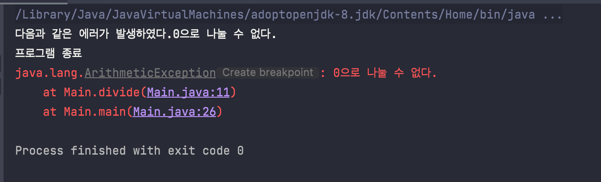

# Java Exception


### 1. java 예외처리

1. 오류

컴파일 오류는 잡기가 쉽지만 **런타임 에러**는 잡기가 어렵다.

이러한 런타임 에러는 두 종류로 보고 있습니다.

**에러(Error)**와 **예외(Exception)**

- 에러 : 프로그램이 **코드로 복구될 수 없는 오류**를 의미
  - 메모리 부족과 같은 오류
    - `OutOfMemoryError`, `StackOverFlowError` 등...
- 예외 : 프로그래머가 직접 예측하여 막을 수 있는 **처리가능한 오류**
  - 예외는 또 두가지 종류로 나눠진다.
    - 컴파일 에러 : 컴파일시 발견되는 예외
    - **런타임 에러** : 런타임시 발견되는 예외, 런타임 에러를 우리(프로그래머)가 **예측하여 처리**해줘야함


2. 예외 처리

java는 기본적으로 `try ... catch`, `throw` 구문을 사용하여 오류를 처리한다.


첫번째로 `try ... catch ... finally`라는 키워드로 예외를 처리할 수 있습니다.

예외가 발생 했을 때, 메소드를 호출한 곳으로 예외를 던질 수 있습니다.

중요한 포인트는 자바에서 모든 예외는 `Exception`이라는 클래스를 상속받습니다.

예외 처리 방식은 아래와 같다.

```java
try{
	//예외가 발생될만한 코드
}catch(FileNotFoundException e){	//FileNotFoundException이 발생했다면

}catch(IOException e){ //IOException이 발생했다면

}catch(Exception e){	//Exception이 발생했다면

}finally{	
	///어떤 예외가 발생하던 말던 무조건 실행
}
```

try 블록에서 예외가 발생할만한 코드를 작성하고 catch에 해당하는 예외가 발생했을 때 처리되는 코드를 작성합니다.

여러 개의 catch를 작성할 수 있지만 catch의 순서가 존재합니다. 즉, 자식 예외를 먼저 작성하고 부모 예외를 나중에 작성해야 합니다. 


두번째로 `throws`를 사용하여 예외를 그냥 던질 수 있습니다. 

즉, 예외를 여기서 처리하지 않을테니 나를 불러다가 쓰는 녀석에게 에러 처리를 전가하겠다는 의미이며 코드를 짜는 사람이 이 선언부를 보고 어떤 예외가 발생할 수 있는지도 알게 해줍니다. 


```java
public class Main {

  public static void divide(int a, int b) throws ArithmeticException{

    if(b == 0){
      throw new ArithmeticException("0으로 나눌 수 없다.");
    }

    int ans = a / b;

    System.out.println(ans);

  }

  public static void main(String[] args) {

    int a = 10;
    int b = 0;

    try {
      divide(a, b);
    } catch (ArithmeticException e) {
      System.out.println("다음과 같은 에러가 발생하였다." + e.getMessage());
      e.printStackTrace();
    }

    System.out.println("프로그램 종료");
  }
}
```




아래와 같이 예외를 던질 수 있다.

```java
throw 예외객체
//ex) throw new Exception("예외 발생!");
```

던지면 위 메소드를 호출한 곳에서 예외를 처리를 할 수가 있다.

위 코드에서 `divide()` 메소드에서 예외가 발생하였고 `throw`를 호출한 `main`에 던졌다.

예외 객체를 전달받은 `main`에서 `try ... catch`를 하여 예외를 캐치하고 `catch`블록을 실행한다. 

그 후 정상적으로 나머지 코드를 실행한 후 종료가 된다.

핵심은 `throw new ArithmeticException("0으로 나눌 수 없다.");`에서 객체를 생성하여 호출한 메소드로 `throw`(던지는 것)하고 catch하는 것이다. 


### 2. Spring boot 예외처리

Spring Boot에서 예외 처리를 하는 방법은 다양하다. 그 중 대표적인 예외 처리 방법은 아래와 같다.

- Controller에서 ExceptionHandler 정의
- ControllerAdvice에 ExceptionHandler 정의
- Exception에 ResponseStatus 어노테이션 추가


1. DispatcherServlet

   SpringBoot에서는 요청이 들어오면 dispatcherServlet에 의해서 적합한 컨트롤러에 위임을 하는 역할을 하고 있다.

   그러기 때문에 Spring Boot에서 dispatcherServlet이 `try ... catch`문을 이용하여 예외를 처리를 한다.

   ```java
   public class DispatcherServlet {
     protected void doDispatch(...) throws Exception {
       // ...
       try {
         ModelAndView mv = null;
         Exception dispatchException = null;
   
         try {
             // Controller 로직 실행 (핸들러를 찾고, 해당 로직을 실행)
         } catch (Exception ex) {
           dispatchException = ex;
         }
         // Dispatch 결과 처리 (예외 처리도 여기서 진행)
         processDispatchResult(...,dispatchException);
       } catch {...}
       // ...
     }
   }
   ```

   


2. 예외 처리 방법

   `HandlerExceptionResolver.resolveExceptionHandler()`에서 어떤 `ExceptionResolver`를 택할지 결정한다. 다음의 3가지의 `ExceptionResolver`가 존재한다.

   - `ExceptionHandlerExceptionResolver`
   - `ResponseStatusExceptionResolver`
   - `DefaultHandlerExceptionResolver`

   이름에서 유추할 수 있듯이, `ExceptionHandler`로 정의한 경우에는 `ExceptionHandlerExceptionResolver`, 

   `ResponseStatus`로 정의한 경우 `ResponseStatusExceptionResolver`로 처리한다.

   ```java
   public class HandlerExceptionResolverComposite {
     public ModelAndView resolveException(
       HttpServletRequest request, HttpServletResponse response, @Nullable Object handler,
       Exception ex) {
   
       if (this.resolvers != null) {
         for (HandlerExceptionResolver handlerExceptionResolver : this.resolvers) {
           ModelAndView mav = handlerExceptionResolver.resolveException(request, response, handler, ex);
           if (mav != null) {
             return mav;
           }
         }
       }
       return null;
     }
   }
   ```

   


.png)


# Spring 예외처리

Spring의 기본 흐름

1. 컨트롤러가 호출한 결과 `Exception`이 발생 예외가 컨트롤러 밖으로 던져진다.
2. 예외가 발생했으므로 `ExceptionResolver`가 작동한다. `ExceptionResolver`는 우선순위 대로 실행된다.
3. `ExceptionHandlerExceptionResolver` 해당 `Exception`을 처할 수 있는 `@ExceptionHandler`를 확인한다.
4. 해당 내용을 처리하는 `@ExceptionHandler`의 정의된 코드 내용대로 응답한다.


## ExceptionResolver

- `ExceptionResolver` 적용 전

  

  

- `ExceptionResolver` 적용 후

  


Spring boot는 Exception이 발생하면 무조건 ExceptionResolver를 통해서 에러를 해결하려 요청한다.

Spring boot가 기본으로 제공하는 ExceptionResolver는 다음과 같다. 아래의 순서는 우선순위 순이다.

1. `ExceptionHandlerExceptionResolver`
   - 개발자가 `@ExceptionHandler`어노테이션을 사용하여 정의되어진 Exception을 먼저 찾고 해당 예외가 존재하지 않다면 null일 경우 다음 Resolver를 호출한다.
2. `ResponseStatusExceptionResolve` 
3. `DefaultHandlerExceptionResovler`


### 1. DefaultHandlerExceptionResovler

- 스프링 내부에서 발생하는 스프링 예외를 해결
- 
- 대표적으로 파라미터 바인딩 시점에 타입이 맞지 않으면 내부에서 `TypeMisMatchException`이 발생함.


### 2. ResponseStatusExceptionResolve

- 다음 두가지 경우를 처리

  - `@ResponseStatus`가 달려있는 예외
  - `ResponseStatusException` 예외

- `@ResponseStatus`

  - ```java
    @ResponseStatus(code = HttpStatus.BAD_REQUEST, reason = "badError")
    public class BadRequestException extends RuntimeException{
      
    }
    ///////////////////////////////////////
    
    @GetMapping("/api/response/status/ex1")
    public String responseStatusEx1(){
      throw new BadRequestException();
    }
    
    
    ```

  - 위와 같이 `BadRequestException()`을 던지면 `@ResponseStatus`에 정의한 상태코드와 메시지를 담아서 클라이언트에게 보낸다.

  - 

- `ResponseStatusException`

  - `@ResponseStatus`의 반대로 동적으로 변경할 수 있음.

  - 개발자가 직접 변경할 수 없는 예외에는 적용할 수 없다.

  - ```java
    @GetMapping("/api/response/status/ex2")
    public String responseStatusEx2(){
      throw new ResponseStatusException(HttpStatus.BAD_REQUEST, "ResponseStatusException Error", new IllegalArgumentException());
    }
    ```

  - 

  


### 3. ExceptionHandlerExceptionResolver

- 스프링은 **API** 예외 처리 문제를 해결하기 위해 `@ExceptionHandler`라는 어노테이션을 사용하는 매우 편리한 예외 처리 기능을 제공, 이것이 바로 `ExceptionHandlerExceptionResolver`.

- ```java
  @Getter
  @AllArgsConstructor
  public class ErrorResult{
    private String code;
    private String message;
  }
  
  //////////////////
  
  @RestController
  public class ApiExceptionController{
    
    @ResponseStatus(HttpStatus.BAD_REQUEST)//안쓰면 Http.ok 200 나감
    @ExceptionHandler(IllegalArgumentException.class)
    public ErrorResult illegalExHandler(IllegalArgumentException e){
      return new ErrorResult("BAD", e.getMessage());
    }
    
    @GetMapping("/api2/members/{id}")
    public MemeberDto getMember(@PathVariable("id")String id){
      if(id.equals("bad")){
        throw new IllegalArgumentException("잘못된 입력 값");
      }
    }
    
  }
  ```

  - 위에서 `@ExceptionHandler`를 사용하여 `IllegalArgumentException` 예외가 발생시 `illegalExHandler()`메서드를 호출하여 `ErrorResult`를 반환한다.

- `@ExceptionHandler` 사용법

  - `@ExceptionHandler`어노테이션을 선언하고, 해당 컨트롤러에서 처리하고 싶은 예외를 지정해주면 된다.
  - **해당 컨트롤러**는 예외가 발생하면 이 메서드가 호출. 참고로 지정한 예외 또는 그 예외의 자식 클래스는 모두 잡을 수 있다.(**해당 컨트롤러에서만 사용 가능하다.**)

  - `@ExceptionHandler`에 지정한 부모 클래스는 자식 클래스까지 처리할 수 있다.

    - ```java
      @ResponseStatus(HttpStatus.INTERNAL_SERVER_ERROR)
      @ExceptionHandler
      public ErrorResult exHandler(Exception e){
        return new ErrorResult("EX", "내부 공통 처리 오류");
      }
      
      @GetMapping("/api2/members/{id}")
      public MemeberDto getMember(@PathVariable("id")String id){
        if(id.equals("ex")){
          throw new RuntimeException("잘못된 사용자");//예외 발생!
        }
      }
      ```

    - `exHandler()`

      - `@ExceptionHandler`에 아무 값도 지정하지 않았으므로 파라미터에 있는 Exception 예외가 지정된다.
      - `RuntimeException`에러가 발생하였다. 그런데  `@ExceptionHandler`으로 지정한 예외가 없다.
      - 그러나 `Exception`예외는 `RuntimeException`의 부모 클래스이므로 `exHandler`메서드가 호출된다.

  - 그런데 둘 중 더 자세한 것이 우선권을 가지므로 자식 예외 처리가 호출된다.

  - 물론 부모 예외가 호출되면 부모 예외처리만 호출 대상이 되므로 부모 예외 처리가 호출된다.

  - `@ExceptionHandler`에 예외를 생략할 수 있다. 생략하면 메서드 파라미터의 예외가 지정된다.

    


## 예외 처리 방법

### 1. Controller 레벨에서 처리 - @ExceptionHandler


### 2. Global 레벨에서의 처리 - @ControllerAdvice, @RestControllerAdvice

- `@ControllerAdvice`
  - `@ControllerAdvice`는 대상으로 지정한 여러 컨트롤러에 `@ExceptionHandler`, `InitBinder` 기능을 부여해주는 역할을 한다.
  - `@ControllerAdvice`에 대상을 지정하지 않으면 **모든 컨트롤러에 적용된다(글로벌 적용)**
  - 대상은 클래스, 패키지 가능.
- `@RestControllerAdvice` : `@ControllerAdvice` + `@ResponseBody`
  - 기능은 `@ControllerAdvice`와 같으며 단지 `@ResponseBody`가 추가된 것.


# Validation


1. 어디서 `throw new CustomException(MemberErrorCode.MEMBER_LOGINID_DUPLICATION); `가 호출
2. GlobalExceptionHandler에서 `@ExceptionHandler(CustomException.class)`가 붙어있는 메서드 호출
3. 저 메소드에서 응답으로 보낼 응답 HTTP를 생성.
   1. 파라미터로 들어온 CustomExcetion e의 에러코드를 사용하여 생성.
   2. errorcode가 MemberErrorCode.MEMBER_LOGINID_DUPLICATION이므로
   3. 


-------------

@Validate를 사용해서 검증은 빈칸만 검증할 것.

Validate를 하면서 생기는 에러들이 Errors객체로 들어온다.

검증은 순서대로 하나씩 진행할 것이므로.

List를 하지 않고 한개씩 에러를 클라이언트에게 보낼 것.


```JSON
{
	"message": "~은 필수입니다.",
 ,
  "error": "BAD_REQEUST",
  "status": 400,
  "timestamp": ""
}
```


- https://kapentaz.github.io/spring/Spring-Boo-Bean-Validation-제대로-알고-쓰자/
- 


## @NotNull, @NotEmpty, @NotBlank의 차이점 및 사용법


### @NotNull

- `null`만 허용하지 않는다.
- 즉, 공백인 `""`, `" "`허용한다


### @NotEmpty

- `null`과 `""` 둘 다 허용하지 않게 합니다.
- `" "`은 허용


### @NotBlank

- `null`과 `""` , `" "` 다 허용하지 않게 합니다.


------------------

## Validation Group


### 시나리오 1.

- 검증에 대한 순서가 정해져있다.

- 예를들어 빈칸인 것을 싹 검사하고 패턴 검사를 해야한다.

- 두 그룹으로 나눠야함.

- ```java
  public class ValidationGroup {
      public interface NotEmptyGroup {};//1. 빈칸에 대한 그룹
      public interface PatternCheckGroup {};//2. 패턴에 대한 그룹
  }
  ```

- 그룹의 순서를 정해야함. 순서는 Default, NotEmptyGroup, PatternCheckGroup 순서.

- ```java
  @GroupSequence({Default.class, NotEmptyGroup.class, PatternCheckGroup.class, })
  public interface ValidationSequence {
  }
  ```

- 위 그룹의 순서를 컨트롤러 메소드에 적용

- ```java
  @PostMapping("/register")
    public ResponseEntity<? extends BasicResponse> registerMember(
      @Validated(value = ValidationSequence.class) @RequestBody CreateMemberRequest createMemberRequest) {
  
  		//...
    }
  ```

- 위 RequestBody에 매핑되는 DTO

- ```java
  public class CreateMemberRequest {
  
    @NotBlank(message = "로그인ID는 필수입니다.", groups = ValidationGroup.NotEmptyGroup.class)
    @Pattern(regexp = "^[a-zA-Z0-9]*$", message = "로그인ID는 특수문자는 포함할 수 없습니다.", groups = ValidationGroup.PatternCheckGroup.class)
    private String loginId;
  
    @NotBlank(message = "패스워드는 필수입니다.", groups = ValidationGroup.NotEmptyGroup.class)
    private String password;
  
    @NotBlank(message = "이름은 필수입니다.")
    private String name;
  
    @NotBlank(message = "이메일 주소는 필수입니다.", groups = ValidationGroup.NotEmptyGroup.class)
    @Email(message = "이메일 형식에 맞춰서 입력해야합니다.", groups = ValidationGroup.PatternCheckGroup.class)
    private String email;
  
    @NotBlank(message = "핸드폰 번호는 필수입니다.", groups = ValidationGroup.NotEmptyGroup.class)
    @Pattern(regexp = "^\\d{3}-\\d{3,4}-\\d{4}$", message = "핸드폰 번호 패턴이 맞지 않습니다.", groups = ValidationGroup.PatternCheckGroup.class)
    private String telephone;
  
  }
  ```

- 위처럼 Validation 어노테이션 groups속성에 그룹을 지정해줘야함. 아무것도 지정안할 경우 Default 그룹에 들어감. 첫번째

- 위에서 일부러 name 필드의 @NotBlank에는 그룹 속성을 안주었다.

- 그 결과 모두 다 검증이 실패해도 default.class가 1순위이므로 응답 메시지에는 name 검증 실패 결과만 응답으로 보내짐.

- 결과

  - 위 처럼 할 경우 모두 다 검증 실패여도 group이 없는(defult)가 1순위로 보내지고, 
  - default그룹 검증이 이상이 없다면 NotEmptyGroup의 Validation이 결과로 가짐.


#### 주의해야할 점

- 위 상황에서 Controller의 메소드에 있는 @Validation어노테이션 속성에 value값을 주지 않는다면?
  - 그러면 default의 어노테이션들만 검증이 된다. 나머지는 검증이 무시된다.
  - 즉, 위 DTO에서 name만 검증 절차를 거친다.

- 위 상황에서 DTO에 어노테이션들에 groups를 모두 다 안준다면(모두 다 default라면)?
  - **모든 검증 실패한 것들이 다 나온다.**


-----------------------------------

# ReqeustParams, PathVariables 유효성 검사

## PathVariables

