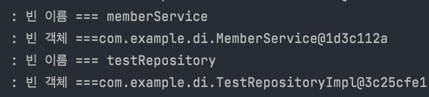
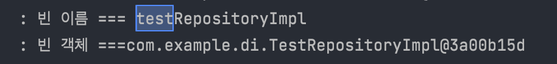

# 의존관계, 의존성 주입


#### 스프링 컨테이너

- ApplicationContext, BeanFactory
  - 일반적으로 ApplicationContext를 스프링 컨테이너라고함.
  - ApplicationContext는 Interface
- 스프링 컨테이너에는 **빈 저장소**가 존재함.
  - 빈 저장소는 빈 이름과 빈 객체를 저장한다.
  - 


### 1. 빈 등록, 의존 관계 설정.(수동 설정)

```java
@Configuration
public class AppConfig {
  
  @Bean
  public MemberRepository memberRepository(){
    return new MemberRepositoryImpl();
  }
  
  @Bean
  public MemberService memberService(){
    return new MemberServiceImpl(memberRepository);
  }
  
}
```

- MemberRepository, MemberService는 Interface
- MemberRepositoryImpl, MemberServiceImpl는 class로 인터페이스 구현체
- 위에서는 **빈 이름**을 각각 **memberRepository, memberService**로 등록함
- **빈 객체**는 **각각 구현체(class)**인 MemberRepositoryImpl, MemberServiceImpl를 **new 생성하여 빈 객체**로 등록
- 의존 관계 설정은 memberService빈 객체를 생성하려면 memberRepository가 MemberServiceImpl 생성자 인자로 memerRepository를 설정함.

---------------------------------------

- 만약 MemberService.class, MemberRepository.inferface, JwtTokenProvider.class를 빈으로 세개 다 등록해야하고 MeberService.class가 MemberRepository.inferface, JwtTokenProvider.class에 의존하고 있다면. 다음과 같다.

- ```java
  @Configuration
  public class AppConfig {
    
    @Bean//인터페이스 빈등록은 구현체를 빈 객체로 설정.
    public MemberRepository memberRepository(){
      return new MemberRepositoryImpl();
    }
    
    @Bean//class 빈등록은 본인을 new해서 리턴.
    public JwtTokenProvider jwtTokenProvider(){
    	return new JwtTokenProvider();
    }
    
    //MemberService -> MemberRepository, JwtTokenProvider
    @Bean
    public MemberService memberService(){
      return new MemberService(memberRepository(), jwtTokenProvider());
    }
    
    
    
  }
  ```

  


**#참고**

- 굳이 모든 인터페이스를 만들어서 구현체(class)를 만들고 구현체를 의존성 관계 설정을 해야하느냐?
  - 답은 아니다.
  - 인터페이스를 사용해서 인터페이스를 주입하는 이유는 


### 2. 컴포넌트 스캔 & 자동 의존관계 설정

- @**`Component`**를 가지고 있는 모든 요소를 스캔하여 빈으로 등록.
- 빈 간에 참조하고 있는 요소(의존관계)를 의존성 주입(DI)으로 표현.

- 구현체를 주입 받는 다면 **객체지향 프로그래밍의 5가지 원칙** 중 OCP, DIP 원칙을 어긴다.

  - ```java
    @Service
    public class MemberServiceImpl{
      private final MemberRepository memberRepository = new MemberRepositoryImpl();
    }
    ```

  - 위와 같이 할 경우

    - OCP(개방 폐쇄 원칙)
      - OCP란 확장에는 열려있고 변경에는 닫혀있어야한다.
    - DIP(의존관계 역전 원칙)

  - ```java
    @Service
    public class MemberServiceImpl{
      private final MemberRepository memberRepository;
    }
    ```

  - 위와 같이 interface만을 MemberServiceImpl가 의존하도록 변경해야한다.

#### 


즉, 우리는 AppConfig를 통해 구현체를 new 생성했다. 또한 AppConfig를 통해서 


-------------

## 결론

### 1. 변경이 필요 없이 확정적이라면 Interface를 사용 안해도 된다.

- xxxService같이 기능을 확장할 가능성이 없다면 구체 클래스를 직접 사용.
  - 추후에 기능을 확장할 필요가 있다면 Interface를 리팩토링

### 2. 의존성 주입할 때는 인터페이스(추상화)를 주입하자

- OCP 개방-폐쇄 원칙으로 인해 확장에는 열려있고, 변경에는 닫혀있어야함.
  - 즉, interface를 상속받아 구현체를 생성(확장)에는 열려 있고
  - 새로운 구현체를 사용한다면 클라이언트에서 사용하는 구현체를 변경하는 것에는 닫혀있어야함.

### 3. 역할(Interface)에 의존하게해야한다

- 1번에 위배되는 것처럼 보이지만 1번은 변경이 필요 없으므로 그 class 자체가 역할과 구현을 동시에 처리하므로 상관없음
- 역할에 의존해야 유연하게 구현체를 변경할 수 있음. 변경해도 클라이언트는 아무런 코드 변화가 없다.

```java
@Service
public class MemberService{
  
  private MemberRepository memberRepository;//interface 주입.
  
  @Autowired//생성자 주입방식. 권장. Autowired생략가능
  public MemberService(MemberRepository memberRepository){
    this.memberRepository = memberRepository;
  }
  
}
```


-----------------------------------------------------------





- ```java
  @Repository
  public interface MemberRepository extends JpaRepository<Member, Long> {
  }
  ```

- ```java
  public class MemberService {
  
    private final TestRepository testRepository;
    private final MemberRepository memberRepository;
  
    @Autowired
    public MemberService(TestRepository testRepository, MemberRepository memberRepository) {
      this.testRepository = testRepository;
      this.memberRepository = memberRepository;
    }
  
  }
  ```

- ```java
  public interface TestRepository {
  }
  ///////////////////////////////////////////////
  public class TestRepositoryImpl implements TestRepository {
  }
  
  ```

- ```java
  @Configuration
  public class AppConfig {
  
  
    private final MemberRepository memberRepository;
  
    @Autowired
    public AppConfig(MemberRepository memberRepository){
      this.memberRepository = memberRepository;
  
    }
  
    @Bean
    public MemberService memberService(){
      return new MemberService(testRepository(), memberRepository);
    }
  
    @Bean
    public TestRepository testRepository(){
      return new TestRepositoryImpl();
    }
  
  }
  
  ```

- MemberRepository.interface는 Spring Data Jpa가 제공하는 JpaRepository를 사용한 레포짓토리다.

  - 자동으로 빈 객체로 Spring이 만들어준 구현체인 `SimpleJpaRepository`를 사용하는 것을 알 수 있다.
  - 즉, 우리가 따로 구현체를 안 만들어도됨.

- 위 코드는 MemberRepository를 제외한 나머지 Service,Repository를 AppConfig를 통해 빈 등록과 의존관계를 수동 설정한 것이다.


- 다음은 AppConfig내용을 싹 지우고 컴포넌트 스캔과 DI를 통하여 한 것이다.
- TestRepository는 인터페이스, TestRepositoryImpl는 구현체이다.
  - 1. TestRepository에만 @Repository를 붙인 결과 에러가 발생한다.
  - 2. TestRepositoryImpl에만 @Repository를 붙인 결과 에러가 발생하지 않는다.
  - 
  - 어노테이션으로 빈 등록과 의존성 설정을 한 결과 빈 이름은 맨 앞글자만 소문자
  - 또한 구현체를 빈 객체로 받아들인다.
  -  TestRepository와 TestRepositoryImpl 둘다 @Repository를 붙인 결과는 
  - 
  - 2번째 결과와 같은 결과가 도출.
- 즉, 결과는 구현체를 빈으로 등록해야만이 정상적으로 ApplicationContext에 있는 스프링 빈 저장소에 빈 객체를 채울 수 있다.
- 또한 Interface가 없고 그냥 Class인 빈은 클래스 자체가 객체로 빈으로 등록이 된다.


### 의존 관계에서 주입시 구현체가 두개 이상일 경우 해결법

- 의존성 연관 관계 설정 시 interface로 주입하나 내부적으로는 빈 객체(구현체)로 의존성이 연결된다.
- TestRepository.interface의 구현체가 두개이다. 그렇다면 어떻게 구현체를 선택해서 의존성 연결을 할까?

- @Qualifier, @Primary 사용

  - ```java
    @Repository
    @Primary
    public class TestRepositoryImpl2 implements TestRepository {
    }
    ```

- 파라미터와 사용할 빈과 일치시킨다(@RequiredArgsConstructor 사용 불가능)

  - ```java
    @Service
    public class MemberService {
    
      private final TestRepository testRepository;
      private final MemberRepository memberRepository;
    
      @Autowired
      public MemberService(TestRepository testRepositoryImpl2, MemberRepository memberRepository) {
        this.testRepository = testRepositoryImpl2;
        this.memberRepository = memberRepository;
      }
    
    }
    
    ```

    


--------------------

### 인터페이스를 주입받는다면 어떤 구현체를 사용할까?

https://it-mesung.tistory.com/120

- 클라이언트(Service)는 Reposit을 주입받았다면 Service가 어떤 오브젝트(구현체)를 선택할지에 선택권을 외부에 맡긴다. 그저 클라이언트는 주입받은 오브젝트를 사용할 뿐이다
  - -> IoC개념
  - 이런 것을 **런타임 시 오브젝트 의존관계**라고한다.
    - 즉, 런타임 시 인터페이스로 의존 주입을 하면 의존 오브젝트(Service)는 어떤 오브젝트(구현체)를 사용할지 모른다.  