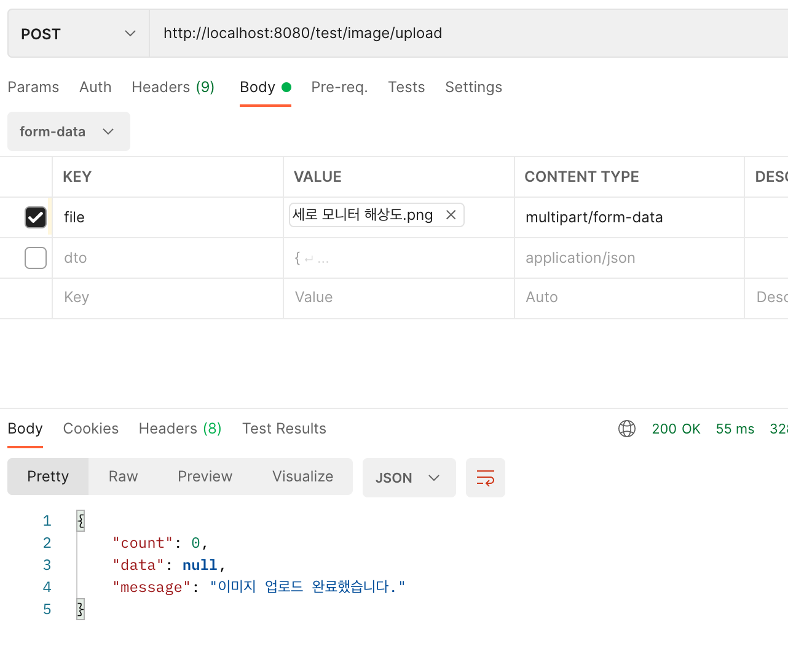

# 이미지 업로드


1. 프론트단.

```js
// 보통 axios 는 아래와 같이 보내게 된다. 
// 이렇게 보내면 폼 전송형식이 아닌 JSON 포맷으로 전송하게 된다.
axios.post('https://domain/form-post-url', {
  name: '이름'
  key: '값'
}).then((response) => {
  // 응답 처리
})
.catch((error) => {
  // 예외 처리
})
```

```js
const frm = new FormData()
frm.append('name', '이름')
frm.append('key', '값')

axios.post('https://domain/form-post-url', frm)
.then((response) => {
  // 응답 처리
})
.catch((error) => {
  // 예외 처리
})
```


------------------

### MultiPartFile

- ```java
    @SneakyThrows
    @PostMapping("/test/image/upload")
    public ResponseEntity<? extends BasicResponse> imageUploadTest(@RequestParam(name = "file") MultipartFile file,
                                                                   HttpServletRequest httpServletRequest) throws IOException {
      String originalFilename = file.getOriginalFilename();
      File dest = new File("/Users/jungwoo/Desktop/dev/SpringBootApiServer/backend/src/main/resources/img/member/" +
          originalFilename);
      try {
        file.transferTo(dest);
      } catch (IOException | IllegalStateException e) {
        e.printStackTrace();
      }
    
      return ResponseEntity.ok().body(new CommonResponse<>("이미지 업로드 완료했습니다."));
    
    }
  ```

- 

  


##### #참고

- ​	`axios.post(url, body, header)`
- **image upload base64 vs multipart**
  - **Base64**는 Binary Data(ex: 김정우)를 아스키코드와 매칭시키는 단순 치환.
  - 이미지를 base64로 인코딩시 최대 33%까지 기존 이미지보다 사이즈가 커짐.


---------------------------------------------

1. 클라이언트 단에서 이미지를 업로드 하는 순간. 서버로 이미지가 전송됨.
2. 전송된 이미지는 임시 폴더로 저장이 됨.
3. 클라이언트에서 글쓰기를 완료한다
   1. 전송된 이미지랑 글쓴 내용을 영구폴더로 저장한다.
4. 임시폴더는 배치로 일정기간마다 삭제한다.


---------------

저같은 경우는 헤더에 현재 유저의 jwt 하고 현재 작성중인 보드의 테이블정보와 uuid v4로 생성된 키값을 같이 보낸다음 file_log테이블에 다 기록을 해둡니다. 이미지 업로드일때는 use값을 false로 해두었다가 글 저장 버튼을 누를경우 true로 해둡니다.

관리자페이지에서 예약으로 false인 파일들 삭제하는 쿼리랑 지금 삭제쿼리를 만들어뒀고

백앤드에서는 파일업로드함수가 작동할때 file_log 테이블에서 총 업로드 용량을 계산해서 지정한 용량이 되면 created 한시간이내만 제외하고 use값이false인것만 지우게 해두었는데 이미지 뿐만 아니라 모든 데이터를 이렇게 관리하니까 매우 편합니당


-----------------

https://bohyeon-n.github.io/deploy/web/image-upload.html


----------------------

```java
  @SneakyThrows
  @PostMapping("/test/image/upload")
  public ResponseEntity<? extends BasicResponse> imageUploadTest(MultipartHttpServletRequest multipartReq) throws IOException {

    MultipartFile file = multipartReq.getFile("upload");
    String originalFilename = file.getOriginalFilename();
    File dest = new File("/Users/jungwoo/Desktop/dev/SpringBootApiServer/backend/src/main/resources/img/" +
        originalFilename);


    file.transferTo(dest);


    return ResponseEntity.ok().body(new CommonResponse<>("이미지 업로드 완료했습니다."));

  }
```


```js
 <CKEditor
                    editor={ClassicEditor}
                    onInit={editor => {

                    }}
                    config={
                        {
                            ckfinder: {
                                uploadUrl: 'http://localhost:8080/test/image/upload'

                            }

                        }
                    }


                    onChange={this.handleCkeditorState}
                />
```

- 클라이언트에서 ckeditor를 사용하여 ckfinder 플러그인을 사용하여 uploadurl(서버 url)로 업로드한다
  - 그럼 req의 바디에 이미지 파일을 실어서 보내며 `key = upload`, `value = 이미지 파일`로 보낸다.
- 서버는 `MultipartHttpServletRequest`으로 request를 핸들링한다.
  - 서버의 응답에 들어가야하는 바디 내용은 아래와 같다
    - `uploaded`: boolean타입으로 업로드가 정상적으로 서버에 되었다는 것을 알려준다.
    - `url`: 이미지의 url을 말한다.
- react에서 html에 들어가는 ``경로 값은 기본이 public폴더이다.
  - 즉, react 프로젝트에서 `/pulbic/image/test.png`가 있다면 `"`로 접근이 가능하다.
  - https://dev-note-97.tistory.com/213

- 현재는 s3에 이미지를 저장하지 않고 로컬에 저장한다.
  - 서버에서 이미지를 저장할때 프론트엔트 public/image폴더에 저장.
  - 응답으로 image폴더를 응답
    - `ImageDto.builder().uploaded(true).url("/image/address.png").build();`


react에서 ckeditor의 ckfinder로 `uploadUrl: 'http://localhost:8080/test/image/upload'`해서 서버에 사진을 업로드할 경우 서버에서는 리스폰을 `uploaded(boolean), url(String)`으로 응답을 줘야한다.


---------------

cors 해결하는 설정 2가지 방법 https://developer-talk.tistory.com/91

- 프록시 설정
  - 프록시 설정 후, 클라이언트에서 서버로 전송할때, `url = 'http://server.com/new'`식으로 보내면 프록시 설정이 적용안되므로 cors에러가 발생.
  - 프록시 설정 후면 `url= '/new' `식으로 요청을 보내야 프록시가 적용됨.
- response header에 Access-Control-Allow-Origin 설정


-------------------------------------------------

### need : 저장 서버, 파일 테이블

1. 저장서버는 s3로 하는 것이 좋지만, 현재 s3를 구현 안했으므로 프론트엔드단에 `/public/image`를 저장 서버로 생각하고 구현.

2. 파일 테이블

   1. `use` : 저장하면 true, 저장안하고 나가거나 글을 삭제할 경우 false
      1. 이 `use`를 이용하여 주기적으로 파일들을 삭제.

   2. `filename`: 파일의 원래 이름
   3. `fileUUID`: 파일 중복이 있을 경우 덮어쓰기 되므로 랜덤 UUID 생성한 값.
   4. `path`: 파일이 저장된 경로를 저장.


### 요구사항

1. 글쓰다가 이미지 업로드하고 등록을 하였는데 중간에 글쓰기에서 나갈 경우.
   1. 저장버튼 전: `use` 값을 false, 즉, file upload할 때 파일 테이블에 해당 정보를 저장
   2. 저장버튼 후: `use`값을 true
2. `use`값이 false인 것들은 나중에 배치로 삭제.
3. 글을 삭제할 경우
   1. `uploaded`을 false로 하는 방법
   2. 


----------------------

```js
    componentWillUnmount() {
        this.deleteTempImage();


    }
    deleteTempImage = () =>{
        axios.post(`/image/delete`,null,{
            headers: {
                'Authorization': 'Bearer ' + $.cookie('accessToken')
            }
        })
            .then(response => {
                if(response.status == 201){
                    cogoToast.success(response.data.message);
                }
            })
            .catch(err =>{
                console.log(err);
            })


    }
```

이렇게 할 시 뒤로가기나 다른 페이지로 이동시에만 작동함

새로고침, 탭닫기, 브라우저 종료에는 작동하지 않음.


```js
import React, {Component, useEffect} from "react";
import {useBeforeunload} from "react-beforeunload"
import ClassicEditor from "@ckeditor/ckeditor5-build-classic";
import {CKEditor} from "@ckeditor/ckeditor5-react";
import {Button, Form} from "react-bootstrap";
import axios from "axios";
import $ from "jquery";
import {} from "jquery.cookie";
import cogoToast from 'cogo-toast';


axios.defaults.withCredentials = true;


class Editor extends Component {
    constructor(props) {
        super(props);
        this.state = {
            content: "",
            postType: "qna",
            title: ""
        }
    }


    componentDidMount() {

        console.log("hi");

        //edit인 경우만 title 날라옴
        // this.setState({
        //     postType: this.props.location.query.postType
        // });
        console.log(this.props);
        console.log(this.state);
        this.setupBeforeUnloadListener();


    }

    componentWillUnmount() {
        // this.deleteTempImage();


    }

    setupBeforeUnloadListener = () => {

        useBeforeunload()

        window.addEventListener("beforeunload", (ev) => {
            ev.preventDefault();
            return this.doSomethingBeforeUnload();
            // return ev.returnValue = 'Are you sure you want to close?';
            // return "다른페이지로 이동?";

        });
    };

    doSomethingBeforeUnload = () => {
        this.deleteTempImage();
    }


    deleteTempImage = () =>{
        axios.post(`/image/delete`,null,{
            headers: {
                'Authorization': 'Bearer ' + $.cookie('accessToken')
            }
        })
            .then(response => {
                if(response.status == 201){
                    cogoToast.success(response.data.message);
                }
            })
            .catch(err =>{
                console.log(err);
            })


    }

    createPost = () => {

        if (!$.cookie('accessToken')) {
            cogoToast.error("로그인 후 가능합니다!!");
            // window.location.href = "/";
        }

        let url;
        let send_param;

        const title = this.state.title;
        const content = this.state.content;

        if (title === undefined || title === "") {
            cogoToast.warn("글 제목을 입력 해주세요.");
            this.title.focus();
            return;
        } else if (content === undefined || content === "") {
            cogoToast.warn("글 내용을 입력 해주세요.");
            return;
        }

        url = `/boards/${this.state.postType}`;
        send_param = {
            title: title,
            postType: this.state.postType,
            content: content
        };
        axios
            .post(url, send_param,
                {
                    headers: {
                        'Authorization': 'Bearer ' + $.cookie('accessToken')
                    }
                })
            //정상 수행
            .then(response => {
                if (response.status == 201) {
                    cogoToast.success(response.data.message);
                    this.props.history.goBack();
                } else {
                    cogoToast.error("글쓰기 실패");
                }
            })
            //에러
            .catch(err => {
                console.log(err);
            });

    };

    onEditorChange = (e) => {
        this.setState({
            content: e.editor.getData()
        });
    };

    onChangeTitle = (e) => {
        this.setState({
            title: e.target.value
        })
    }

    handleCkeditorState = (event, editor) => {
        const data = editor.getData();
        this.setState({
            content: data
            // content: event.editor.getData()
        })


        console.log(data);
    }

    render() {
        const custom_config ={
            extraPlugins: [ MyCustomUploadAdapterPlugin ],
            toolbar: {
                items: [
                    'heading',
                    '|',
                    'bold',
                    'italic',
                    'link',
                    'bulletedList',
                    'numberedList',
                    '|',
                    'blockQuote',
                    'insertTable',
                    '|',
                    'imageUpload',
                    'undo',
                    'redo'
                ]
            },
            table: {
                contentToolbar: [ 'tableColumn', 'tableRow', 'mergeTableCells' ]
            }
        }
        const divStyle = {
            marginTop: "3%",
            minWidth: "70%",
            minHeight: "700px"
        };
        const titleStyle = {
            marginBottom: 5
        };
        const buttonStyle = {
            marginTop: 5
        };

        return (
            <div className="container" style={divStyle}>
                <h2>글쓰기</h2>
                <Form.Control
                    type="text"
                    style={titleStyle}
                    placeholder="글 제목"
                    value={this.state.title}
                    onChange={this.onChangeTitle}
                />
                <CKEditor
                    editor={ClassicEditor}
                    onInit={editor=>{

                    }}
                    config={custom_config}
                    data={this.state.content}
                    onChange={this.handleCkeditorState}
                />

                <Button style={buttonStyle} onClick={this.createPost} block>
                    저장하기
                </Button>
            </div>
        );
    }
}

//
function MyCustomUploadAdapterPlugin(editor) {
    editor.plugins.get( 'FileRepository' ).createUploadAdapter = (loader) => {
        return new MyUploadAdapter(loader)
    }
}

class MyUploadAdapter {
    constructor(props) {
        // CKEditor 5's FileLoader instance.
        this.loader = props;
        // URL where to send files.
        this.url = `/image/upload`;
    }

    // Starts the upload process.
    upload() {
        return new Promise((resolve, reject) => {
            console.log("아릉하세연");
            this._initRequest();
            this._initListeners(resolve, reject);
            this._sendRequest();
        } );
    }

    // Aborts the upload process.
    abort() {
        if ( this.xhr ) {
            this.xhr.abort();
        }
    }

    // Example implementation using XMLHttpRequest.
    _initRequest() {
        const xhr = this.xhr = new XMLHttpRequest();

        xhr.open('POST', this.url, true);
        xhr.responseType = 'json';
        xhr.setRequestHeader('Access-Control-Allow-Origin', 'http://localhost:8080')
        xhr.setRequestHeader('Authorization', 'Bearer ' + $.cookie('accessToken'))
        xhr.withCredentials = true;
    }

    // Initializes XMLHttpRequest listeners.
    _initListeners( resolve, reject ) {
        const xhr = this.xhr;
        const loader = this.loader;
        const genericErrorText = 'Couldn\'t upload file:' + ` ${ loader.file.name }.`;

        xhr.addEventListener( 'error', () => reject( genericErrorText ) );
        xhr.addEventListener( 'abort', () => reject() );
        xhr.addEventListener( 'load', () => {
            const response = xhr.response;
            if ( !response || response.error ) {
                return reject( response && response.error ? response.error.message : genericErrorText );
            }

           //서버에서 upload성공시 response로 오는 url의 값으로 이미지의 url을 등록한다.
            //
            resolve({
                //default: response.s3Url
                default: response.url
            });

        } );

        if ( xhr.upload ) {
            xhr.upload.addEventListener( 'progress', evt => {
                if ( evt.lengthComputable ) {
                    loader.uploadTotal = evt.total;
                    loader.uploaded = evt.loaded;
                }
            } );
        }
    }

    // Prepares the data and sends the request.
    _sendRequest() {
        const data = new FormData();

        this.loader.file.then(result => {
                data.append('upload', result);
                this.xhr.send(data);
            }
        )
    }

}

export default Editor;

```


- go back, route another url.

```js
import {Prompt} from 'react-router-dom'

	<Prompt
		when={isFormInComplete}
                    // message="Are you sure you want to leave?"
                    message={this.deleteTempImage}
                />
```

