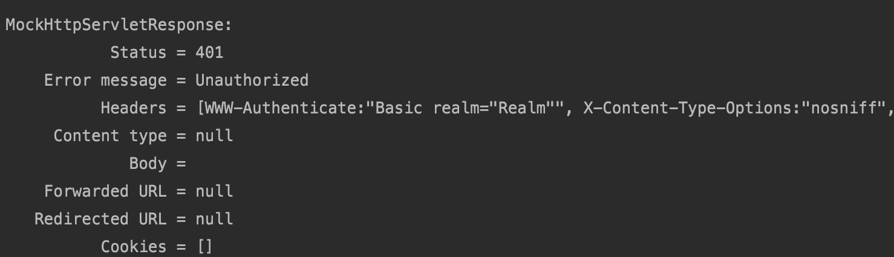
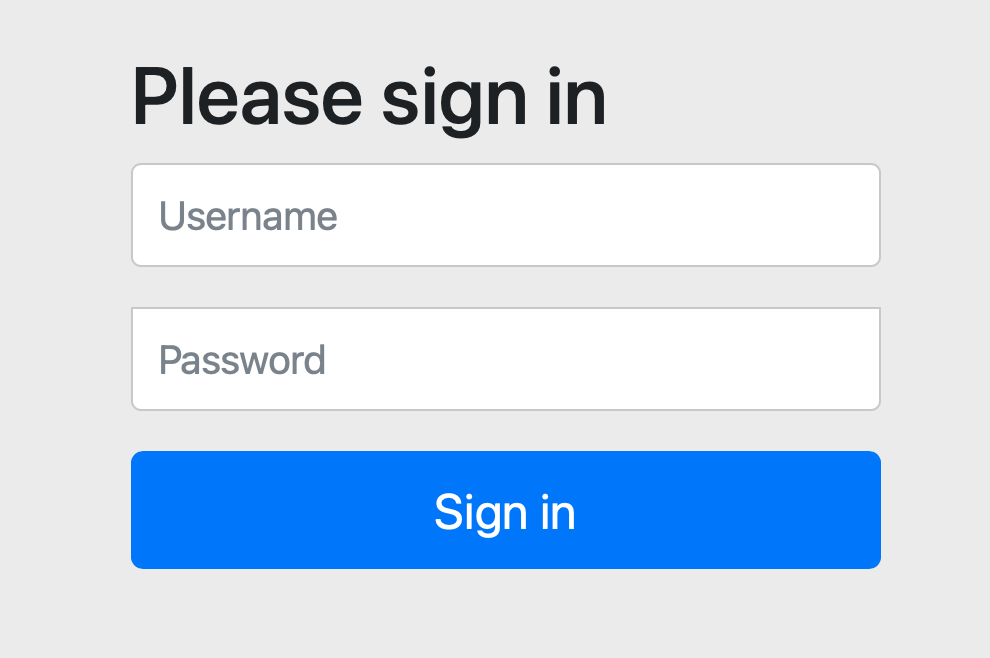
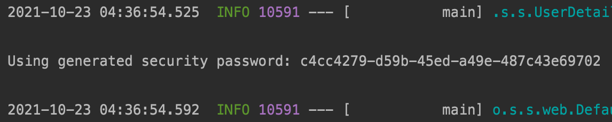

```xml
        <dependency>
            <groupId>org.springframework.boot</groupId>
            <artifactId>spring-boot-starter-thymeleaf</artifactId>
        </dependency>
```


```java
package com.example.demo7springbootstartersecurity;

import org.springframework.stereotype.Controller;
import org.springframework.web.bind.annotation.GetMapping;

@Controller
public class HomeController {

    @GetMapping("/hello")
    public String hello(){
        return "hello";
    }
}

```

```java
//WebConfig
package com.example.demo7springbootstartersecurity;

import org.springframework.context.annotation.Configuration;
import org.springframework.web.servlet.config.annotation.ViewControllerRegistry;
import org.springframework.web.servlet.config.annotation.WebMvcConfigurer;

@Configuration
public class WebConfig implements WebMvcConfigurer {

    @Override
    public void addViewControllers(ViewControllerRegistry registry) {
        registry.addViewController("/hello").setViewName("hello");
    }
}

```

단순히 어떤 요청이 들어오면 뷰만 보여줄려면 위와 같이 두가지 방법으로 사용해도 된다. 즉, 두개 다 같은 것. 둘 중 아무거나 사용해도된다.

```java
package com.example.demo7springbootstartersecurity;

import org.junit.jupiter.api.Test;
import org.springframework.beans.factory.annotation.Autowired;
import org.springframework.boot.test.autoconfigure.web.servlet.WebMvcTest;
import org.springframework.test.web.servlet.MockMvc;

import static org.springframework.test.web.servlet.request.MockMvcRequestBuilders.get;
import static org.springframework.test.web.servlet.result.MockMvcResultMatchers.status;
import static org.springframework.test.web.servlet.result.MockMvcResultMatchers.view;

@WebMvcTest(HomeController.class)
public class HomeControllerTest {

    @Autowired
    MockMvc mockMvc;


    @Test
    public void my() throws Exception {
        mockMvc.perform(get("/my"))
                .andDo(print())
                .andExpect(status().isOk())
                .andExpect(view().name("my"));

    }
    @Test
    public void hello() throws Exception {
        mockMvc.perform(get("/hello"))
          			.andDo(print())
                .andExpect(status().isOk())
                .andExpect(view().name("hello"));

    }
}
```

테스트를 통해 지금까지 문제 없다는 것을 알 수 있다.


이 상태에서 http://localhost:8080으로 들어가면 hello, my_page 하이퍼링크가 나온다.

my_page는 로그인한 상태에서 들어가기를 원한다.

이제 시큐리티 의존성을 추가한다.

```xml
<dependency>
    <groupId>org.springframework.boot</groupId>
    <artifactId>spring-boot-starter-security</artifactId>
</dependency>
```

이 상태에서 테스트 코드를 실행하면 에러가 나온다.



401에러가 나오고 unauthorized가 나온다.

스프링 부트가 지원하는 security 자동 설정 중 하나이다. 모든 요청이 spring boot security로 인해 인증을 필요로 해진다. 그리고 basic authenticate과 form authenticate 둘 다 적용이 된다. 위에서는 basic authenticate에 대한 응답이 온 것. 이 응답을 브라우저가 받으면 브라우저가 내장하고 있는 basic authentication form을 띄운다.

이런 basic 인증은 Accept 헤더에 따라서 달라진다. 


이 상태에서 애플리케이션을 실행하고 http://localhost:8080으로 접속하면 자동으로 http://localhost:8080/login으로 리다이렉트되고 아래와 같이 나온다.

 

루트를 요청했지만 인증 정보가 없기 때문에 Spring security가 자동으로 만들어준 로그인 폼으로 페이지가 나온 것이고 아래와 같이 로그인 폼 페이지에 입력할 수 있는 정보를 security가 자동으로 하나 만들어 준다. username은 기본적으로 user이다.



로그인하면 루트로 다시 돌아가고 다른 페이지도 사용이 가능하다.


-------------------------------

# spring boot가 제공하는 자동설정 security를 사용하지 않고 커스텀해서 사용하기


config 패키지를 만들고 SecurityConfig class 만들고

```java
package com.example.demo7springbootstartersecurity.config;

import org.springframework.context.annotation.Configuration;
import org.springframework.security.config.annotation.web.builders.HttpSecurity;
import org.springframework.security.config.annotation.web.configuration.WebSecurityConfigurerAdapter;

@Configuration
public class SecurityConfig extends WebSecurityConfigurerAdapter {

    @Override
    protected void configure(HttpSecurity http) throws Exception {
        http.authorizeRequests()
                .antMatchers("/","/hello").permitAll()
                .anyRequest().authenticated()
                .and()
                .formLogin()
                .and()
                .httpBasic();
    }
}

```

위와 같이 WebSecurityConfigurerAdapter을 상속받는 순간 spring boot가 지원하는 security 자동설정을 사용안하고 이 설정을 사용한다.

위 설정을하면 /, /hello 요청이 들어오면 인증없이 가능하고 /my가 들어오면 인증이 필요하다.


```xml
        <dependency>
            <groupId>com.h2database</groupId>
            <artifactId>h2</artifactId>
        </dependency>
        <dependency>
            <groupId>org.springframework.boot</groupId>
            <artifactId>spring-boot-starter-data-jpa</artifactId>=
        </dependency>
```


```java
package com.example.demo7springbootstartersecurity.account;

import javax.persistence.Entity;
import javax.persistence.GeneratedValue;
import javax.persistence.Id;

@Entity
public class Account {

    @Id @GeneratedValue
    private Long id;

    private String username;
    private String password;

    public Long getId() {
        return id;
    }

    public void setId(Long id) {
        this.id = id;
    }

    public String getUsername() {
        return username;
    }

    public void setUsername(String username) {
        this.username = username;
    }

    public String getPassword() {
        return password;
    }

    public void setPassword(String password) {
        this.password = password;
    }
}

```

```java
//AccountRepository.java
package com.example.demo7springbootstartersecurity.account;

import org.springframework.data.jpa.repository.JpaRepository;

import java.util.Optional;

public interface AccountRepository extends JpaRepository<Account, Long> {
    Optional<Account> findByUsername(String username);

}

```

```java
//AccountService.java
package com.example.demo7springbootstartersecurity.account;

import org.springframework.beans.factory.annotation.Autowired;
import org.springframework.security.core.GrantedAuthority;
import org.springframework.security.core.authority.SimpleGrantedAuthority;
import org.springframework.security.core.userdetails.User;
import org.springframework.security.core.userdetails.UserDetails;
import org.springframework.security.core.userdetails.UserDetailsService;
import org.springframework.security.core.userdetails.UsernameNotFoundException;
import org.springframework.stereotype.Service;

import java.util.Arrays;
import java.util.Collection;
import java.util.Optional;

@Service
public class AccountService implements UserDetailsService {

    @Autowired
    private AccountRepository accountRepository;

    public Account createAccount(String username, String password) {
        Account account = new Account();
        account.setUsername(username);
        account.setPassword(password);
        return accountRepository.save(account);
    }

    @Override
    public UserDetails loadUserByUsername(String username) throws UsernameNotFoundException {
        Optional<Account> byUsername = accountRepository.findByUsername(username);
        Account account = byUsername.orElseThrow(() -> new UsernameNotFoundException(username));
        return new User(account.getUsername(), account.getPassword(), authorities());
    }

    private Collection<? extends GrantedAuthority> authorities() {
        return Arrays.asList(new SimpleGrantedAuthority("ROLE_USER"));
    }
}

```


보통 유저정보를 관리하는 서비스계층에다가 UserDetailsService 인터페이스를 구현하도록 하면 된다.

우리가 입력하는 username과 password가 loadUserByUsername로 들어오고 username에 해당하는 정보를 확인하고 user 정보에는 password가 있다. 그 password와 우리가 입력한 password를 비교한다. 아주 핵심적인 인터페이스다.


위 예제에서는 password를 인코딩을 안하고 바로 db에 저장을 하였다. 실제에서는 이런 식으로 하면 절대 안된다. 인코딩을 항상 해야하는 데, 인코딩을 안하고 인증을 할 경우 에러가 뜬다.

그러기에 인코딩을 해야한다.


```java
package com.example.demo7springbootstartersecurity.config;

import org.springframework.context.annotation.Bean;
import org.springframework.context.annotation.Configuration;
import org.springframework.security.config.annotation.web.builders.HttpSecurity;
import org.springframework.security.config.annotation.web.configuration.WebSecurityConfigurerAdapter;
import org.springframework.security.crypto.factory.PasswordEncoderFactories;
import org.springframework.security.crypto.password.PasswordEncoder;

@Configuration
public class SecurityConfig extends WebSecurityConfigurerAdapter {

    @Override
    protected void configure(HttpSecurity http) throws Exception {
        http.authorizeRequests()
                .antMatchers("/","/hello").permitAll()
                .anyRequest().authenticated()
                .and()
                .formLogin()
                .and()
                .httpBasic();
    }

    @Bean
    public PasswordEncoder passwordEncoder(){
        return PasswordEncoderFactories.createDelegatingPasswordEncoder();
    }
}

```

SercurityConfig에 passwordEncoder를 빈에 추가한다.

```java
package com.example.demo7springbootstartersecurity.account;

import org.springframework.beans.factory.annotation.Autowired;
import org.springframework.security.core.GrantedAuthority;
import org.springframework.security.core.authority.SimpleGrantedAuthority;
import org.springframework.security.core.userdetails.User;
import org.springframework.security.core.userdetails.UserDetails;
import org.springframework.security.core.userdetails.UserDetailsService;
import org.springframework.security.core.userdetails.UsernameNotFoundException;
import org.springframework.security.crypto.password.PasswordEncoder;
import org.springframework.stereotype.Service;

import java.util.Arrays;
import java.util.Collection;
import java.util.Optional;

@Service
public class AccountService implements UserDetailsService {

    @Autowired
    private AccountRepository accountRepository;
    
    @Autowired
    private PasswordEncoder passwordEncoder;

    public Account createAccount(String username, String password) {
        Account account = new Account();
        account.setUsername(username);
        account.setPassword(passwordEncoder.encode(password));
        return accountRepository.save(account);
    }

    @Override
    public UserDetails loadUserByUsername(String username) throws UsernameNotFoundException {
        Optional<Account> byUsername = accountRepository.findByUsername(username);
        Account account = byUsername.orElseThrow(() -> new UsernameNotFoundException(username));
        return new User(account.getUsername(), account.getPassword(), authorities());
    }

    private Collection<? extends GrantedAuthority> authorities() {
        return Arrays.asList(new SimpleGrantedAuthority("ROLE_USER"));
    }
}

```

PasswordEncoder를 주입받고 password를 저장하기 전에 인코딩을하고 db에 넣는다.


이 것은 security에 기본적인 흐름이고 배울 것이 상당히 많다. 이건 추후에 배우도록하자.

