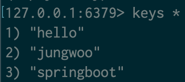
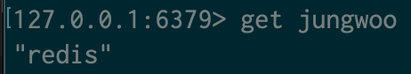
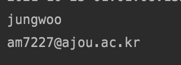
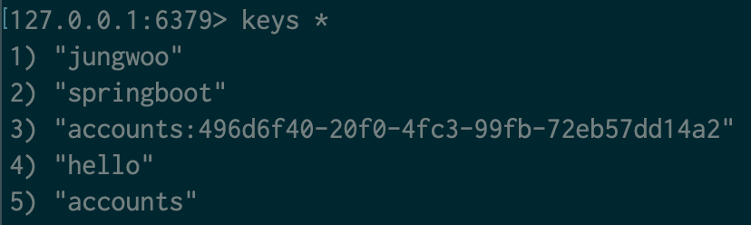
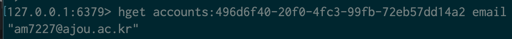
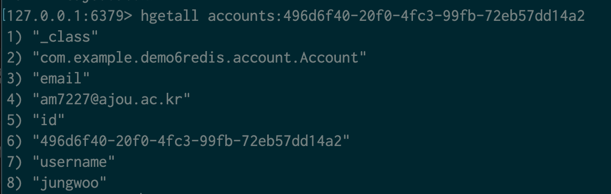

---

---


# Redis


#### 캐시, 메시지 브로커, 키/밸류 스토어 등으로 사용 가능.

#### 의존성 추가

- spring-boot-starter-data-redis

#### Redis 설치 및 실행 (도커)

- docker run -p 6379:6379 --name redis_boot -d redis
- docker exec -i -t redis_boot redis-cli

#### 스프링 데이터 Redis

- https://projects.spring.io/spring-data-redis/
- StringRedisTemplate 또는 RedisTemplate
  - redis 템플릿을 사용하여 redis서버와 통신.
- extends CrudRepository

| Interface               | Description                                                  |
| ----------------------- | ------------------------------------------------------------ |
| *Key Type Operations*   |                                                              |
| `GeoOperations`         | Redis geospatial operations, such as `GEOADD`, `GEORADIUS`,… |
| `HashOperations`        | Redis hash operations                                        |
| `HyperLogLogOperations` | Redis HyperLogLog operations, such as `PFADD`, `PFCOUNT`,…   |
| `ListOperations`        | Redis list operations                                        |
| `SetOperations`         | Redis set operations                                         |
| `ValueOperations`       | Redis string (or value) operations                           |
| `ZSetOperations`        | Redis zset (or sorted set) operations                        |
| *Key Bound Operations*  |                                                              |
| `BoundGeoOperations`    | Redis key bound geospatial operations                        |
| `BoundHashOperations`   | Redis hash key bound operations                              |
| `BoundKeyOperations`    | Redis key bound operations                                   |
| `BoundListOperations`   | Redis list key bound operations                              |
| `BoundSetOperations`    | Redis set key bound operations                               |
| `BoundValueOperations`  | Redis string (or value) key bound operations                 |
| `BoundZSetOperations`   | Redis zset (or sorted set) key bound operations              |

#### Redis 주요 커맨드

- https://redis.io/commands
- keys*
- get {key}
- hgetall {key}
- hget {key} {column}

#### 커스터마이징

- 아무런 설정없이 redis를 사용할 수 있었던 것은 컨테이너에 있는 6379 port로 연결하였기에 가능했다.
- 그러나 커스텀마이징하려면 propertie에서 spring.redis.*을 사용하여 가능.


```java
package com.example.demo6redis;

import org.springframework.beans.factory.annotation.Autowired;
import org.springframework.boot.ApplicationArguments;
import org.springframework.boot.ApplicationRunner;
import org.springframework.data.redis.core.StringRedisTemplate;
import org.springframework.data.redis.core.ValueOperations;
import org.springframework.stereotype.Component;

@Component
public class RedisRunner implements ApplicationRunner {


    @Autowired
    StringRedisTemplate stringRedisTemplate;

    @Override
    public void run(ApplicationArguments args) throws Exception {
        ValueOperations<String, String> values = stringRedisTemplate.opsForValue();
        values.set("jungwoo", "redis");
        values.set("springboot", "2.5.5");
        values.set("hello", "world");
    }
}

```

StringRedisTemplate을 사용하여 redis 서버와 통신을 한다. 지금은 ValueOperations 객체에 key, value를 넣는다.



key가 정상적으로 들어가 있는 것을 알 수 있다. 위는 docker를 사용하여 redis 서버를 만들고 접속하여 keys 커맨드를 사용한것.



key에 맞는 value도 정상적으로 들어가 있는 것을 알 수 있다.


아래는 redis repository를 만드는 과정이다.

```java
package com.example.demo6redis;

import org.springframework.data.annotation.Id;
import org.springframework.data.redis.core.RedisHash;

@RedisHash("accounts")
public class Account {

    @Id
    private String id;

    private String username;
    
    private String email;


    public String getId() {
        return id;
    }

    public void setId(String id) {
        this.id = id;
    }

    public String getUsername() {
        return username;
    }

    public void setUsername(String username) {
        this.username = username;
    }

    public String getEmail() {
        return email;
    }

    public void setEmail(String email) {
        this.email = email;
    }
}

```

@RedisHash 애노테이션을 붙여서 해쉬를 만들어줘야한다.


```java
package com.example.demo6redis.account;

import org.springframework.data.repository.CrudRepository;

public interface AccountRepository extends CrudRepository<Account, String> {
}

```

CrudRepository를 상속받는데 CrudRepository는 spring data에서 거의 최상위에 있는 기본적인 인터페이스이다.

CrudRepository<repository가 다루는 타입, key의 타입>을 설정하고 자동으로 빈으로 등록된다.


```java
package com.example.demo6redis;

import com.example.demo6redis.account.Account;
import com.example.demo6redis.account.AccountRepository;
import org.springframework.beans.factory.annotation.Autowired;
import org.springframework.boot.ApplicationArguments;
import org.springframework.boot.ApplicationRunner;
import org.springframework.data.redis.core.StringRedisTemplate;
import org.springframework.data.redis.core.ValueOperations;
import org.springframework.stereotype.Component;

import java.util.Optional;

@Component
public class RedisRunner implements ApplicationRunner {


    @Autowired
    StringRedisTemplate stringRedisTemplate;

    @Autowired
    AccountRepository accountRepository;

    @Override
    public void run(ApplicationArguments args) throws Exception {
        ValueOperations<String, String> values = stringRedisTemplate.opsForValue();
        values.set("jungwoo", "redis");
        values.set("springboot", "2.5.5");
        values.set("hello", "world");

        Account account = new Account();
        account.setEmail("am7227@ajou.ac.kr");
        account.setUsername("jungwoo");

        accountRepository.save(account);

        Optional<Account> byId = accountRepository.findById(account.getId());
        System.out.println(byId.get().getUsername());
        System.out.println(byId.get().getEmail());
    }
}

```

AccountRepository 객체를 사용하여 save를 할 수가 있다. 저장을 한 후에는 저장되어있는 객체 정보를 가져올 수 있기에 findById.. 를 사용하여 정보를 가져올 수 있다.

findById를 사용하여 객체를 가져올 수 있으나 Optional<T> 클래스로 가져온다.



정보를 정상적으로 가져오는 걸 알 수 있다.




docker에서 확인을 해보면 5번에 accounts라고 hash 이름이 들어가 있고 3)에 accounts에 대한 하나의 enetity에 대한 key가 나오게 된다.



저 3번은 hash이므로 그냥 get으로는 값을 가져오지 못하고 hget을 사용하여 key를 적고 field(email)을 작성하여 value를 get한다.



hgetall을 사용하여 해쉬안에 들어있는 전부를 가져올 수 있다. class 정보도 추가적으로 가져오는 것으 알 수 있다.